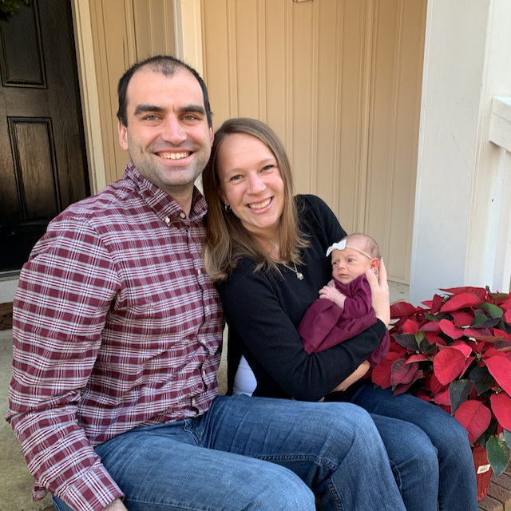

    

Hi, I'm Ben McCormick.  I'm a web developer, writer, occasional athlete, and a Christian. This is my blog about JavaScript, the Web and development tools.

I live in Durham NC with my wife Claire, our 2 kids Elena & Elijah and our dog Moxie. Prior to that I grew up in Pittsburgh.  I have plenty of pride in both of my homes.  When I'm not writing code or text, you can find me playing basketball, ultimate frisbee, and board games, relaxing with my wife, or volunteering at my church.  I currently work at [Kustomer](http://www.kustomer.com) as an Engineering Manager.

If you have thoughts about the blog or want to contact me about related opportunities you can reach me [by email](mailto:ben@benmccormick.org).

### Disclaimers and Faux-legalese

I occasionally link to various books and services when I blog.  These links are sometimes affiliate links, for which I receive a small commission on sales.

All content on the blog was written by me, and I maintain copyright over it.  If you want to reuse or reprint it somewhere else, please contact me.

All opinions, positions and thoughts on the blog are my own and do not represent the positions or opinions of my employer, my family, my church, my country, etc.

[twitter]:http://twitter.com/_benmccormick
[ghp]: https://pages.github.com/
[gatsby]: https://github.com/gatsbyjs/gatsby
