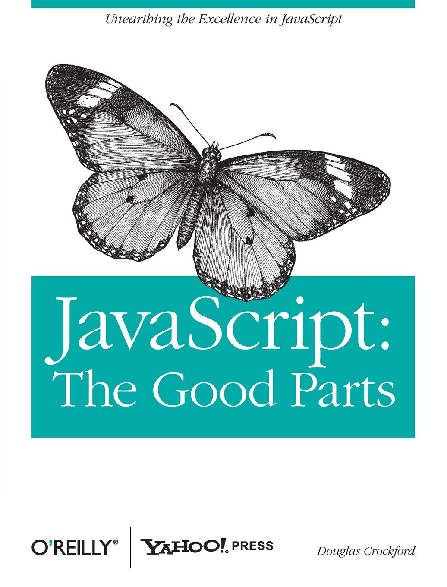
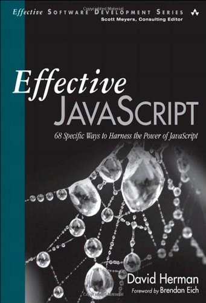
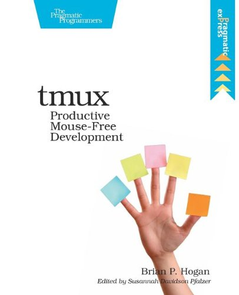
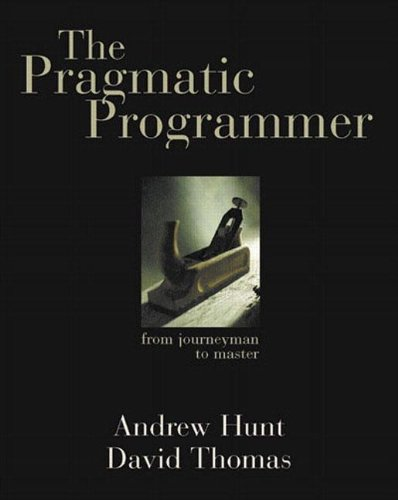

These are the books that have helped me grow most as a developer.  I highly recommend them all.  Please note that the links are affiliate links and a small portion of any purchases you make will go towards the costs of maintaining this site.

---

## JavaScript

#### JavaScript: The Good Parts, By Douglas Crockford

This is the first book I'd recommend for anyone interested in getting started with Front End development and JavaScript.  It's getting a bit dated now, 6 years after it was published, but I haven't found anything else that explains as well the basics of the language and how to use it.

Buy: <a href="http://www.amazon.com/gp/product/0596517742/ref=as_li_tl?ie=UTF8&camp=1789&creative=390957&creativeASIN=0596517742&linkCode=as2&tag=benmccormicko-20&linkId=XZEWUV7PCEO7DNTY">Amazon</a>

#### Effective JavaScript by David Herman

You can find my full review [here][effectivejs], but Effective JavaScript is a great read for developers with a good comfort level with the language who want to dig a bit deeper.  It's presented as a series of imperative tips (do this, don't do that), and each one is backed up with a tremendous depth of knowledge and insight.  A must read for any JavaScript dev.

Buy: <a href="http://www.amazon.com/gp/product/0321812182/ref=as_li_tl?ie=UTF8&camp=1789&creative=390957&creativeASIN=0321812182&linkCode=as2&tag=benmccormicko-20&linkId=HOPC6ZNKSVMH3NZ7">Amazon</a>

---

## Tools

#### Practical Vim by Drew Neil

Practical Vim is a must have book for anyone who wants to be efficient while editing text.  While it's a book about Vim, it will challenge you to use your editor more efficiently and powerfully no matter what you use (and maybe convince you to switch to Vim).  Highly recommended for anyone who deals with code or text for a living.

Buy: <a href="http://www.amazon.com/gp/product/1934356980/ref=as_li_tl?ie=UTF8&camp=1789&creative=390957&creativeASIN=1934356980&linkCode=as2&tag=benmccormicko-20&linkId=FE3JFKHYVRYCUOVS">Amazon</a>

#### Tmux: Mouse Free Productivity By Brian Hogan

Tmux is a terminal multiplexer, a program that allows you to split and organize your terminal windows.  With an unfriendly [project page][tmuxpage] and a dearth of great tutorials out there, it can be a bit difficult to get started with.  Tmux: Mouse Free Productivity is a short (88 pages) little guide to using Tmux effectively.  It helped me get up and running with what is now an indispensable tool in my workflow.

Buy: <a href="http://www.amazon.com/gp/product/1934356964/ref=as_li_tl?ie=UTF8&camp=1789&creative=390957&creativeASIN=1934356964&linkCode=as2&tag=benmccormicko-20&linkId=ITHR5LSXMGMXCPS7">Amazon</a>

---

## General Programming

#### The Pragmatic Programmer by Andrew Hunt and David Thomas

This is a classic in the programming field, easily the most well known book on this list.  But it also is an indispensible explanation of the process of making great software.  There's not a lot of code in this book, and thats a feature, not a bug.  This is a book about the techniques of building a software project, not the nitty gritty details.  As such, it's relevance has lasted a lot longer than instructional books which have come and gone.

Buy: <a href="http://www.amazon.com/gp/product/020161622X/ref=as_li_tl?ie=UTF8&camp=1789&creative=390957&creativeASIN=020161622X&linkCode=as2&tag=benmccormicko-20&linkId=OGOUQY6XAPDGUA4T">Amazon</a>

[effectivejs]:http://benmccormick.org/2013/01/06/book-review-effective-javascript/
[tmuxpage]: http://tmux.sourceforge.net/
