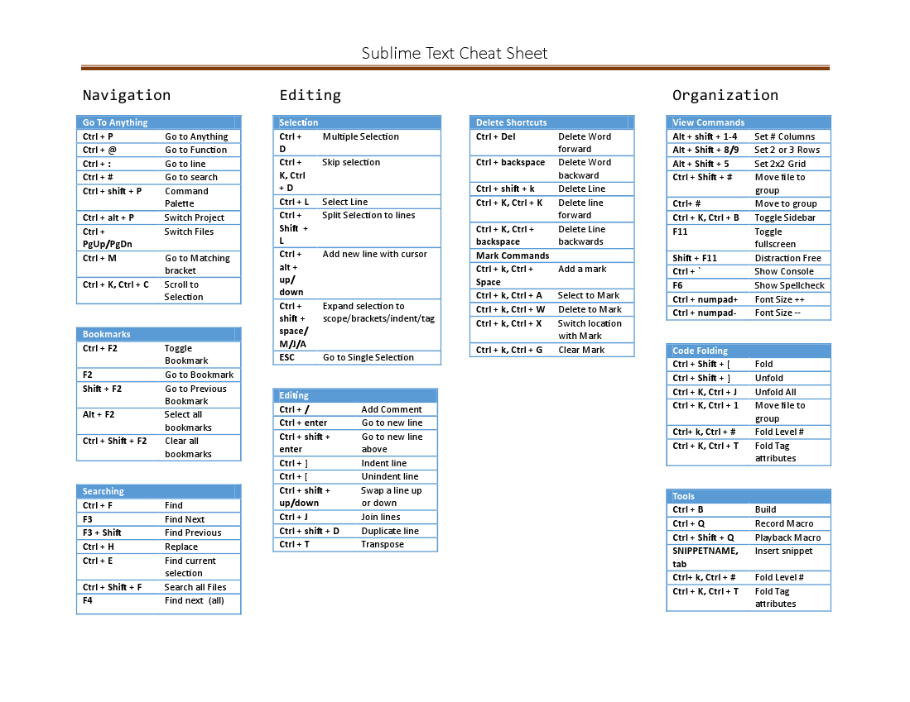

I'm starting a new series of posts on Sublime Text, and how to get the most out of the editor.
The series will be focused on Javascript development, as that is how I use Sublime Text, but it
should be applicable to any developer who uses Sublime Text as part of their workflow.

 * [Sublime Text For Javascript: Keyboard Shortcuts][keyboard]
 * [Sublime Text For Javascript: Configuration][configuration]
 * [Sublime Text For Javascript: Packages][plugins]

## Keyboard Shortcuts

##### Update: Get a [printable cheat sheet here](https://github.com/ben336/benmccormick_blog_posts/blob/master/images/post_images/sublime_cheatsheet.pdf?raw=true))

When you've gotten comfortable with a quality text editor, it should really be unnecessary to
move your hands off the keyboard. Sublime Text gives you a ton of power without ever touching
your mouse.  It takes a little while to get up to speed with its way of doing things, but the
more you use these shortcuts, the more you want to use Sublime Text.

**Note: I will be using windows based commands for these examples.  In general they are the same for linux, and similar for OSX, with command replacing ctrl, and alt replacing shift in some cases.**

### Navigation

#### Ctrl + P  (Go To Anything)

We're starting with the best here.  Ctrl + P opens up "Go To Anything".  This allows for
fuzzy search with Google Instant style results from among all open files and files in your current project.

So you could start typing "mpag" and the editor would instantly load up mainPage.html into your editor pane, while showing a list of possible hits in your command palette, with a score next to them showing the confidence level of the match.  The speed of this feature is amazing.

The real power of Go To Anything though comes when you combine it with subcommands.
Go To Anything supports 3 subcommands

* __@__ - this lets you specify a function within the file that you want to go to.  This can
also be fuzzy-matched, so chb@setbg might take you immediately to the setBackground
method of the chartbuilder.js file.
* __:__ - this lets you go to a line by number.  So chb:100 will take you to line 100 of chartbuilder.js
* __\#__ - this lets you search for a string in the file so chb#extend will take you to
the first occurence of "extend" in Chartbuilder.js.

You can also use these subcommands by themselves (Ctrl+ subcommand) to navigate within the current file.

After you've found the location you want, you can hit enter and begin editing immediately.

#### Ctrl + alt + P (Switch Project)

Sublime Projects are a powerful way to organize your work.  Switching projects allows
you to instantly open all windows that you had left open the last time you used the project.
This gives you the ability to instant switch between work-items without losing momentum
getting things set up the way you want.  ctrl + alt + P lets you switch projects within
your current window.

#### Ctrl + shift + P (Command Palette)

Sublime's Command Palette probably deserves its own article.  But in essence this
is the easiest way to control plugins, and also holds shortcuts for several of the lesser used
commands like setting syntax and controlling bookmarks.

#### Ctrl + PgUp, Ctrl + PgDown (Switch Files)

These let you switch between your open files.  There are also Ctrl+tab and Ctrl+shift+tab, which are listed as
next file in stack and previous file in stack.  I have seen no difference between the behavior of these two
sets of commands.  If anybody knows the difference, please enlighten me in the comments.

#### F2 and variants (Bookmark Commands)

Sublime Texts bookmarks make it easy to move to predetermined locations in the file.  Bookmarks are set to a specific location in the file. There are several shortcuts associated with them.

* __Ctrl + F2__ - Toggles a bookmark from the current location.
* __F2__ - Go to next bookmark
* __Shift + F2__ - Go to previous bookmark
* __Alt + F2__ - puts a cursor at each bookmark location
* __Ctrl + Shift + F2__ - Clear all bookmarks

#### Search Commands

Sublime Text has a fairly standard set of search commands, with a few special twists

* __Ctrl + F__ - Search
* __Ctrl + Shift + F__ - Search in other files (gives a listing of all findings in a new file, you can use f4 to iterate over the results within their files)
* __F3__ - Find Next
* __Shift + F3__ - Find Previous
* __Ctrl + H__ - Replace
* __Ctrl + E__ - Search for current selection

#### A few more minor shortcuts

* __Ctrl + M__ - Go to a matching bracket.  Goes to the end of the innermost set of brackets if not currently on a bracket.
* __Ctrl + K then Ctrl + C__ - Scrolls to move cursor to center of the screen

### Selection and Multiple Cursors

One of the most powerful features of Sublime Text is its ability to easily select and manipulate text, especially
the way it can use multiple cursors simultaneously

#### Ctrl + D (Multiple Selection)

One of the cooler features of sublime text is its multiple selection option.  When you have some selected text,
entering Ctrl+D selects the next instance of that selection.  You can do this repeatedly.  If you want to skip an instance
you can just hit Ctrl + K and then Ctrl + D again.  You can then edit all of the selections together, or use the multiple selections to make further changes.  The Esc key lets you go back to a single selection.

#### Ctrl + L (Select Line)

I use this one all the time.  Allows you to select the entire line the cursor is on.  Combined with Ctrl + D you can select
every line a selection appears on.

#### Ctrl + Shift + L (Split Selection into lines)

Splits a multiline selection into individual line selections, giving you a cursor for each line

#### Ctrl + alt + Up/Down (Add a new line with a cursor)

Adds a new line above or below the current line with an additional cursor at that line.
Lets you quickly start multiple lines with the same content

#### Ctrl + D Select Current Word

Expands the selection to the current word

#### Ctrl + Shift + Space - Expand selection to current block

The name of this feature in Sublime Text is "Expand selection to current scope",
but thats misleading for javascript, which does not have block scope.  There are
a few more of these commands, but this and Ctrl + Shift + M (which appears to behave identically)
are the relevant commands for Javascript.  Ctrl + Shift + A expands to tag for HTML.

### Editing

#### Ctrl + / (Add Comment)

If you add a shift it makes a block comment.

#### Ctrl + Enter (Move to a new line)

Moves to a new line below the current line.  Ctrl + Shift + Enter moves to a new line above the current line

#### Delete shortcuts

* __Ctrl + del__ - Delete word forward (removes the rest of the word from cursor)
* __Ctrl + backspace__ - Delete word backward
* __Ctrl + Shift + K__ - Delete Line
* __Ctrl + K, Ctrl + K__ - Delete Line forward
* __Ctrl + K, Ctrl + backspace__ - Delete line backwards

#### Mark Commands

* __Ctrl + k then Ctrl + space__ - Add a mark
* __Ctrl + k then Ctrl + A__ - Select to mark
* __Ctrl + k then Ctrl + W__ - Delete To mark
* __Ctrl + k then Ctrl + X__ - Switch Location with mark
* __Ctrl + k then Ctrl + G__ - Clear Mark

#### Some Quickies

* __Ctrl + ]__ - Indent a line
* __Ctrl + [__ - Unindent a line
* __Ctrl + shift + up/down__ - Swap a line upwards/downwards
* __Ctrl + J__ - join line with next line
* __Ctrl + Shift + D__ - Duplicate line
* __Ctrl + T__ - Transposes the letter/word prior to the cursor with the one after.  I've never actually found a use for this in my js coding.

### Finding The Power

Of course the real power of these shortcuts happens when you start using them for real things and combining them together.
Here are a few real life examples of ways sublime text can speed up everyday javascript coding.

#### Creating a Javascript array from a CSV

If you have a CSV full of data that you want to convert into a 2d js array, you can simply select the whole area,
use Ctrl + Shift + L, hit end to move to the end of the lines, insert a "]," then hit home and add "[" to the start of each line.
Finally hit escape, then [ to surround the selection with brackets.  Finally hit the right arrow to move to the end of the selection
and move back to delete the trailing comma.  The whole transformation can be done with 10 keystrokes.

#### Renaming a variable or function

This is an obvious one, but Ctrl + D allows you to easily select every instance of a selection.  You can switch over "false positives" with Ctrl+K, Ctrl+D

#### Code Formatting

Want to move your curly brackets to a new line after the expression?  Ctrl +D all "){" instances then move left and enter.  You can move it back by selecting the plain { and using backspace, though you may need to skip some.  Fixing indentation is easy with Ctrl + [ and ctrl + ].

#### Editing in 2 functions

If you're working on 2 functions, bookmarks can be great ways to easily navigate back and forth between 2 (or more sections of code)

### This is just the start

Sublime Text is what you make of it.  If you use it regularly I suggest that you learn to use it well.
You don't need to learn all the shortcuts, but find a few that work for you and make you a faster, more efficient coder.

If you have suggestions for other great uses of keyboard shortcuts in Sublime Text, please leave them in the comments.

[keyboard]: http://benmccormick.org/2012/12/30/sublime-text-for-javascript-keyboard-shortcuts

[configuration]: http://benmccormick.org/2013/01/01/sublime-text-for-javascript-configuration

[plugins]: http://benmccormick.org/2013/01/03/sublime-text-for-javascript-plugins
