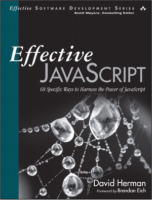

After seeing some positive early reviews, I went to Amazon last week and bought "Effective JavaScript" by David Herman.  I'm glad that I did.  The book is a great experience for anyone who wants to deepen their understanding of the JavaScript language in a practical grounded fashion.

### Whats the book like?

The subtitle of the book, "68 Specific Ways To Harness The Power Of JavaScript", gives you a hint as to what it will be like.  The book contains 68 best-practice"items", each an imperative sentence (Prefer Primitives to Object Wrappers, Get comfortable using Higher-Order Functions), divided into 7 chapters (Accustoming yourself to JavaScript, Variable Scope, Objects and Prototypes,  Arrays and Dictionaries, Library and API design, Concurrency).  Each of these items contains an in depth examination of why it is a best practice.  You could read through the table of contents and get something out of the book, but the heart of this book is the way that the author fully digs into each best practice, explaining not only why its a good idea but also what the exception cases are, and why it might be a good idea to break the rule.  The way the discussion of language attributes is grounded by the practical imperative statements, combined with the clear and concise explanations of the author makes everything feel extremely relevant.

### Who is the book for?

This is a great book for people who are familiar with JavaScript, and maybe know some of the best practices, but want to deepen their understanding of how the language works and how to use it better.  This is not a comprehensive reference book, or an introductory text for people just starting with Javascript.  I would recommend <a href="http://www.amazon.com/gp/product/1118026691/ref=as_li_tl?ie=UTF8&camp=1789&creative=390957&creativeASIN=1118026691&linkCode=as2&tag=productjavasc-20">Professional JavaScript for Web Developers</a> and <a href="http://www.amazon.com/gp/product/0596517742/ref=as_li_tl?ie=UTF8&camp=1789&creative=390957&creativeASIN=0596517742&linkCode=as2&tag=productjavasc-20">JavaScript: The Good Parts</a> respectively for those cases.  This book will increase understanding, not knowledge of the syntax or basics.

### What is good about the book?

The layered explanations are fantastic.  On the top layer the author gives you the **specific** best practices, then follows that with an explanation of the underlying reasons for these practices, gives examples of them in action, and following up with any cases where it might be best to use a different method.  The book communicates clearly and concisely about complex subjects.  The payoff is understanding.

### What is not so great?

I felt the chapter on Library and API design was significantly weaker than the rest of the book.  Perhaps it's because I'm not currently working on building a library, but these chapters felt less like deep explanations and more like quick writeups to justify the stating of the best practices.  The depth of the other explanations was not there.

### Want to buy it?

Its available on <a href="http://www.amazon.com/gp/product/0321812182/ref=as_li_tl?ie=UTF8&camp=1789&creative=390957&creativeASIN=0321812182&linkCode=as2&tag=benmccormicko-20&linkId=HOPC6ZNKSVMH3NZ7">Amazon</a>
.

[zakaspro]: http://www.amazon.com/Professional-JavaScript-Developers-Nicholas-Zakas/dp/1118026691/ref=sr_1_1?ie=UTF8&qid=1357524131&sr=8-1&keywords=zakas+javascript

[goodparts]: http://www.amazon.com/JavaScript-Good-Parts-Douglas-Crockford/dp/0596517742/ref=sr_1_1?s=books&ie=UTF8&qid=1357524224&sr=1-1&keywords=javascript+the+good+parts

[pearson]: http://www.informit.com/store/effective-javascript-68-specific-ways-to-harness-the-9780321812186

[amazon]: http://www.amazon.com/Effective-JavaScript-Specific-Software-Development/dp/0321812182
