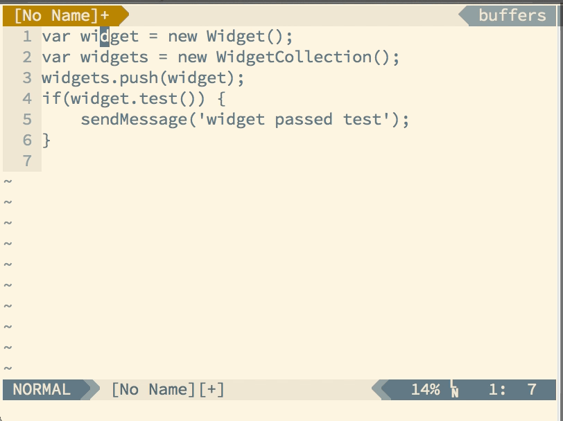

How do you feel about being efficient?  If you're reading this blog, I bet you like it.  What if I told you your text editor could help you cut the amount of time you spend typing in half, with just a little reading and a bit of practice?  For you Vim users, it's very possible that you're spending way more time typing than needed.

The software developers reading this have probably heard of the *Don't Repeat Yourself* principle.  Developers want to avoid duplicating work, and try to write each distinct meaningful chunk of code only once.  DRY is extremely powerful when it comes to code, but it's also a very useful principle in text editing.  Much of the editing work we do is extremely repetitive. Vim can help you remove those inefficiencies.

If Vim's composable commands are the [language of Vim][language], then repeating commands are it's art.  For pretty much any thing you do in Vim, there are ways to automate and repeat it.  These "repeating commands" are powerful tools, but it's not always easy to know what to do with them.  There aren't simple rules you can learn for when to use repeating commands.  Instead it takes practice, awareness, and experience.  

All of Vim's commands are designed to be repeatable and undoable.  So if you find yourself typing something a lot, there is likely to be a good solution for making it easier and faster.  I'm going to lay out the tools for doing that, along with a few hints for knowing when to use them.

#### Repetition Basics: The dot command

The most important Vim tool for repetition is the dot command.  Pressing `.` at any time will repeat the last native command you used in Vim.  How is this useful?  Let's say we're faced with the following code

```javascript
var widget = new Widget();
var widgets = new WidgetCollection();
widgets.push(widget);
if(widget.test()) {
    sendMessage('widget passed test');
}
```

If we want to rename the `widget` variable to be more informative, how could we go about it? We'll ignore "language-wise" refactoring solutions, like [ternjs][tern], and look at the basic Vim options.  

A simple find and replace causes problems.  We can't distinguish between the widget we want and other occurences.  `:%s/widget/testWidget/g` results in plenty of unwanted changes.

```javascript
var testWidget = new Widget();
var testWidgets = new WidgetCollection();
testWidgets.push(testWidget);
if(testWidget.test()) {
    sendMessage('testWidget passed test');
}
```

It might be possible to find a complex regex that only hit the variables we want, but thats suddenly a lot of thought for what should be a simple change.  We could go one by one and knock out each word one by one.  But that would be a lot of repeated typing of `testWidget`.  So what can we do?

The dot command is a nice solution.  If we start on the first occurence of `widget`, we can use `ciw` to replace the current word with new text.  When we've added our new text and exit insert mode, we'll have a *command*, which we can then repeat with `.`. After that we can move to the next occurence we want to change and hit `.` to replace it without retyping the variable name.  If we accidentally use it in the wrong place, it's easy to undo with `u`.

Of course it would still be a pain to navigate between each widget with hjkl.  Fortunately, Vim has more commands that allow us to avoid unecessary work.  If we start on one instance of `widget`, we can use `*` to search for all occurences of that word.  We can then use `n` to move from occurence to occurence. If we overshoot and go too far, we can use `N` to go backwards.  So if we start with `*` (shift+8 in the gif below) and then use ciw to replace the word, we can then use `n` and `.` to clean up the other widgets in only 5 keystrokes.



#### The Vim Way

If you're used to another editor, I'm guessing you're justifiably a bit skeptical at this point.  After all, this example is something people do all the time, and many editors have tools to make it easy (multiple selections in Sublime Text and refactoring tools in language specific IDEs like Eclipse for instance).  They may take even fewer keystrokes than Vim. And they don't require you to learn 6 separate commands to use well.  So what's so special here?

Let's have a quick refresher on the philosophy of Vim.  Like the Unix ecosystem it came from, Vim provides **small**, **composable** tools that you can combine to create powerful actions.  The power isn't in a specific use case.  Instead it comes from the range of possibilities that open up when we start mixing and matching the code.  As with verbs, movements, and text objects, repeating commands and their corresponding reverse commands are tools we can add to our toolbox.  Using the commands above and some of the other composable commands from my [language post][language], we can do some cool things.

We can:

- Search through json files and selectively remove lines that contain an attribute we don't want to use (start on the attribute, `*`,`dd`, then use `n` and `.` repeatedly to select lines to delete)
- Replace a long, hard to type function name throughout the document with another version without having to type out the function name (start on the function name, `*`,`:%s//<newname>/g`)
- Fix poorly indented lines using the `.` command (`>>` or `<<`, `.` repeatedly, `u` to undo if you go too far. This can easily be used on groups of lines using visual mode too)

What do all of these have in common?  They all use a command once, and a movement at most once, then allow for as much repetition as you like.  In [Practical Vim][practicalvim], Drew Neil encourages actively thinking about making your actions repeatable.  In many scenarios, once you've made a change and movement once, you can then get by with a single keystroke for each future action and movement, with another keystroke available to cancel an action if you go too far.  Here's a partial list of repeating commands, with the corresponding cancel command to undo them.

<table>
<tr><th>Repeating Command</th><th>Purpose</th><th>Canceling Command</th></tr>
<tr><td>.</td><td>Repeat the last normal mode command</td><td>u</td></tr>
<tr><td>n</td><td>Repeat the last Search</td><td>N</td></tr>
<tr><td>;</td><td>Repeat the last character-wise search</td><td>,</td></tr>
<tr><td>/<replacement>/</td><td>Repeat the last search</td><td>N/A</td></tr>
<tr><td>@:</td><td>Repeat the last ex-mode command</td><td>N/A</td></tr>
<tr><td>@@</td><td>Repeat the last Macro used</td><td>u</td></tr>

</table>

None of these commands are all that useful on their own, but they're each valuable things to learn as you build up your Vim toolbox. Focus on one or two to start, and learn to make edits so that you can easily repeat them. The art of Vim is learning to look for those opportunities, and crafting your commands so that they're short, powerful, and repeatable.

---

### More Resources

- Some of you are probably confused that I wrote a whole post on repeating commands in Vim with only one side-reference to Macros.  Macros are Vim's DRY power tool, and different enough from the rest of these commands that I didn't want to lump it all together.  But for those interested, Drew Neil has a [great screencast][vimcastsmacro] on how to build a good Vim macro.
- On a similar note, Drew's book [Practical Vim][practicalvim] is the best guide I've found on making good use of repetition in Vim.  I learned plenty of the stuff in this article from that book.  For those who don't want to pay, I'm currently giving [new subscribers a chance to win 2 copies of the book][giveaway].  You can also see more about repetition from Drew online at [Vimcasts][vimcastsrep].
- Tim Pope has published a plugin that allows you to extend the dot command to work on arbitrary user commands.  It also works out of the box with many of his other plugins.  You can see it on [Github][repeatvim].

[dry]:http://en.wikipedia.org/wiki/Don't_repeat_yourself
[language]:http://benmccormick.org/2014/07/02/learning-vim-in-2014-vim-as-language/
[vimcastsrep]:http://vimcasts.org/categories/repetition/
[practicalvim]:http://www.amazon.com/gp/product/1934356980/ref=as_li_tl?ie=UTF8&camp=1789&creative=390957&creativeASIN=1934356980&linkCode=as2&tag=benmccormicko-20&linkId=FE3JFKHYVRYCUOVS
[vimcastsmacro]: http://vimcasts.org/episodes/converting-markdown-to-structured-html-with-a-macro/
[repeatvim]:https://github.com/tpope/vim-repeat
[giveaway]:http://benmccormick.org/2014/07/11/new-twitter-feed-and-practical-vim-giveaway/
[tern]:http://ternjs.net/
