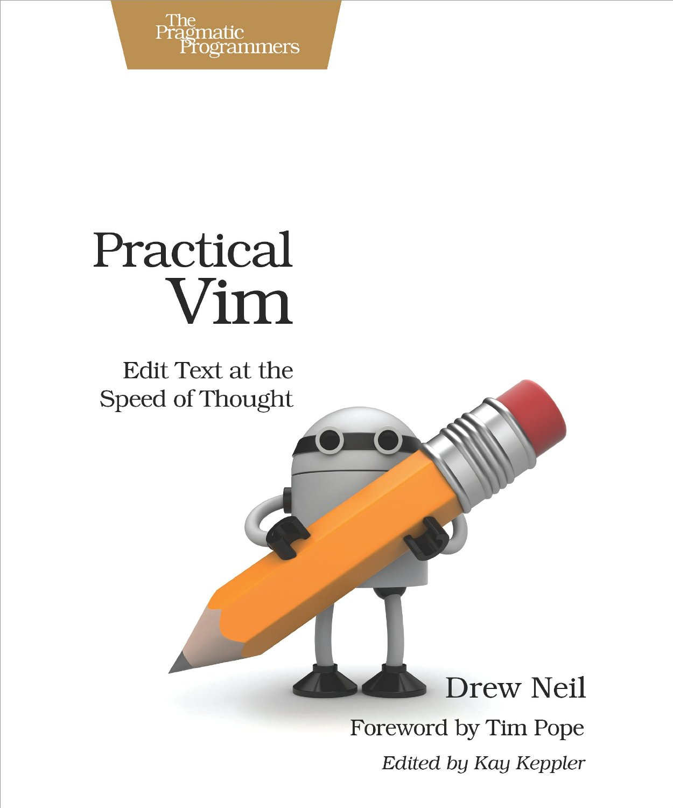

I've got a few orders of site business to deal with today.  First, there's a new way to subscribe to the site.

### New Twitter Feed

The new feed, [@benmccormickorg][twit], will be a Twitter "RSS Feed" with all of the posts from this site. It's just another option for people who want to subscribe, along with [RSS][rss] and my [mailing list][mail].  You can also find my personal account at [@_benmccormick](http://twitter.com/_benmccormick).

<a href="https://twitter.com/benmccormickorg" class="twitter-follow-button" data-show-count="false" data-lang="en">Follow @benmccormickorg</a>

### Practical Vim Giveaway

To go along with that, and as a thanks for all of the great interest and feedback I've gotten for my posts on Vim recently, I'm going to be giving away 2 copies of Drew Neil's book, Practical Vim.

[Practical Vim][pv] is the best resource on Vim I've found.  Drew Neil is the creator of [vimcasts][vc], the popular online Vim site.  And this book is his attempt to explain what makes Vim special.  It's bursting cover to cover with practical tips and tricks to help you become a more efficient writer and developer.  Reading it helped me understand the philosophy behind Vim, and I would recommend it for anyone who uses Vim or thinks they might want to.  There's a reason I recommend it as the Vim resource on my [reading list][rl].

So how do you get a copy?  There are a few ways

1. Follow [@benmccormickorg][twit] on Twitter
2. Subscribe to my [mailing list feed][mail].
3. Tweet a link to one of my *Learning Vim* posts, with the hashtag **#learningvim**

You can accumulate up to 3 entries by doing each of the above (I won't count multiple tweets for the 3rd).  The giveaway will end July 25th, at which time I'll pick 2 winners at random, and get in touch through Twitter or email.  If you have questions or concerns, feel free to speak up in the comments. Otherwise, go subscribe and win a chance to get a great book for free!

[pv]:http://www.amazon.com/gp/product/1934356980/ref=as_li_tl?ie=UTF8&camp=1789&creative=390957&creativeASIN=1934356980&linkCode=as2&tag=benmccormicko-20&linkId=FE3JFKHYVRYCUOVS
[rl]:http://benmccormick.org/readinglist/
[twit]:http://twitter.com/benmccormickorg
[mail]:http://eepurl.com/WFYon
[rss]: http://feedpress.me/benmccormick
[vc]: http://vimcasts.org/
