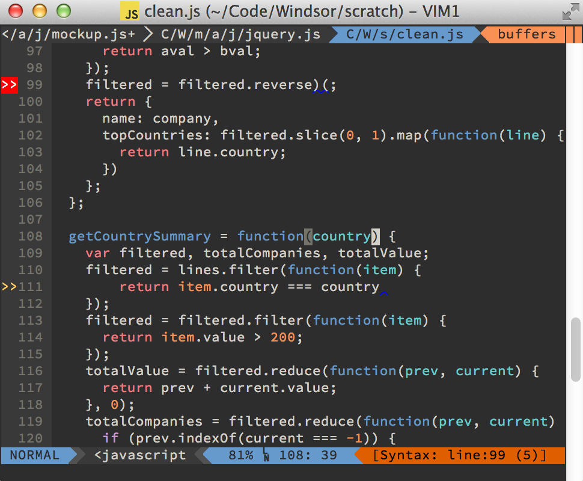
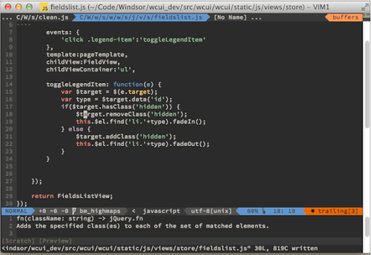

The coding workflow for JavaScript developers gets better all the time.  Over the last 10 years, the JavaScript ecosystem has built up a rich set of tools to make your life easier.  Most of the buzz around tooling comes from browser devtools and the various build systems available for JavaScript projects, but you can also take advantage of improved tools within your code editor.  While there are some great IDEs for JavaScript development out there like WebStorm and Visual Studio, most JavaScript developers seem to prefer lighter-weight text editors.  So this post is going to be a quick look at the tools I use for more seamless JavaScript development in a text editor.

### Basics

Before we get to anything JavaScript specific, there are a few important things to set up.  First, I'm assuming that you're using a modern, extensible text editor. Those include, but are not limited to: [Sublime Text][sublime], [Vim][vim], [Atom][atom] and [Emacs][emacs]. There is great support for all of the below tips in each of these editors<sup id="fnref:0">[1](#fn:0)</sup>.

In addition you should have

1. Reasonable default configurations<sup id="fnref:1">[2](#fn:1)</sup>
2. A fast system for navigating between files<sup id="fnref:2">[3](#fn:2)</sup>
3. Great code searching<sup id="fnref:3">[4](#fn:3)</sup>

If you're still working through those things, make sure to take the time to learn a bit more about your editor along with any JavaScript specific tools you use.  There's a ton of efficiency you can gain from having those 3 things in place.

Finally the first two tips below require [node.JS][nodejs] and npm to be installed, as they rely on node libraries to function.  If you've never installed those before, the process is pretty painless.

Once you have all of that in place, we can move on to other things.

### Syntax Linting

JavaScript is a dynamic, weakly-typed language.  It is also written by human beings.  As a result, it can be easy to start running bad code without realizing that it has problems.  Some types of problems you'll find out about quickly.  Bad syntax will halt program execution for instance.  But others will linger, subtly effecting logic or just making the code hard to understand for future developers (including yourself).   

JavaScript linters (also called syntax checkers) can provide some of the safety of a compiler, and also help enforce a consistent set of styles to help maintain readability.  They are not magic.  JavaScript is still a weakly typed language with some weird syntactical sinkholes. It's relatively easy to make logic mistakes if you're undisciplined.  But linters are a great safety tool, especially for developers newer to JavaScript and its conventions.  Run as part of a build process, they can prevent you shipping bad code and help standardize conventions across a team

While it's a great idea to make linters part of your build process, you get even more power from integrating them with your editor.  Almost all modern text editors include some sort of plugin for displaying syntax errors and warnings in the gutter to the left of the text.  You can check out the integration pages for [ESLint][eslintint] and [jsHint][jshintint] to get a feel for the plugins available for your editor.  



### TernJS + Autocomplete

Linters are great for telling you what not to do, but can't give you much guidance on what you actually are able to do.  Fortunately we have other tools for that.  [Tern.js][ternjs] is a fantastic library that provides "intellisense" style autocompleting for JavaScript code, along with other IDE-like features including documentation links and refactoring support. It's not perfect, since JavaScript's nondeterministic syntax sometimes makes it hard to tell what properties a variable will actually have at runtime, but it takes a good shot at it and is able to go pretty far, especially for libraries where it can expose the full API to you within the editor.  To get the most out of Tern, you'll need to set up a Tern project definition, where you can specify any files that you always want loaded, and any plugins you want to use. The preloaded files is useful if you're making global references to a namespace or library, and the plugins can give you support for module systems, so that you can handle references that are passed into a module from a different file in code using requireJS or Angular.



### Snippets

JavaScript development, especially on the front end, can involve a lot of repetitive boilerplate code<sup id="fnref:4">[5](#fn:4)</sup>.  Whether it's module boilerplate like AMD require/define wrappers, library boilerplate like directive definitions in Angular or a Model definition in Backbone, or our own favorite patterns that we repeat a lot, we end up writing a lot of code over and over again.  Snippets are a great way to accomplish that.  They were one of the key features of Textmate when it first became popular.  Today they're built in to Sublime Text and Atom, and there are popular libraries for both [Vim][ultisnips] and [Emacs][yasnippet] to simulate the same functionality.

Snippets allow you to define templates for common boilerplate code, allowing you to quickly insert repetitive content, including adding hooks for text that will vary across uses.  For instance here's a snippet I have defined for creating a new AMD module<sup id="fnref:5">[6](#fn:5)</sup>.

```
#A new AMD define module
snippet dfn
define([$1],function($2) {
    $0  
});
endsnippet
```

This allows me to type *dfn&lt;tab&gt;* at any time to expand out the template.  Initially my cursor will be in spot `$1`, and I can then enter text and tab to spot `$2`, with my final tab ending me at `$0`.  Snippet libraries can also provide other functionality like functions to show the current time, filename, or other contextual information.   Some can also mirror text so that you can enter a string once and have it appear throughout the template.  It can be a great time saver when you're chugging through the boilerplate code of your project.

---

### More Resources

- If you want to implement JavaScript syntax checking definitely check out [ESLint][eslint] or [jsHint][jshint].  They both offer a lot more options and flexibility than [jsLint][jslint], the pioneer in this area.  It's pretty easy to find an integration plugin for most common editors through those websites or Google, but [Syntastic][syntastic] for Vim and [Sublime Linter][sublimelinter] for Sublime Text come especially recommended and have the advantage of supporting all 3 major JavaScript linters as well as syntax checking for multiple languages.

- [Tern's website][ternjs] has great documentation and links to the editor specific implementations for different editors.  If you're a Vim user I'd also recommend taking a look at [YouCompleteMe][ycm] for an improved autocomplete interface that works well with Tern and UltiSnips.

- For snippet libraries, you can take a look at [UltiSnips][ultisnips] for Vim and [Yasnippet][yasnippet] for Emacs.  If you want an application agnostic snippet solution, [Dash][dash] is a documentation management program for OSX that also has a rich snippet component you can use in any program the same way you'd use an editor specific solution.


<div class="footnotes">
<ol>
    <li class="footnote" id="fn:0">
        <p> Other than the lack of an official Tern plugin for Atom
        <a href="#fnref:0" title="return to article"> ↩</a></p>
    </li>
    <li class="footnote" id="fn:1">
        <p>
        Sublime Text and Atom provide pretty reasonable defaults. Vim users could consider checking out my piece on <a href="http://benmccormick.org/2014/07/14/learning-vim-in-2014-configuring-vim/">configuring Vim</a>.  I don't know enough to advise for Emacs, you're on your own their, but google is your friend.
        <a href="#fnref:1" title="return to article"> ↩</a></p>
    </li>
    <li class="footnote" id="fn:2">
        <p>
        This really deserves a post of its own, not a footnote, but in general my approach to this is fuzzy search, split panes and a way to retrace my movements.   
        <a href="#fnref:2" title="return to article"> ↩</a></p>
    </li>
    <li class="footnote" id="fn:3">
        <p>
        Sublime Text and Atom have reasonably nice built in search tools, but I'd recommend using a plugin that integrates with ack or ag, two <a href="http://benmccormick.org/2013/11/25/a-look-at-ack/">very nice search tools</a>.  I don't see such a plugin for Atom on their repository site right now, but the other 3 certainly support it.
        <a href="#fnref:3" title="return to article"> ↩</a></p>
    </li>
    <li class="footnote" id="fn:4">
        <p>
        Hopefully not too much obviously
        <a href="#fnref:4" title="return to article"> ↩</a></p>
    </li>
    <li class="footnote" id="fn:5">
        <p>
        This is using the syntax for Vim's Ultisnips plugin.
        <a href="#fnref:5" title="return to article"> ↩</a></p>
    </li>
</ol>
</div>

[nodejs]: http://nodejs.org/
[eslintint]: http://eslint.org/docs/integrations/
[jshintint]: http://www.jshint.com/install/
[ultisnips]: https://github.com/SirVer/ultisnips
[yasnippet]: https://github.com/capitaomorte/yasnippet
[syntastic]: https://github.com/scrooloose/syntasticsu
[sublimelinter]: https://github.com/SublimeLinter/SublimeLinter3j
[jslint]: http://www.jslint.com/
[jshint]: http://www.jshint.com/
[eslint]: http://eslint.org/
[ternjs]: http://ternjs.net/
[sublime]: http://www.sublimetext.com/
[emacs]: http://www.gnu.org/software/emacs/
[vim]: http://www.vim.org/
[atom]: https://atom.io/
[ycm]: https://github.com/Valloric/YouCompleteMe
[dash]: http://kapeli.com/dash
[vim2014]: http://benmccormick.org/learning-vim-in-2014/
