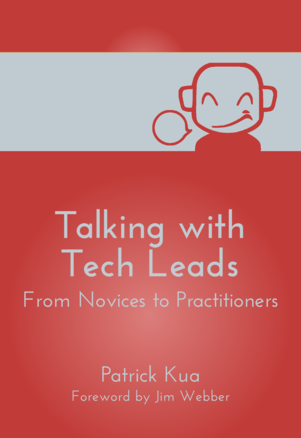

Can we be honest for a moment?  Figuring out a career path is hard for software developers.  Talking to some people, you'll get the impression that we face a pretty bleak binary choice.  Behind door number #1 lies a relatively rapid path to a "senior developer" role, followed by stagnation the rest of your career as you reimplement the same solutions in new technologies for minimally increasing pay over time, until youth-friendly tech culture decides that you're too old to be useful.  Door #2 serves basically as an escape hatch, as you trade the opportunity to work with code for a path into management, where you receive a few more pay raises in return for your soul.

I'm not that cynical, and hopefully not that dramatic, but as a relatively young developer it's been hard to figure out what I want from a career and harder still to know exactly what different options would look like if I got there.  I know that I love technology; at the same time I want to have real influence on the things that I'm building, and in most places it's the product and people challenges that ultimately determine whether software projects succeed or fail, rather than the pure technical ones.  So what does it look like to build a career leading across these different areas? That's the question that [Talking with Tech Leads][twtl] tries to answer.

Talking with Tech Leads is an eBook about what it's like to pursue a middle path between the two sides of the false dichotomy above.  It's structured as a series of interviews with "Tech Leads", which the author defines as [a developer leading a development team][techleaddef].  Each interview shares a series of questions, as well as an open space for interviewees to share more freeform thoughts and advice.

> - What should a Tech Lead focus on and why?
> - What has been your biggest challenge as a Tech Lead?
> - Any time-management tips?
> - How do you strike the right balance between writing code and dealing with other issues?

As you would expect from a series of nearly forty interviews with the same structure, there is plenty of repetition across answers.  Themes emerge quickly: a need to look beyond code for solutions without losing sight of your technical skills, the importance of enabling your team members to succeed, and the need to bridge the communication gap between technical and non-technical participants in a business.  At the same time it's clear that many of these individuals view their roles drastically differently despite superficially similar job descriptions.  Some focus on leading people, some on software architecture, and some on aligning business and technical objectives.  What the interviews expose are a wide and varied set of niches that fall between the traditional "Senior Developer" and "Management" career paths.

I have no idea how this book would read to a seasoned tech lead.  I expect that it would be affirming to see how others have approached similar challenges, but I'm not sure it does a good enough job pulling the various threads from the interview into practical insights to provide much tangible big picture advice for current tech leads.  Instead it would likely be a collection of small useful ideas and nuggets.

For a developer like myself who is still figuring out what it looks like to have a career in this industry though, this book is a tapestry of ideas and possibilities.  I'd recommend it to anyone who's been underwhelmed by the extreme career paths that serve as the "path of least resistance" in some organizations, and want to become leaders without sacrificing their roots.

*You can purchase Talking with Tech Leads as an e-book through [Leanpub][twtl] or as a paperback on [Amazon][amzn]*

[twtl]: https://leanpub.com/talking-with-tech-leads?a=3a4Srv2pP9p87WQ_eoDoGp
[techleaddef]: https://www.thekua.com/atwork/2014/11/the-definition-of-a-tech-lead/
[debug]: http://benmccormick.org/2014/08/19/the-debugging-toolbox/
[amzn]: http://amzn.to/1KQdC90
