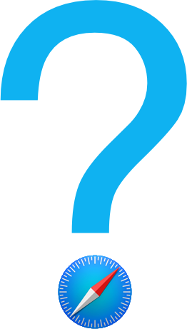

On Twitter yesterday, [Alex Sexton][sexton] surfaced Apple's fact sheet on what's new with Safari 9:

<blockquote class="twitter-tweet" lang="en">
<a href="https://t.co/fVg9U9dEq4">https://t.co/fVg9U9dEq4</a>&#10;&#10;Some ES6 and lots of unprefixed CSS (flexbox!), but I really want Intl, ServiceWorkers, PointerEvents, HTTP2, CSP2…
&mdash; Alex Sexton (@SlexAxton) <a href="https://twitter.com/SlexAxton/status/608017541173284864">June 8, 2015</a></blockquote>

Safari 9 is still in developer preview and won't ship till September or so, so this all could change, but Apple's changelog is underwhelming to say the least.   The developer facing changes in Safari 9 consist of only standardized versions of CSS properties (that were already supported with a prefix), and a handful of ES6 features.

> The following ECMAScript 6 content is now supported by Safari:
>
> - Classes
> - Computed Properties
> - Weak Set
> - Number Object
> - Octal and Binary Literals
> - Symbol Objects
> - Template Literals

*- [Safari Pre-Release notes][safarinotes]*

While it's great to see ES6 support, the truth is that by the time Safari is released in the fall, [Microsoft Edge][edge] will have been released, and Safari 9 will release as (at best) the [3rd most ES6-compliant browser][compat] among the 4 major desktop browsers.  And due to its yearly schedule, it's basically guaranteed to be in last by the end of the year.  At the same time Safari has neglected other APIs like Internationalization, Pointer Events, Web Components, CSS Variables, Service Workers, or ASM.js optimizations, all of which are supported or in progress by each of the other browsers [1](#fn:1).  In addition, Safari's developer tools, which were once best in class, have been slowly falling behind Chrome and Firefox, especially in more advanced performance features.

So does this mean that Safari is the next IE6?  Not so much.  We've come a long way since the IE6 era, and browsers are more standards compliant than ever.  Tools like [Babel][babel] make it easier for developers to participate in the future of the web without being restricted by slow moving browsers or legacy support concerns.   But there's always going to be some browser that serves as the "bottleneck" for what web developers are able to reasonably use in production.  Currently that is older versions of Internet Explorer and old Android browsers.  But as more and more users upgrade to Android phones using Chrome, and Microsoft makes strong pushes to move users to the [evergreen][evergreen] Edge browser, it's quite likely that Safari could take their place.  It is now the only major browser being updated yearly, and with Microsoft's recent re-emphasis on JavaScript and HTML development, Apple is the only major browser vendor who seems to view the web as a second class platform.

Safari is not going away.  Its monopoly status on iOS more or less guarantees that, and on the desktop I've talked to plenty of people who like its simple UI, and others who feel that it's faster or consumes less memory than Chrome and Firefox.  But it will be a sad sight if it gets left behind.  Here's hoping that the final release contains more surprises, and that going forward Apple chooses to embrace the web browser as a platform worthy of the respect and effort its competitors have lavished on it.

<ol>
    <li class="footnote" id="fn:1">
        

        Ok, CSS Variables, Service Workers and Web Components are "under consideration" by IE.
        <a href="#fnref:1" title="return to article"> ↩</a>

    </li>
</ol>

[safarinotes]: https://developer.apple.com/library/prerelease/mac/releasenotes/General/WhatsNewInSafari/Articles/Safari_9.html#//apple_ref/doc/uid/TP40014305-CH9-SW27
[babel]: https://babeljs.io/
[evergreen]: http://benmccormick.org/2013/06/11/evergreen-browsers/
[es6]: http://benmccormick.org/2015/02/22/rauchg-on-es6/
[bbes6]: http://benmccormick.org/2015/04/07/es6-classes-and-backbone-js/
[sexton]: https://alexsexton.com/
[edge]: http://blogs.windows.com/msedgedev/2015/05/12/javascript-moves-forward-in-microsoft-edge-with-ecmascript-6-and-beyond/
[compat]: http://kangax.github.io/compat-table/es6/
