For the past 2 years, ~90% of my coding time has been spent working on a large scale Backbone.js app.  In February 2014, the Backbone community was in a fairly good place.  The core library had reached 1.0 the previous year and had a strong team around it.  Marionette had emerged as a de-facto standard for web applications [^1].  There were Backbone specific plugins for many tasks, and generally gaps could be filled using the jQuery plugin ecosystem, or a framework agnostic library.  At the time, Backbone would have been a very defensible choice as a library for starting a new web development, as a simpler and more stable alternative to AngularJS, the current "hot" framework.

Since then a few things have happened.  First, React has taken off, while Angular and Ember have continued to grow and learn from React and each other. Angular and React have benefited from significant marketing and financial support for a core development team that have helped them grow quickly.  Google Trends gives a pretty good idea of how that has turned out.

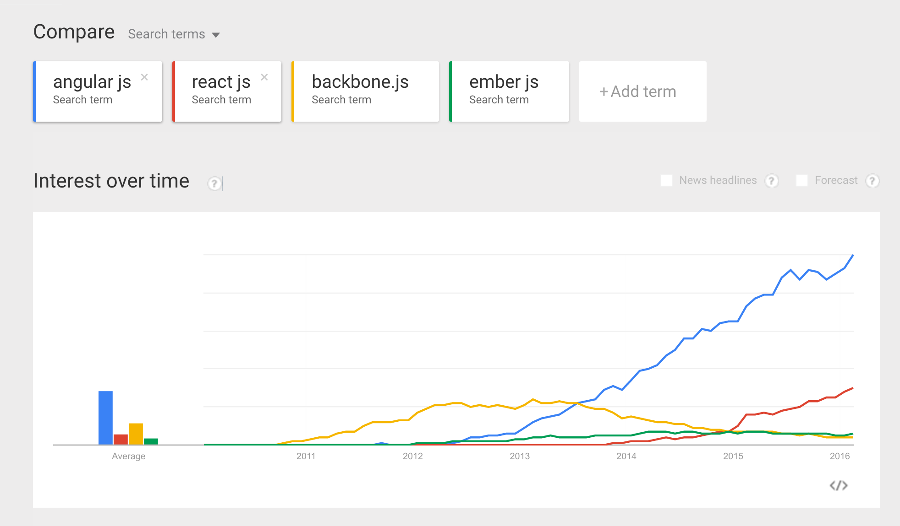

**Update:** *I've changed the above graph from an original that used angular.js, backbone.js, ember.js, and react.js as the search terms.  Only Backbone prefixes itself with a .js that way, and it undersold the other libraries, especially Angular.  I believe that this chart more accurately reflects usage trends.*

Secondly, Backbone's author, [Jeremy Ashkenas](https://twitter.com/jashkenas) made a decision to call Backbone "finished" in terms of API and feature set after the 1.0 release.  This has the advantage of leaving Backbone as by far the most stable major JavaScript framework, but hinders efforts to pull in lessons from other frameworks [^2].

Finally, whether as a result of the first 2 items or due to some other factor, the ecosystem around Backbone has crumbled.  While Backbone's core has stabilized, it still has a team of maintainers who are actively managing the project.  That does not appear to be the case for many of the other libraries in the Backbone ecosystem.  To investigate my perception of this, I decided to look at the contribution graphs of popular Backbone libraries to see the trends over the last 2 years.  I built a list of libraries based on the projects that the bower registry returns for the backbone keyword, looking for projects with at least 400 github stars[^3]. That lead to a list of 24 projects below.

To be clear, I'm not posting this as a criticism of anyone.  Open source is a volunteer effort, and maintaining a project is hard and often doesn't make sense when the author has moved on to other challenges.  This is simply an honest look at where the Backbone ecosystem stands, with the goal of helping those of us who are building Backbone applications or considering using it to evaluate the ecosystem honestly.

### 1. Backbone

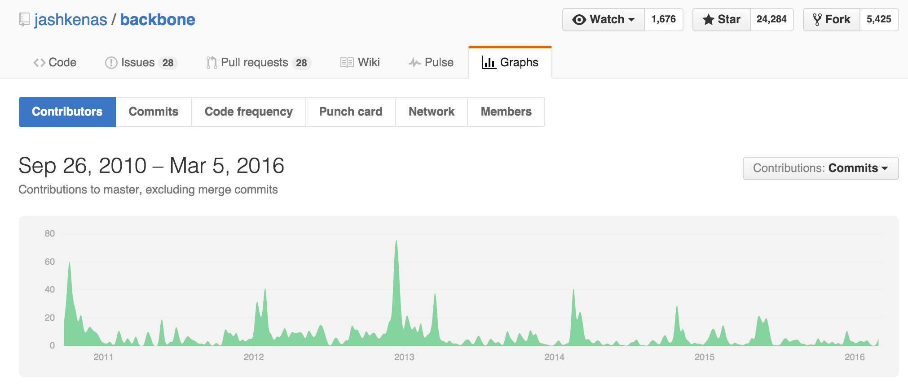

**Open issues:** 54

**Issues closed in 2016:** 50+

**Last Release**: 3 days ago (March 3rd 2016)

I'm starting with Backbone itself to give an idea what a stable mature project graph looks like.  Backbone isn't getting the activity it used to, but there's still a steady flow of bug fixes and documentation updates, and issues are being worked through.

### 2. Marionette

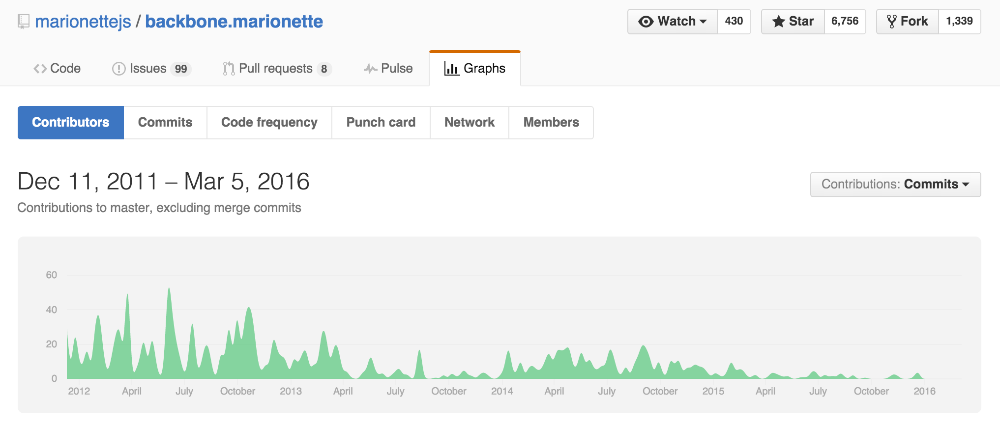

**Open Issues:** 107

**Issues closed in 2016:** 30+

**Last Release**: November 22 2015

Of all the graphs here, this one is the nearest and dearest to me.  I've contributed code to Marionette, and have written about it [many times](http://benmccormick.org/marionette-explained/) on this blog.  Marionette still is seeing plenty of work, but as the contributors have cycled through, work on a long awaited version 3 with important improvements has sat on a branch for over a year.  This is a great library, but it hasn't been immune to the wider issues in the ecosystem.

### 3. Backbone.Relational

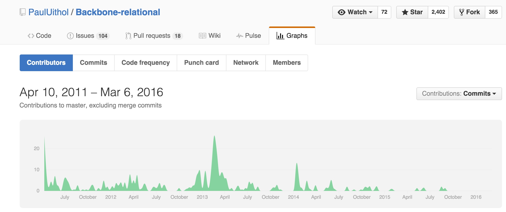

**Open Issues:** 122

**Issues closed in 2016:** 0

**Last Release:** August 19 2015

Backbone.Relational is another "stable" library.  On its own, there's nothing wrong with that, this is a focused library that doesn't necessarily need a lot of new features.  But this is the start of a pattern.

### 4. backbone-forms

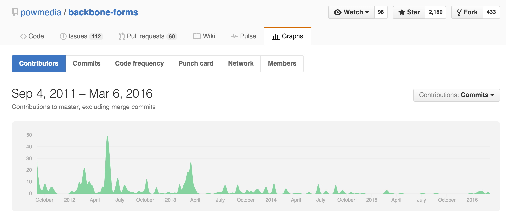

**Open Issues:** 172

**Issues closed in 2016:** 14

**Last Release:** Jan 21, 2016

### 5. backgrid

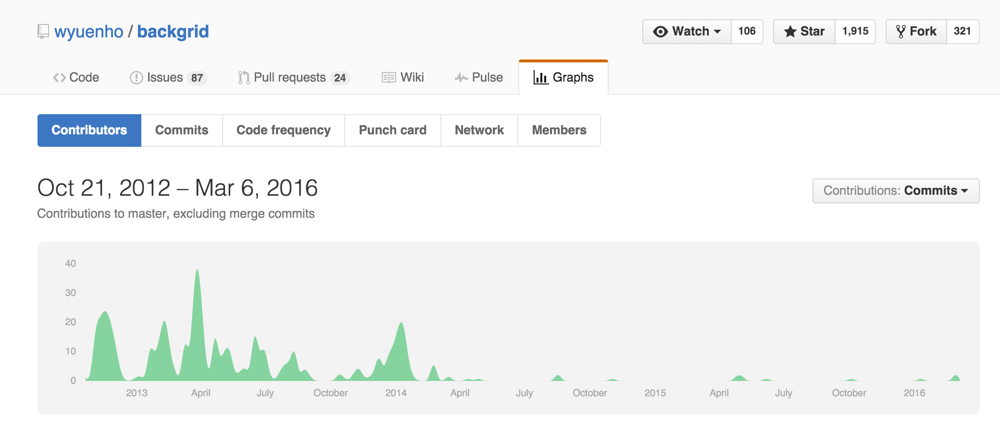

**Open Issues:** 111

**Issues closed in 2016:** 3

**Last Release:** Jan 21 2014

This is the first project on this list that I wouldn't consider to be actively maintained.  Commits over the past 2 years have been primarily about keeping tooling and documentation up to date.

### 6. backbone.localStorage

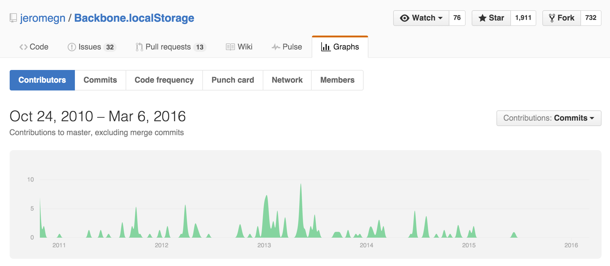

**Open Issues:** 45

**Issues closed in 2016:** 1

**Last Release:** Jan 22 2015

### 7. backbone.stickit

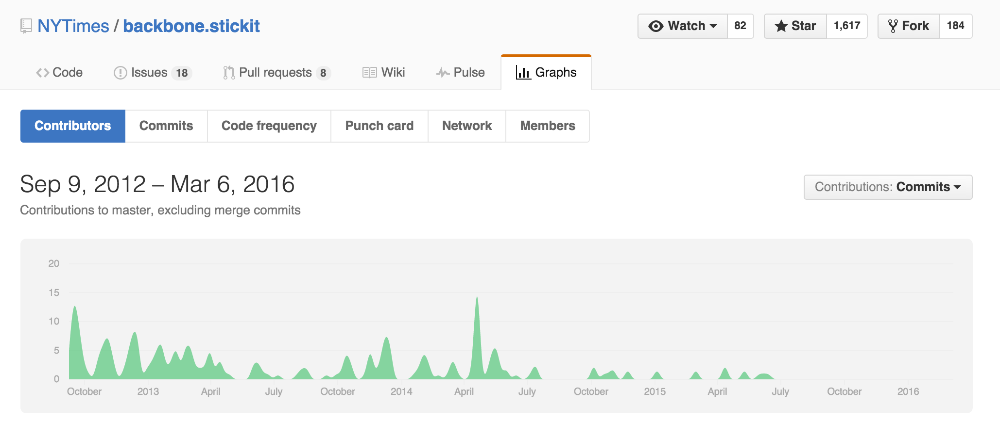

**Open Issues:** 26

**Issues closed in 2016:** 1

**Last Release:** May 11 2015

### 8. backbone.paginator

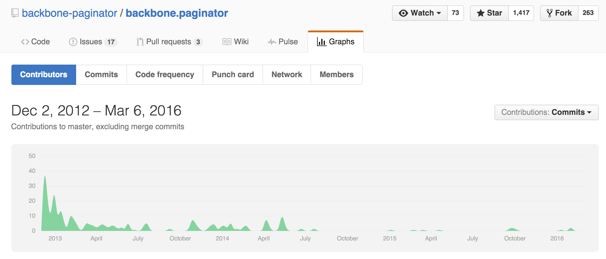

**Open Issues:** 20

**Issues closed in 2016:** 7+

**Last Release:** Feb 3 2016

### 9. Backbone-validation

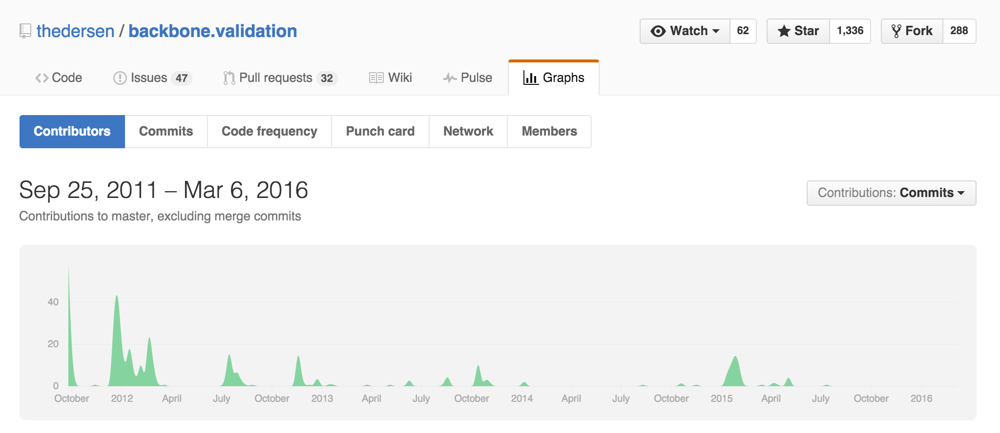

**Open Issues:** 79

**Issues closed in 2016:** 1

**Last Release:** May 8 2015

I have personal experience with the abandoned state of this library since my team has been working off a forked version of it for 6 months while waiting on maintainers to address a [pull request](https://github.com/thedersen/backbone.validation/pull/302).  Like many others here, it appears to be a project that the core team moved on from and nobody else had the motivation or time to pick it up.  While there's nothing wrong with that, it makes it hard to rely on these projects.

### 10. Knockback

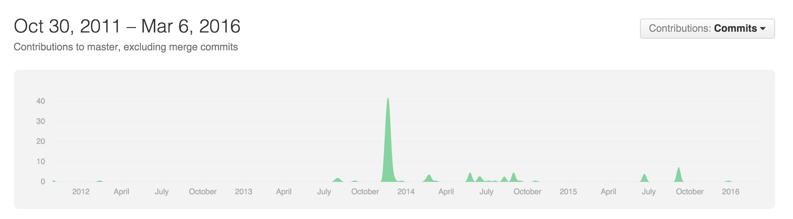

**Open Issues:** 4

**Issues closed in 2016:** 1

**Last Release:** Sep 28 2015

### 11. Exoskeleton

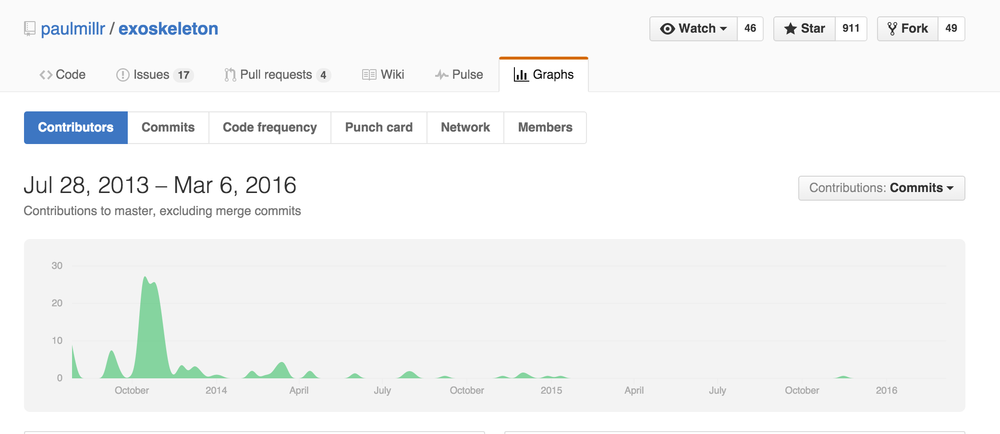

**Open Issues:** 21

**Issues closed in 2016:** 2

**Last Release:** August 4 2014

### 12. Backbone.dualstorage

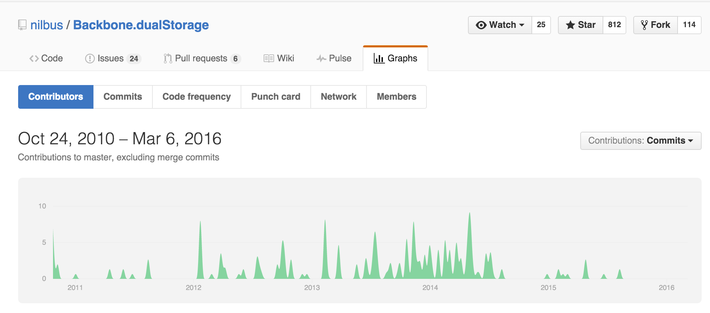

**Open Issues:** 30

**Issues closed in 2016:** 0

**Last Release:** Feb 16 2015

### 13. Backbone-react-component

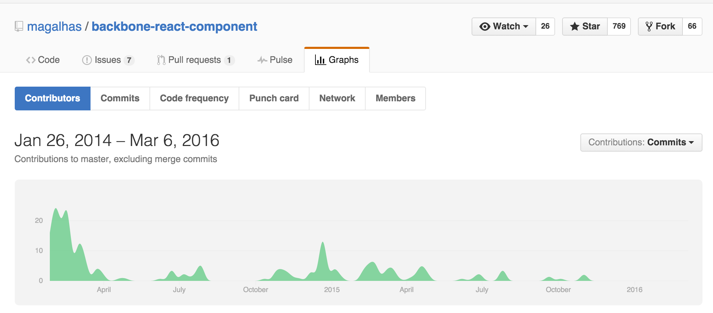

**Open Issues:** 8

**Issues closed in 2016:** 1

**Last Release:** Nov 6 2015

### 14. Backbone-offline

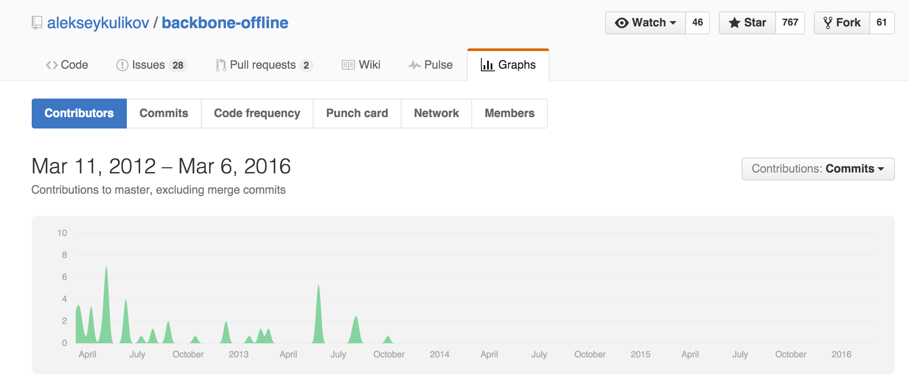

**Open Issues:** 30

**Issues closed in 2016:** 0

**Last Release:** Aug 21 2013

This project is actually documented as being deprecated and discontinued.  There is talk in the README about building a successor library, but it appears to have never emerged.

### 15. React.Backbone

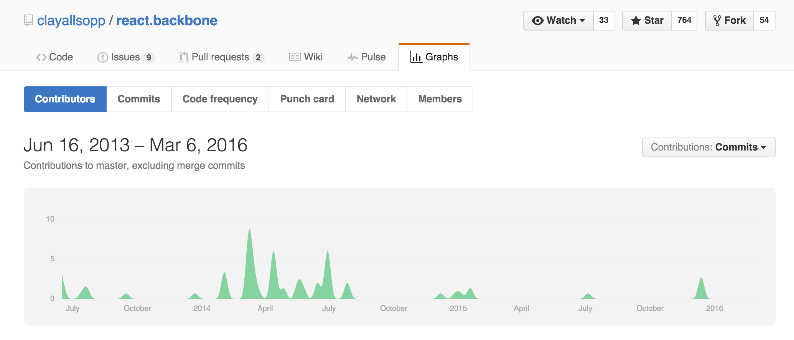

**Open Issues:** 11

**Issues closed in 2016:** 0

**Last Release:** Jan 5 2015

Interesting, and not encouraging, that the 2 newest libraries at this popularity level are both for helping Backbone users migrate to React, and neither appear to be very active.

### 16. Backbone.expoxy

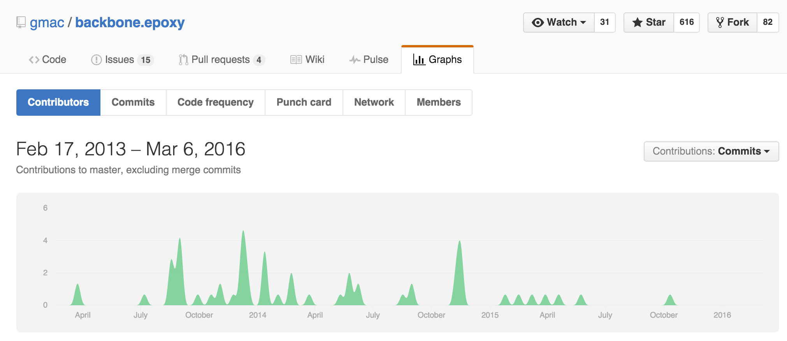

**Open Issues:** 19

**Issues closed in 2016:** 1

**Last Release:** Nov 20 2014

### 17. backbone.iobind

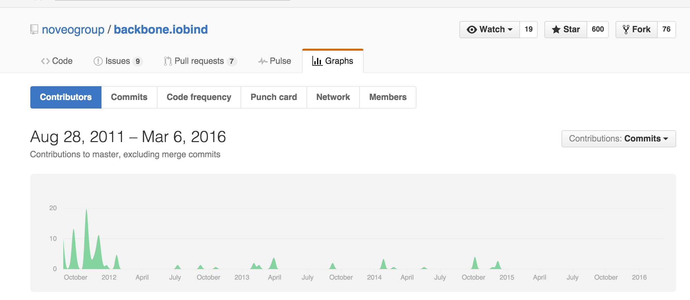

**Open Issues:** 16

**Issues closed in 2016:** 1

**Last Release:** Dec 10 2014

### 18. backbone-associations

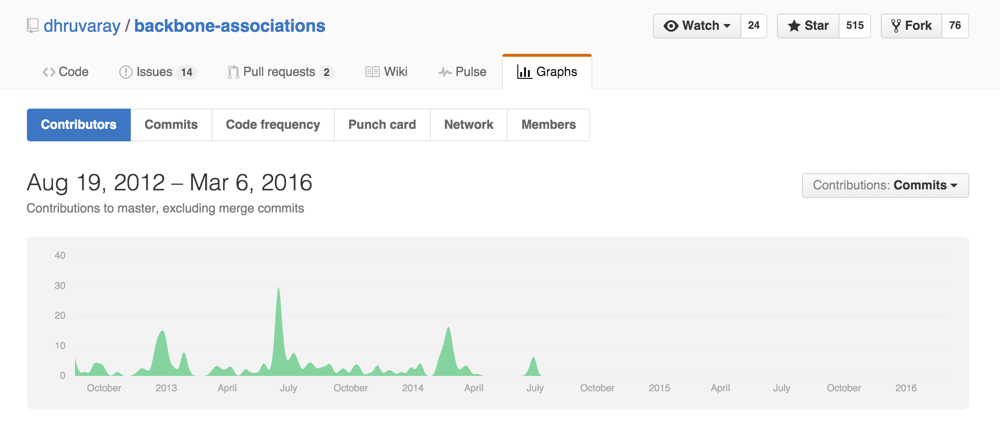

**Open Issues:** 16

**Issues closed in 2016:** 0

**Last Release:** Jun 28 2014

We're really starting to get into the meat of the dead projects now.  While there are always going to be older projects that were once popular and got a lot of stars and are now abandoned, that shouldn't be this many of the top 20 projects

### 19. backbone-tastypie

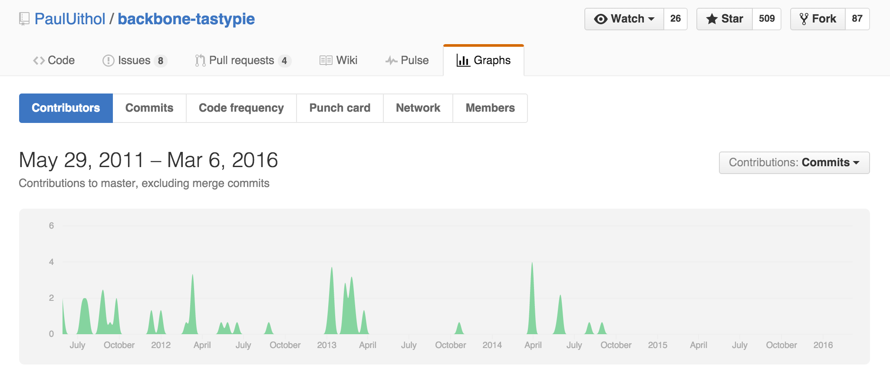

**Open Issues:** 12

**Issues closed in 2016:** 0

**Last Release:** Oct 26 2013

This is a single use case library that presumably was abandoned after solving a problem, but its worth including to illustrate that the 400 star bar isn't that hard to hit. A similar search for React projects on bower yields 46 projects with 400+ stars, and React is only ~3 years old.

### 20. backbone.syphon

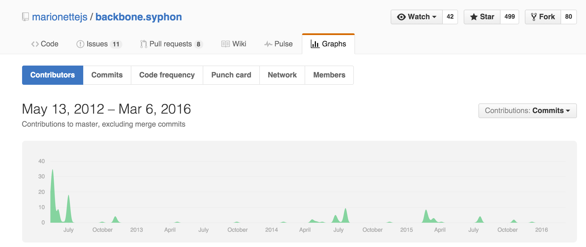

**Open Issues:** 19

**Issues closed in 2016:** 1

**Last Release:** Oct 18 2015

### 21. backbone-nested

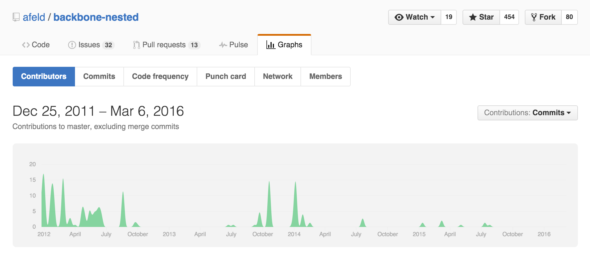

**Open Issues:** 45

**Issues closed in 2016:** 1

**Last Release:** Jul 27 2015

### 22. backbone.radio

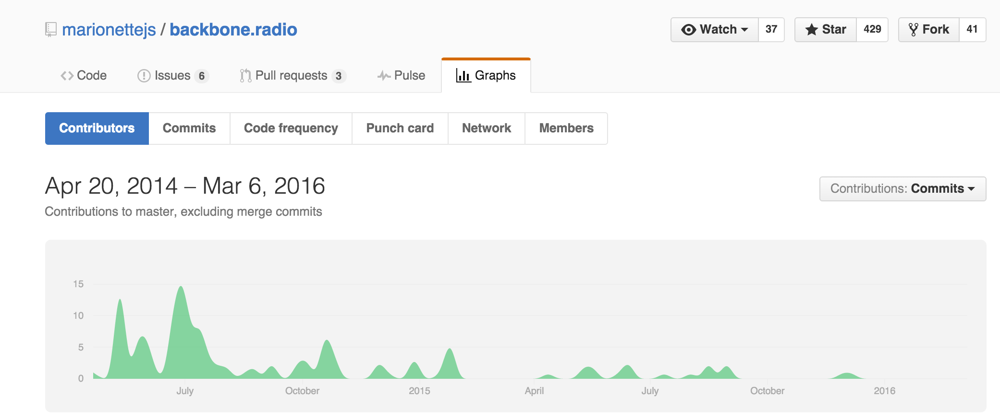

**Open Issues:** 9

**Issues closed in 2016:** 0

**Last Release:** Sep 5 2015

Backbone.Radio (along with Backbone.syphon) is part of the marionette project.  You can see that those projects at least have continued work during the past year, albeit at a significantly less active rate than during 2014

### 23. backbone-fetch-cache

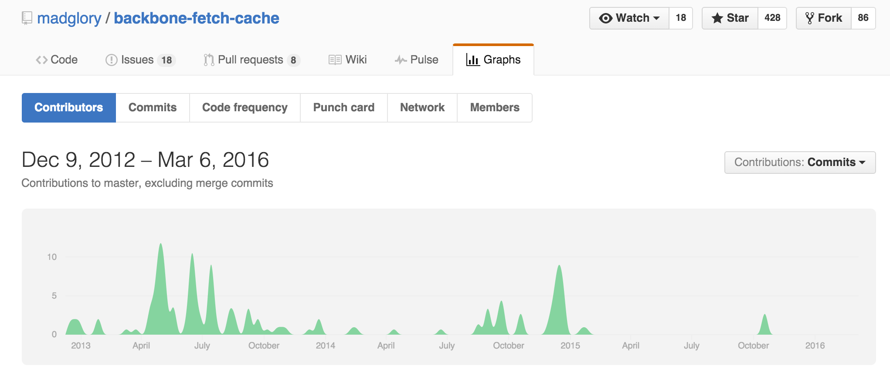

**Open Issues:** 26

**Issues closed in 2016:** 2

**Last Release:** Feb 16 2014

### 24. backbone-query-parameters

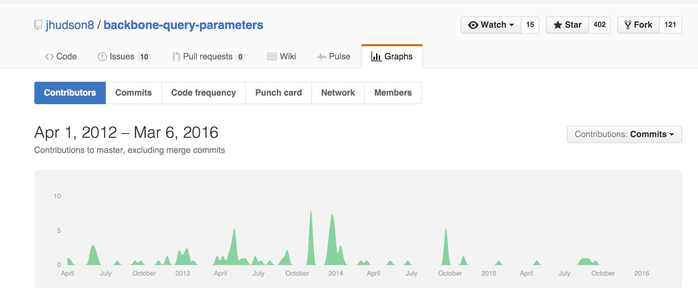

**Open Issues:** 10

**Issues closed in 2016:** 0

**Last Release:** Sep 23 2014

So what does this look like in aggregate.  Of the "top 24" Backbone projects, only 2 were started after January 2014, and one of those is a tool to migrate Backbone projects to React, the other was a rebrand of an existing tool.  18 of the top 24 libraries have not had a release in the last 6 months, 9 have not had a release since December 2014 or earlier.  If we classify these libraries as "Actively Growing", "Actively being developed", "Stable and maintained", "Flickering Signs of life", "All but dead"[^4], and "Dead", I would personally split that out like this:

<table>
<thead>
<tr><th>Title</th><th>Libraries</th><tr>
</thead>
<tbody>
<tr><td>Actively Growing</td><td></td></tr>

<tr><td>Actively Developed</td><td> Marionette</td></tr>

<tr><td>Stable + minimally maintained</td><td> Backbone, Backbone.Relational, backbone-forms, backbone.paginator, Backbone.syphon, Backbone.radio</td></tr>

<tr><td>Flickering Signs of life</td><td> back grid, knockback,</td></tr>

<tr><td>All but Dead</td><td> backbone.localstorage, backbone.stickit, backbone-validation, exoskeleton, backbone.dualstorage, backbone.react-component, react.backbone, backbone-nested, backbone-fetch-cache, backbone-query-parameters</td></tr>

<tr><td>Dead</td><td> backbone.offline, backbone.iobind,  backbone.epoxy, backbone-associations, backbone-tastypie</td></tr>
</table>

It is not a pretty picture right now.  If you're part of the Backbone community, I'd love to hear from you on this.  Should we be calling Backbone dead and looking to migrate ASAP?  Do you think I'm overselling this problem?  Are there libraries that I'm not considering right now that are thriving?  Or is focusing on Backbone-specific libraries a mistake because most developers are pasting together multiple libraries that aren't necessarily tightly tied.

[^1]: When I attended BackboneConf later that year, about 75% of attendees raised their hands when asked if they had used Marionette
[^2]: Some ideas, like a better router or better templating systems, can be pulled in as 3rd party libraries just fine.  But conceptual changes like 1 way data flow or easily composable components from React and the ES6 class model can't easily be pulled into Backbone without changes to the core library.  It's debatable whether those ideas are useful for Backbone, but it is clear that they will not fit within the current state of the library.
[^3]: I used Bower rather than npm because it returns search results sorted by stars rather than trying to directly match the query.
[^4]: I don't like calling somebody else's project dead if its not labeled that way and has had recent issues activity
