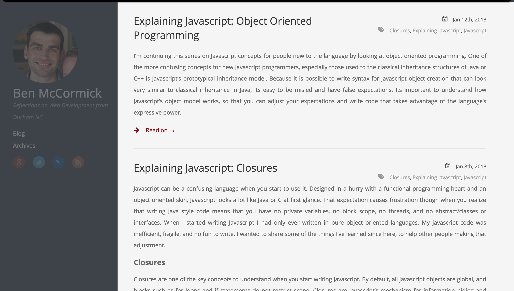
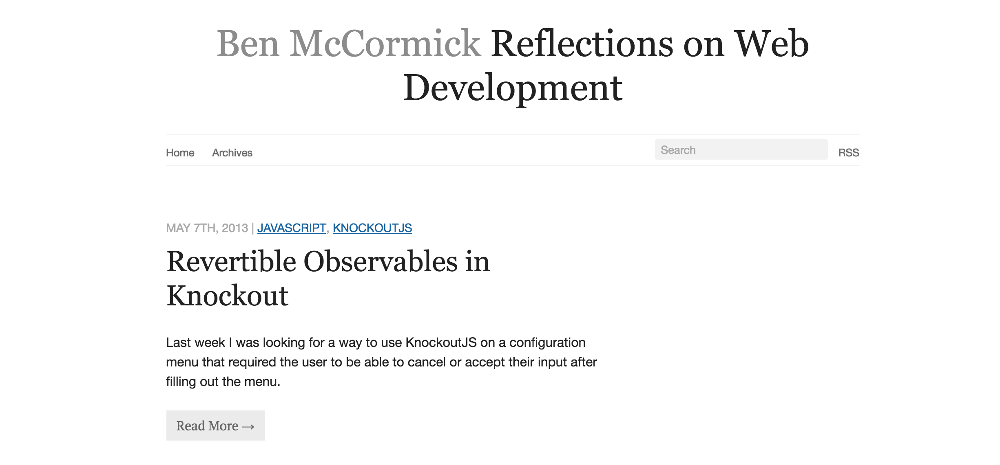
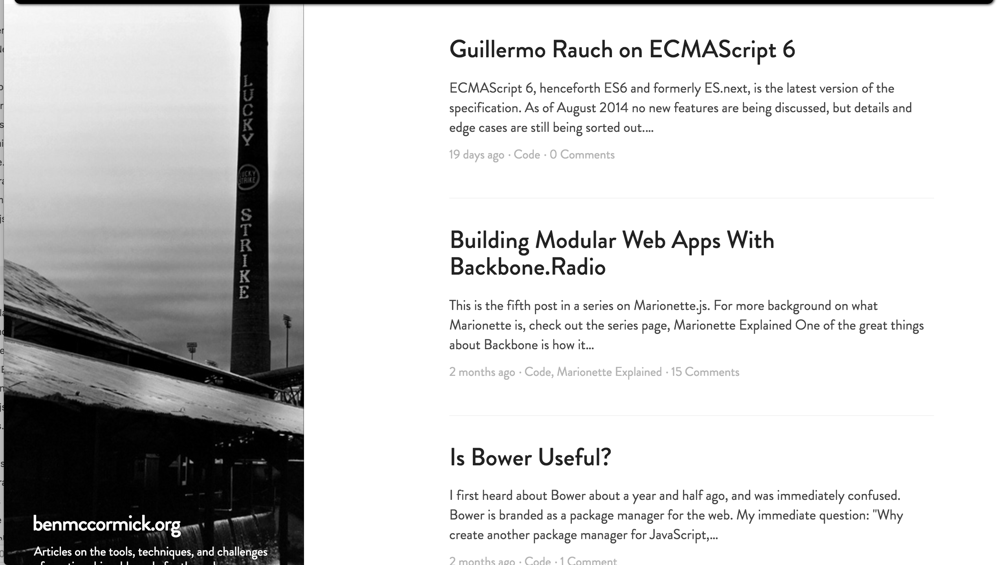
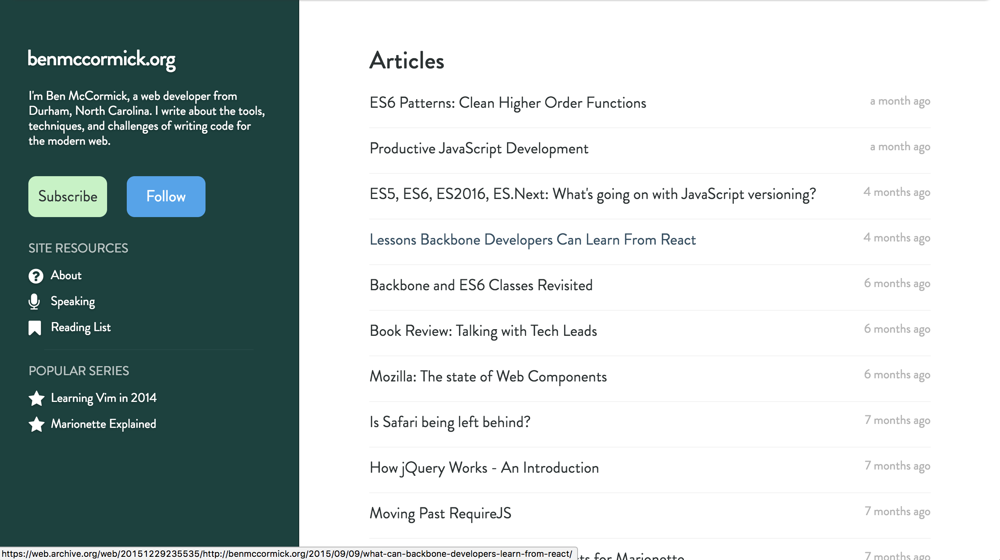
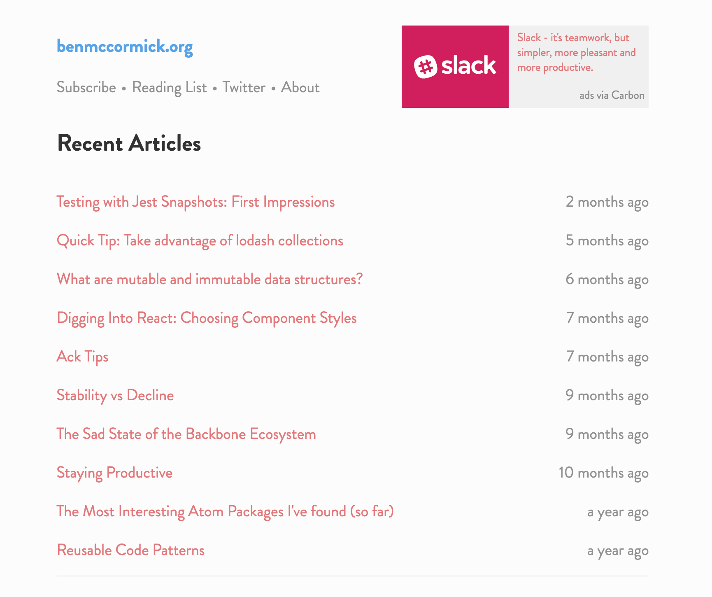

After 2.5 years of stability, this week I moved benmccormick.org to a new platform and overhauled the look and feel. Although most readers have seen the site remain relatively stable, this is actually the 5th major revision of the site since it was first created, so this seems like a good time for a quick trip down memory lane.

I first started it as a Django app, wanting to challenge myself to build a blog.  That was so short-lived that the way-back machine never even registered it, and I don't have any evidence that it ever existed (thankfully).  In December 2012, I moved the blog over to [Octopress](http://octopress.org/) a static site generator based on Ruby.  I started out using a very nice stock template:

and then shortly switched to a version that I mostly did myself based off of the default octopress theme.  This was one of my first attempts to design anything from scratch, and was not particularly pretty:

I enjoyed Octopress, but spent a lot of time messing around with it (and struggling through the unfamiliar ruby ecosystem), and not a lot of time writing.  So in the spring of 2014 I decided I wanted to switch to a blogging platform where I could write, rather than messing with code.  So I moved my blog to [Ghost](https://ghost.org/), lightly modified a public theme, and began writing about Vim.  It was around this time (2 years and 40 articles in) that I began to attract more readers, and also began to focus more on higher quality technical articles:

About a year after that I re-introduced some color to the blog after a prolonged absence. The black and white sidebar was traded for a colorful green, and a I began using a mix of blue and red for text emphasis. I also began to focus on making it more clear how to subscribe to the blog, and highlighted the more popular content:

Ghost was a great blogging platform, but this fall I decided it was time to move off of it.  I was interested in trying some things that didn't fit into the platform's more structured approach, and wanted to move the blog to a place where it was no longer losing me money to run.  So I decided to take another look at the static site generator landscape. I looked through the top 12 or so options on [StaticGen](https://www.staticgen.com/) and [Gatsby](https://github.com/gatsbyjs/gatsby) quickly stood out.  It uses concepts I'm extremely comfortable with (built with React and Webpack!), produces fast server-rendered SPA style sites, and dictates almost nothing about how the site is built.

The site is now built with Gatsby and hosted on Github pages.  I've ditched the noisy green sidebar in favor of a simpler text-focused experience and added a small ad at the top of the page to offset some of the costs associated with the blog.  I'm planning on iterating on the design (better organizing and exposing older content, making it simpler to subscribe to the blog, and making it easier for me to add rich content/code examples to posts without relying on 3rd party services), but for right now I'm excited to get back to focusing on writing.

Like all software, as this blog has evolved, I'm sure not all of the progress has been forward.  If you see any issues with the new site, feedback and bugfixes are welcome.  Feel free to hit me up on [twitter](https://twitter.com/ben336), comment on this post, or open an issue on the site's [github repo](https://github.com/benmccormick/benmccormickorg/issues).  Thank you to everyone who has read and supported this site over the past several years.

### More Resources

- If you're interested in [Gatsby](https://github.com/gatsbyjs/gatsby) this post on [Practical Gatsby.js](https://blog.scottnonnenberg.com/practical-gatsby-js/) by Scott Nonnenberg is excellent.  Its not a how-to, but more of a series of examples of how he deviated from the base Gatsby blog (and why).  I found it really helpful when brainstorming ideas for this site.
