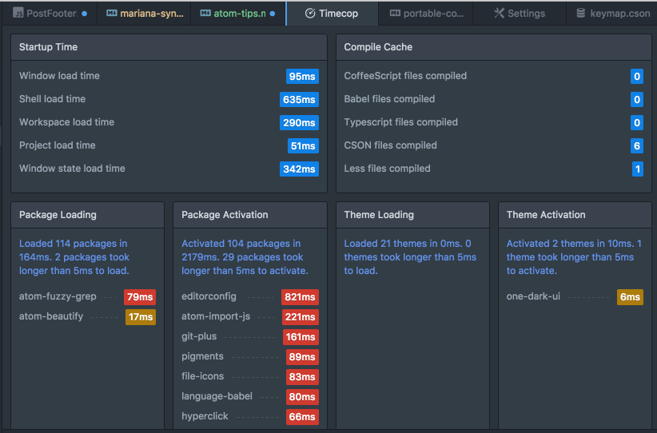
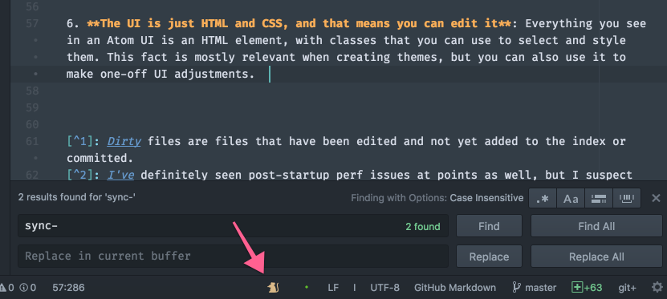
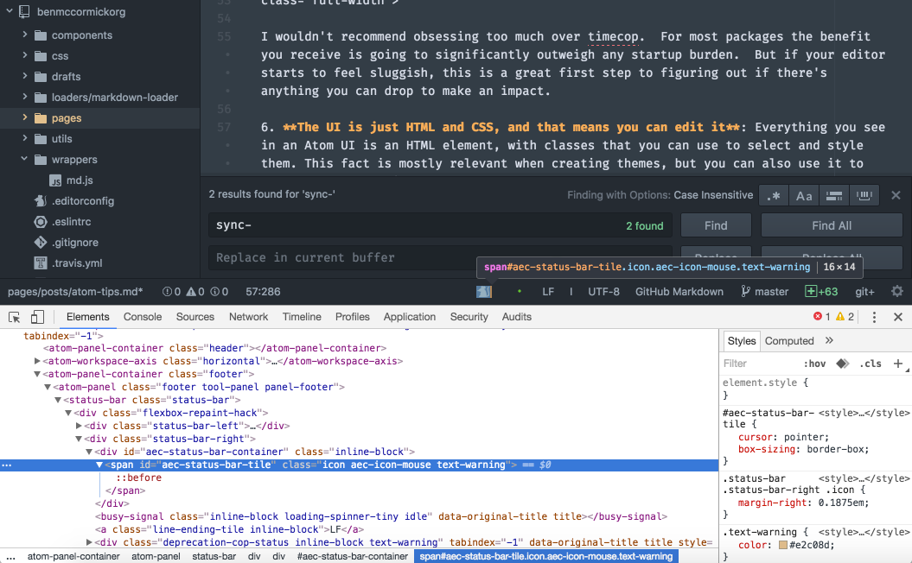

[Atom](https://atom.io) is a modern hackable text editor.  I've been using it as my primary editor for a year and a half, and have picked up some tips along the way that I thought were worth sharing.  These tips assume that you have at least a passing familiarity with Atom: they're the things that I've picked up over time that have made me more productive.


#### 1. There is more to the Fuzzy Finder than meets the eye

Fuzzy finders have been a key feature on modern editors since TextMate first popularized the ⌘T command[^1] for searching through project files.  ⌘T (or ⌘P) still works great in Atom, but what you may not know is that Atom provides 2 other versions of the command. ⌘B searches only among currently open files.  ⇧⌘B searches only among files that are "dirty" according to git[^2].  Both of those options are built in.  You can also find other uses for the fuzzy-finder if you start exploring plugins, including [atom-fuzzy-grep](https://atom.io/packages/atom-fuzzy-grep), a plugin that lets you use the fuzzy-finder interface to search file contents using grep, [ack](https://benmccormick.org/2016/04/30/ack-tips/), ag, or ripgrep.

#### 2. Atom is a great Vim replacement

If you've been following this blog for a while, you know I've written a lot about [Vim](https://benmccormick.org/learning-vim-in-2014/).  I still love the [philosophy of Vim](https://benmccormick.org/2014/07/16/learning-vim-in-2014-vim-as-art/), and think that the text editing [language](https://benmccormick.org/2014/07/02/learning-vim-in-2014-vim-as-language/) it implements is the best way to edit code quickly.  But Atom's [vim-mode-plus](https://atom.io/packages/vim-mode-plus) is the best vi implementation I've seen outside of Vim, and unlike other editors, you don't need to get frustrated with a halfway approach to Vi-keybindings, since you can make pretty much everything work in a vim-like way.  That's because:

#### 3. Atom's keybindings are powerful and flexible

Any command exposed by the core editor or a plugin in Atom can be bound to a keyboard shortcut.  None of the default commands are hard-coded, and the editor provides powerful contexts for controlling what keys have lead to what action when.  That means if I want to use `ctrl-j/k/l/h` to control my navigation between split panes, but also use `ctrl-j/k` to move up and down in the autocomplete widget, I can just add these lines to my `keymap.cson` file

```coffeescript
'atom-text-editor, body':
  'ctrl-k': 'window:focus-pane-above'
  'ctrl-j': 'window:focus-pane-below'
  'ctrl-h': 'window:focus-pane-on-left'
  'ctrl-l': 'window:focus-pane-on-right'

'body atom-text-editor.autocomplete-active':
  'ctrl-k': 'autocomplete-plus:move-up'
  'ctrl-j': 'autocomplete-plus:move-down'
```

Different commands are triggered in different context.  You can also take advantage of this with vim-mode to have "normal mode only" keyboard shortcuts like this:

```coffeescript
'atom-text-editor.vim-mode-plus.normal-mode':
  '] b': 'pane:show-next-item'
  '[ b': 'pane:show-previous-item'
```

That implements a behavior I'd missed from Vim's [unimpaired plugin](https://github.com/tpope/vim-unimpaired) of moving between open files with `[b` and `]b`.

#### 4. Make sure to sync your settings

One area where Atom is less ideal than Vim is setting portability.  It doesn't have a single file where all configuration is stored, or a nice settings folder that can be synced.  Instead settings are intermingled with other data in a `~/.atom` folder, a fact that is obscured by the editor's UI, which attempts to put a nice UI in front of all of these setting files and steer you away from editing them directly or caring about where they're stored.  Which works great until you need to move your config to a new machine or sync between 2 machines.  

Fortunately, there's a great plugin [sync-settings](https://github.com/atom-community/sync-settings) that makes this simple.  It does require setting up a gist to serve as your repo, but after that the process is painless and allows you to continue on unaware of the implementation details behind settings.

#### 5. Check Timecop and clean up plugins that you're not using

Atom is built on web technologies.  This is both the best and worst thing about Atom.  It leads to its greatest strengths: hackability, a focus on UX early on since they didn't have to build a whole UI engine from scratch, and quick iteration.  But it also has very real tradeoffs, the biggest of which are battery life and startup performance[^3].  There's not much to be done about the battery life drain; Atom is based on Chromium, and Chromium is a battery hog.  It is simply a tradeoff to understand when choosing an editor.  But startup performance is often greatly influenced by the packages that you choose to use.  Fortunately Atom includes a simple tool for tracking this called Timecop.

You can find Timecop in the command palette (⇧⌘P by default).  When you run it, Timecop displays a report of all of your packages and themes and how they contribute to startup time.  It will look something like this:



I wouldn't recommend obsessing too much over timecop.  For most packages the benefit you receive is going to significantly outweigh any startup burden.  But if your editor starts to feel sluggish, this is a great first step to figuring out if there's anything you can drop to make an impact.

#### 6. The UI is just HTML and CSS, and that means you can edit it

Everything you see in an Atom UI is an HTML element, with classes that you can use to select and style them. This fact is mostly relevant when creating themes, but you can also use it to make one-off UI adjustments.  For instance, when I edit Markdown files, the [editorconfig](https://github.com/sindresorhus/atom-editorconfig) plugin I have installed warns me about a possible conflict with another atom package. The warning shows up as a small colored mouse icon in the status bar.



I find this warning distracting.  I know what its there for and have decided I don't care about it, but I can't dismiss it normally.  So instead I can take advantage of Atom's flexibility to just get rid of it. All I need to do is open up devtools (⇧⌘I) and find the class.



Then we can edit our styles.less file.  Atom will open it for you if you click the *your stylesheet* link at the top of the Settings>Themes page.  My edit to remove the mouse icon looks like this:

```less
.aec-icon-mouse {
  display: none;
}
```

### More Resources

- The [atom documentation](https://atom.io/docs) is really great, and worth diving into if you want to go deeper into Atom
- If you're interested in learning more about keyboard driven text editing, check out [my series on Vim](https://benmccormick.org/learning-vim-in-2014/).


[^1]: I'm using MacOS default keyboard shortcuts for this post.  Windows and Linux shortcuts are usually similar with `ctrl` often swapped for `⌘`.
[^2]: Dirty files are files that have been edited and not yet added to the index or committed.
[^3]: I've definitely seen post-startup perf issues at points as well, but I suspect that those are implementation problems that will continue to improve as the editor matures and the underlying Chromium platform continues to push on performance.  This may be naive.
