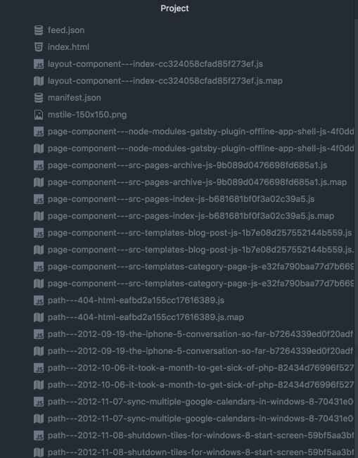
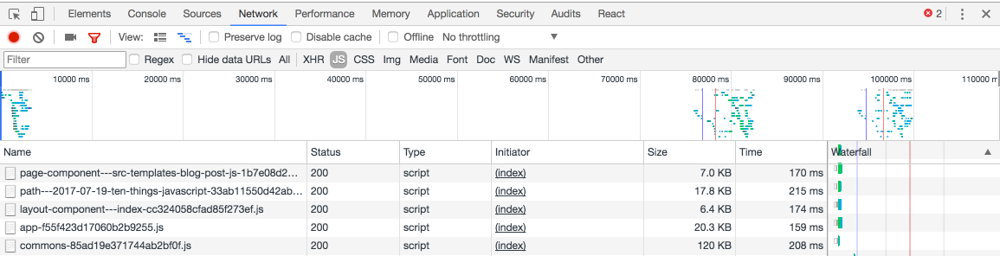

Today's post gets into some very specific weeds.  I've been using [Gatsby](https://www.gatsbyjs.org/) as the engine for my blog since last fall, and recently upgraded to the new 1.0 release.  Gatsby 1.0 introduced a lot of cool new concepts and improvements.  One of the biggest ones was using Webpack and GraphQL to make it easy after a user browses a page to only load the minimum data the site needs for a given page, and then make additional requests as the user navigates the site.  This results in a build with many small js bundles that correspond to the data for a particular page, as well as a few larger bundles that correspond to a particular page layout.  In my editor the public folder created by a build looks like this:



That's great because it means that unlike Gatsby 0.x, I don't need to (asynchronously) load the whole site on each page load.  When my site loads up on a typical article page, it loads 5 core scripts, along with some 3rd party scripts for comments/ads/analytics/fonts.  



The sizes get a bit skewed when loaded up because they're compressed by [Cloudflare](https://www.cloudflare.com/), but on my filesystem, they look something like this:

```
page-component---src-templates-blog-post-js-1b7e08d257552144b559.js 25K
path---2017-07-19-ten-things-javascript-33ab11550d42ab9a3d1b.js     57K
layout-component---index-cc324058cfad85f273ef.js                    22K
app-f55f423d17060b2b9255.js                                         138K
commons-85ad19e371744ab2bf0f.js                                     409K
```

So the page is comprised of 2 rather large JS files that share common code, 2 layout components that are shared between most but not all pages, and a path specific script.  About 600K total with the page specific code making up ~ 1/10th of that.  

I was surprised going into this how big the commons and app chunks were.  547K is NOT light.  However it also shouldn't be too much of a problem in practice, since the site loads in a usable fashion without JavaScript, and those files will get cached after first page load.  There's also a service worker which will maintain that cache cross-visit if the user's browser supports it.  So I filed that away for a future exploration. What was more interesting to me was the path file, which held the information specific to a single blog post.  Specifically I was interested because [the markdown file that serves as a source for that blog post](https://github.com/benmccormick/benmccormickorg/blob/master/src/pages/posts/2017/ten-things.md) is only 18K.  

It turns out I was doing something that had made sense with Gatsby 0.x but became very inefficient in the new model:  I was loading a reference to every page in my application into my blog post component for each page.  And I was doing it at the page level, so instead of getting pulled into the blog post component, I had a copy of the url, title, and description for every page in my site (~120 of them) in every page bundle.   

So why was I doing this?  If you scroll down to the footer of this article, you'll see a recommended article section.  That section is populated in one of 2 ways.  My RecommendedPosts component is passed a list of pages and the current post and then either takes the `readNext` metadata from the current post and looks up pages with those key or if there is no `readNext` metadata, reads the current posts category and pulls the 3 most recent posts from that post's category.  The code looks like this:

```javascript
let nextArticleFilter;
if (readNext) {
  const keyList = isArray(readNext) ? readNext : readNext.split(',');
  nextArticleFilter = page => page && includes(keyList, page.key);
} else {
  nextArticleFilter = page =>
    page &&
    page.category === category &&
    page.path !== path &&
    page.dontfeature !== 'true';
}

let nextPosts = take(
  filter(orderBy(pages, 'date', 'desc'), nextArticleFilter),
  3
)
```

When I switched to Gatsby 1, I loaded this information using the following graqhQL query:

```javascript
// markdownRemark gets the current Post
// allMarkdownRemark gets all of the posts and the info we need for
// showing them in the recommended section
export const pageQuery = graphql`
  query BlogPostBySlug($slug: String!) {
    markdownRemark(fields: { slug: { eq: $slug } }) {
      html
      frontmatter {
        title
        keywords
        category
        readNext
        date
        path
        layout
        hideFooter
      }
    }
    allMarkdownRemark(limit: 2000) {
      edges {
        node {
          frontmatter {
            title
            date
            path
            description
            category
            dontfeature
            key
          }
        }
      }
    }
  }
`;
```

In Gatsby 0.x, we always loaded the whole site in one JS bundle, so this made sense.  We kept the recommended post information in the post metadata where it was easy to update, and just mapped it at render time, which was fine since we had all the data.  

In Gatsby 1 though, we don't want to send our whole site (even a sub-selection of the site data) on every page load.  And the idea of sending data like category, key, date and title that we won't even display on the page goes against what we're trying to accomplish with a static site generator to begin with.  Since these recommendation relationships are static, we should be able to determine the relationships at build time and not need to run *any* logic on the client, or pass it any excess data.
