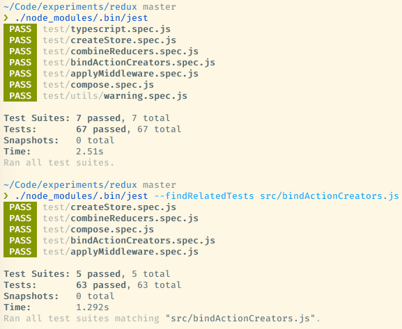
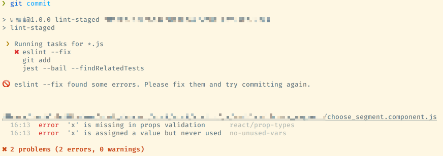

My main work project makes heavy use of [Jest](https://facebook.github.io/jest/) to test our JavaScript code.  For a while now I've wanted to set up a way to run tests every time I run a commit.  I knew that git provides [hooks](https://git-scm.com/book/en/v2/Customizing-Git-Git-Hooks) that allow scripting actions to occur before or after any commit or push, and in fact we were already using a `pre-commit` hook script to lint our code with [ESLint](http://eslint.org/).  But it was non-obvious how to make that work well with Jest testing.  I eventually figured out a setup that worked, and the found a better way to do both the Jest and ESLint testing.  Since it took me a while to work through, I thought I'd share it here and save the rest of you some time.

### What didn't work

A naive approach to this problem would be to set up a pre-commit hook that simply ran `jest` to run all tests. The problem is that running our full test suite currently takes between 10 and 20 seconds to run all tests and that time is increasing as we grow our test suite.  Adding that overhead to every commit would cost my team a lot of time, and would be especially inefficient since the repo contains plenty non-JavaScript code that doesn't require tests to be run when updated.

For our ESLint hook, we queried git to get a list of staged files, and then ran eslint against each one of them individually, displaying a pass/fail message.  That looked something like this:

```bash
STAGED_FILES=$(git diff --cached --name-only --diff-filter=ACM | grep "js$")
if [[ "$STAGED_FILES" = "" ]]; then
    exit 0
fi

PASS=true

for FILE in $STAGED_FILES
do
    eslint --quiet "$FILE"

    if [[ "$?" == 0 ]]; then
        echo "\t\033[32mESLint Passed: $FILE\033[0m"
    else
        echo "\t\033[41mESLint Failed: $FILE\033[0m"
        PASS=false
    fi
done
```

This works great for ESLint, but doesn't work out of the box for Jest, because I don't want Jest to run the files that changed, I want them to run any tests that changed AND any tests that might have been broken because of that.

Jest has a wonderful command line flag `jest --onlyChanged`/`jest -o` that runs only the tests related to files that have been changed according to git.  It is extremely helpful since it is smart enough to read the dependency structure for the project and run all tests that might be changed from updating a source file. It also has a `--lastCommit` option that does the same thing for files that were in the previous commit.  Unfortunately, these options aren't helpful at the point of committing, since `onlyChanged` does not look at files that have been staged for commit, and we haven't actually made a commit yet for `lastCommit` to read.

### What Did Work

Fortunately Jest has a lower level command that uses the same logic as `onlyChanged` and `lastCommit`.  `--findRelatedTests` is a flag that tells Jest to run any tests related to the files passed to it instead of trying to run those files as tests as it would normally do.



This is a perfect fit for a pre-commit hook.  I was able to integrate it into my existing script like this:

```bash
jest --bail --findRelatedTests $STAGED_FILES
if [[ "$?" == 0 ]]; then
    echo "\t\033[32mJest Tests Passed\033[0m"
else
    echo "\t\033[41mJest Tests Failed\033[0m"
    PASS=false
fi
```

`$STAGED_FILES` is re-used from the eslint portion of the script, and is just a space delimited list of files that are being committed.  The `--bail` option simply stops running tests as soon as one has failed.  Including that is optional, you won't see all the tests that have failed, but the failure will happen faster and you'll be able to decide how to proceed, including possibly running the full test script on your own.   

Those lines (along with some sanity checks for the existence of Jest and error handling when PASS is set to false) are enough to get a workable commit hook going, but they're not ideal.  pre-commit hooks aren't persisted by git, so each user has to install the hook script individually, and any updates aren't shared automatically.  Plus I'm inefficiently passing all staged files to eslint and Jest regardless of whether they're JavaScript that those tools are actually meant to work on.  My ESLint code was also written before ESLint developed robust `--fix` capabilities, and doesn't try to fix the errors it is capable of fixing.  Finally, while this is just poor coding and not an inherent limitation of my other method, I'm using globally installed versions of Jest and ESLint instead of scoping them to my project.


### Making it better

Fortunately I'd discovered a better solution the other day while working on something else.  There is an npm package for making this process easier, [lint-staged](https://github.com/okonet/lint-staged).  Lint staged abstracts away the boilerplate of getting the staged files, and makes it easy to run local node executables against specific sets of files.  I was able to replace my whole pre-commit script and address all of the problems mentioned above with only a few lines in my package.json:

```json
{
  "scripts": {
    "lint-staged": "lint-staged",
  },
  "lint-staged": {
    "*.js": [
      "eslint --fix",
      "git add",
      "jest --bail --findRelatedTests"
    ]
  },
  "devDependencies": {
    "eslint": "3.16.1",
    "jest": "19.0.1",
    "lint-staged": "3.3.1",
  },
}
```

`lint-staged` now handles making sure that I'm only running checks against JavaScript files, lets eslint autofix and stage any files that it can fix, and uses the local versions of jest and eslint.  It also adds a nice pretty interface for the results:



`lint-staged` docs recommend using an npm based hooks manager like [pre-commit](https://github.com/observing/pre-commit) for running the scripts, but due to some quirks in my setup (node_modules is symlinked, and I sometimes want to run these commands inside a docker container), I found it easier to maintain a custom pre-commit script and just replace the previous logic with `npm run lint-staged`.  Either way, all of the actual logic is now checked into the repository and shared between all users.  The only manual step is adding the call to a pre-commit hook or (if you're using a helper lib) running npm install.

### More Resources

- This maybe merits a future post on its own, but if you're interested in automating away your code style maintenance look at combining [prettier](https://github.com/prettier/prettier) (and possibly  [eslint-plugin-prettier](https://github.com/not-an-aardvark/eslint-plugin-prettier)) with the pre-commit hooks from above.  Prettier will guarantee that your code follows a consistent style, and because it handles maximum line lengths, is much more robust than ESLint on its own.  Using its ESLint plugin within my editor and on pre-commit hooks has pretty much eliminated me manually fixing code style problems.
