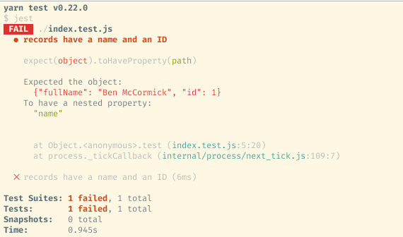

Back in May, my favorite testing library, Jest, released it's 20th version and [rebranded itself](https://facebook.github.io/jest/blog/2017/05/06/jest-20-delightful-testing-multi-project-runner.html) as the library for "Delightful JavaScript Testing".  Delightful and testing are two words that usually don't go together in the software development lexicon.  But that claim is the result of 2 years of hard work from the Jest team trying to get the usability details of testing exactly right.  One of the version 20 announcements that exemplified this commitment to detail was the addition of several new assertion APIs to an already large list. This post dives into the many matcher options in Jest, why they're there, and how to make good use of them.

Assertion APIs, or matchers, are the methods that the library makes available for defining the expected value of a variable or expression.  The most basic assertion in Jest is the `.toBe` matcher, which checks to see if one value is the same as the other.

```javascript
test('Math still works', () => {
  expect(1 + 1).toBe(2);
})
```

### Why so many matchers?

When writing tests, the only assertion api you really **need** is a method that takes a boolean and determines whether it is true or false.  Assuming you can figure out inspecting functions and async code, everything else can be expressed with an assert method like that:

```javascript
test('Math still works', () => {
  assert((1 + 1) === 2);
})
```

So why does Jest need 30+ matcher methods?  Because they allow you to be specific in your intent, and also let Jest provide helpful error messages.  For instance, when you write a test like this:

```javascript
const getRecord = () => ({ id: 1, 'fullName': 'Ben McCormick'});
test('records have a name and an ID', () => {
    let record = getRecord(1);
    expect(record).toHaveProperty('id');
    expect(record).toHaveProperty('name');
})
```

it is obvious what the test is trying to check, and you can get detailed output like this:



You get the structure of the object as it is, the name of the property that is missing, the line number and file name where you can find the assertion, all in a concise, colorful and nicely formatted test failure message.

You can categorize Jest's matchers into 8 different categories: equality matchers, template matchers, numeric comparison matchers, contains matchers, async matchers, snapshot matchers, function matchers, and meta matchers.  I'll go through the first 3 in this post, and cover the rest in a followup.


### Equality Matchers

Equality matchers are the workhorse matchers of any test libraries.  This is where we see whether an expression evaluates to the value we expect. This being JavaScript however, equality takes a few different forms, and Jest covers each of them, along with some syntactic shortcuts.

#### toBe and toEqual

`toBe`, as mentioned previously, is the simplest Jest matcher.  It is equivalent to a simple `===` statement, and verifies that the expression being tested is the same reference as the expression that it is matched against.  Since it is reference based, toBe is a good fit for numbers, strings and booleans, or for checking that an object is the exact same reference as another object.  But it's not good for comparing two separate objects.  It behaves like this:

```javascript
expect(1 + 1).toBe(2) // true
expect('on' + 'e').toBe('one') // true
expect(1 === 1).toBe(true) // true
let oneObj = {one: 1};
expect(oneObj).toBe(oneObj) // true
expect(oneObj).toBe({one: 1}) // false!
```

For comparing object and array equality, it usually is better to use `toEqual`, which does a deep property comparison:

```javascript
let oneObj = {one: 1};
let nestedObj = {nested: {one: 1}};
expect(oneObj).toEqual({one: 1}) // true
expect(nestedObj).toEqual({nested: {one: 1}}) // true
```

`toEqual` doesn't line up to any built in JavaScript idea of equality exactly, it just does a recursive equal check. But it behaves like most people who haven't already encountered the details of JavaScript equality would expect equality to work.  If objects share the same structure and values, they're equal. There also is no Jest equivalent to `==` with its odd type casting behavior, and that is ok by me.

#### toBeDefined, toBeNull and toBeUndefined

`toBeDefined`, `toBeNull`, and `toBeUndefined` are all shortcut functions.

```javascript
// same as expect(x).toBe(null)
expect(x).toBeNull()
// same as expect(typeof x).toBe('undefined')
expect(x).toBeUndefined()
// same as expect(typeof x).not.toBe('undefined')
expect(x).toBeDefined()
```
One thing worth pointing out here is the use of `.not` in my example comment.
`.not` is a utility property that you can chain to reverse the output of
any matcher.

#### toBeFalsy and toBeTruthy

These matchers essentially are shortcuts that act like `if` and `else` statements.

```javascript
// same as expect(!!x).toBe(true)
expect(x).toBeTruthy()
// same as expect(!!x).toBe(false)
expect(x).toBeFalsy()
```

If you aren't aware of the JavaScript concepts of truthiness and falsiness, the terms refer to whether a value is evaluated as true or false when evaluated in a boolean context.

### Template matchers

Template matchers are matchers that don't check for a specific value, but instead look to see if the expression is consistent with a certain pattern or shape.

#### toMatch

`toMatch` is a template matcher for strings.  It accepts a regular expression that
you can use to describe the acceptable list of strings.

```javascript
let id1 = '155-60-7723';
let id2 = '15-60-7723';
let socialSecurityNumberFormat = /\d{3}-\d{2}-\d{4}/;
expect(id1).toMatch(socialSecurityNumberFormat); // true
expect(id2).toMatch(socialSecurityNumberFormat); // false
```

#### toMatchObject and toHaveProperty

`toMatchObject` and `toHaveProperty` are template matchers for objects. `toMatchObject` works similarly to `toEqual` and does a deep comparison on objects and arrays.  But unlike `toEqual`, `toMatchObject` doesn't require an exact match, it just verifies that the expression has the same properties as the template object.  So extra properties on the expression we're evaluating don't matter.

```javascript
let oneObj = {one: 1, uno: 1};
expect(oneObj).toEqual({one: 1}) // false
expect(oneObj).toMatch({one: 1}) // true
```

`toHaveProperty` performs a similar function but doesn't enforce the whole structure of an object.  Instead it just tests whether a single property is defined.

```javascript
let oneObj = {one: 1};
expect(oneObj).toHaveProperty('one') // true
```

`toHaveProperty` can take a second "value" argument, at which point it acts as a more limited version of `toMatch`.

```javascript
let oneObj = {one: 1};
expect(oneObj).toHaveProperty('one', 1) // true
expect(oneObj).toHaveProperty('one', 2) // false
```

#### toHaveLength

`toHaveLength` is a simple matcher for checking the length of strings, arrays and any other array-like object that has a length property.  `expect(x).toHaveLength(y)` is just a shorthand for `expect(x.length)` with the benefit of handling undefined values of `x` safely.

```javascript
expect('Hello').toHaveLength(5) // true
expect(['Hello', 'From', 'The', 'Other', 'Side']).toHaveLength(5) // true
expect({length: 5}).toHaveLength(5) // true
```

#### toBeInstanceOf

`toBeInstanceOf` allow's checking the "type" of an object to see if it is an instance of a class, including inherited classes.

```javascript
test('We can test whether an object is an instance of a class', () => {
  class A{}
  class B extends A{}
  class C{}

  let a = new A();
  let b = new B();
  let c = new C();
  expect(a).toBeInstanceOf(A); // true
  expect(b).toBeInstanceOf(A); // true because of inheritance
  expect(c).not.toBeInstanceOf(A); // true
})
```

### toThrow

`toThrow` is a bit of a different template matcher, because rather than matching a value, it matches against an exception.  `except()` takes a function, and instead of evaluating that function, it executes the function and looks to see if an exception is thrown. If there is an exception, `toThrow` can take a string, regex or Class and acts like either `toMatch` or `toBeInstanceOf` depending on what it is passed.

```javascript
test('We can match exceptions', () => {
  const throwingFunc1 = () => {
    throw 'error';
  };
  class SpecialError{}
  const throwingFunc2 = () => {
      throw new SpecialError()
  };

  expect(throwingFunc1).toThrow('err'); // true
  expect(throwingFunc1).toThrow(/err/); // true
  expect(throwingFunc2).toThrow(SpecialError); // true
})
```


### Numeric Comparison Matchers

Numeric comparison matchers are straightforward.  They test whether a number relates correctly to another number.

#### toBeGreaterThan, toBeGreaterThanOrEqual, toBeLessThan, toBeLessThanOrEqual

These are exactly what they sound like.

```javascript
expect(1).toBeGreaterThan(1) // false
expect(2).toBeGreaterThan(1) // true
expect(1).toBeGreaterThanOrEqual(1) // true
expect(2).toBeGreaterThanOrEqual(1) // true
expect(1).toBeLessThan(1) // false
expect(0).toBeLessThan(1) // true
expect(1).toBeLessThanOrEqual(1) // true
expect(0).toBeLessThanOrEqual(1) // true
```

#### toBeCloseTo

This test checks whether a number is the same as another number within a set number of significant digits.  `toBeCloseTo` takes a number and an optional second option that determines the number of significant digits, then tests whether an expression is the same as that number within that number of significant digits.  This is useful in JavaScript since [floating point math is not precise and 0.1 + 0.2 famously does not equal 0.3 exactly](https://stackoverflow.com/questions/588004/is-floating-point-math-broken).

```javascript
test('Floating Point Math Is Hard', () => {
  expect(0.2 + 0.1).not.toBe(0.3) //true
  expect(0.2 + 0.1).toBeCloseTo(0.3) //true
})
```

### Part 2 Coming Soon

There's a lot to cover here, so check back next week for part 2 of this post, with contains matchers, async matchers, snapshot matchers, function matchers, meta matchers, and a few extra tricks for using matchers.
