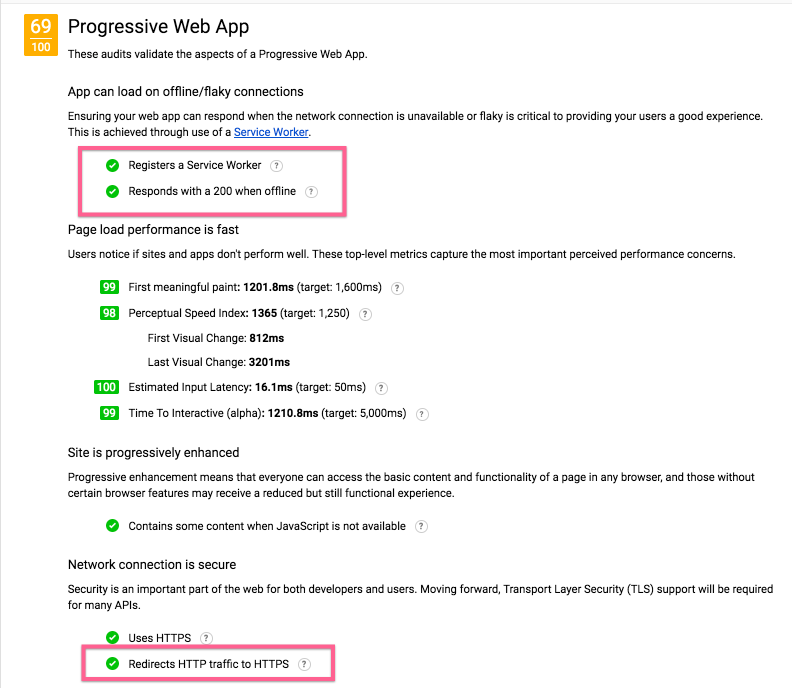

Last year Google coined the term "Progressive Web App" as a way of describing the type of sites and applications that they think are the future of the web.  Progressive Web Apps are sites that load quickly, are always responsive to user input, work as well as possible offline, and integrate with native platforms like native apps.  While this site is not an "app" per say, I do want it to be as fast and responsive as possible, and I also wanted to better understand what Google is pulling under the PWA umbrella.  Fortunately, Google has built a tool [Lighthouse](https://developers.google.com/web/tools/lighthouse/) to help developers profile and improve their web applications, comparing them to a set of PWA benchmarks.  So I took this site through Lighthouse, and worked against their suggestions with the goal of learning more about PWAs and improving the experience of using benmccormick.org.  I'm passing along my experience here.


### Getting Started

I began by downloading the Lighthouse extension in the [Chrome Web Store](https://chrome.google.com/webstore/detail/lighthouse/blipmdconlkpinefehnmjammfjpmpbjk).  Lighthouse can be installed either as a chrome extension or a node command line tool.  Both produce the same HTML report, but I chose the chrome extension for the convenience of keeping everything in the browser.  When I ran the initial report, I got the following result:


48 out of 100 didn't seem like a bad starting place.  Scrolling down it looked like I was mainly dinged on a few main areas:

1. I had no offline support
2. I did't have any special setup for being included on a users homescreen. (I did have platform appropriate icons, but no app configuration)
3. I had some possible inefficiencies in the assets I loaded.


Native app support isn't a huge priority for me, and the assets issue seemed small, so I decided to investigate the offline support issue first.

### Offline

I based my service worker implementation off of [Simple Offline Site](https://github.com/chriscoyier/Simple-Offline-Site) a demo Service Worker repo created by Chris Coyier for an article on [CSS Tricks](https://css-tricks.com/serviceworker-for-offline/).  This was perfect since it's default behavior was what I wanted: cache everything, and check for updates from the server everytime we return from cache so we're never out of date for long.  You can see what I did specifically in my [github repo for this site](https://github.com/benmccormick/benmccormickorg/blob/master/pages/sw.es6). After adding the service worker, my score moved up to 63/100.  

Finally, Service Workers only work on HTTPS connections, but most links to my site are not https currently. So to take full advantage (and to address another metric I was flagged on), I used a [CloudFlare page rule](https://support.cloudflare.com/hc/en-us/articles/200170536-How-do-I-redirect-all-visitors-to-HTTPS-SSL-) to redirect all visting traffic to use https.  That bumped me up to 69/100.




### Native Support

As I said previously, native platform support isn't a major priority for this blog, but I was curious about the process.  Getting native support turned out to be very straightforward.  I had already collected icons for the various platforms, and created a simple manifest when I originally created a favicon for my site.  But the manifest file didn't have everything and it wasn't being deployed properly to my site.  Fixing that and making it available at `/manifest.json`, fixed all of the problems related to native platform support.

My manifest file now looks like this:

```json
{
	"name": "benmccormick.org",
  "short_name": "benmccormick",
	"icons": [
		{
			"src": "\/android-chrome-192x192.png?v=yyxgnp97qG",
			"sizes": "192x192",
			"type": "image\/png"
		},
		{
			"src": "\/android-chrome-384x384.png?v=yyxgnp97qG",
			"sizes": "384x384",
			"type": "image\/png"
		}
	],
	"theme_color": "#ffffff",
	"background_color": "#57a3e8",
	"display": "browser"
}
```

After correctly deploying that manifest file, my score moved all the way up to 100/100!


I clearly benefited from starting in a good spot.  [Gatsby](https://github.com/gatsbyjs/gatsby) is "fast by default" as a platform for building blogs, and I've done my best to avoid making it slow.  But it was fun seeing what I could do to make the site a better experience for users with bad connectivity, and to learn more about what Google is trying to do with PWAs.  


### More Resources

- Google has a bunch of resources around creating Progressive Web Apps.  You can find them on [their PWA landing page](https://developers.google.com/web/progressive-web-apps/).

- It was so easy to make my blog a PWA mostly because it is built on [Gatsby](https://github.com/gatsbyjs/gatsby). Worth looking at if you're a web developer who blogs.
