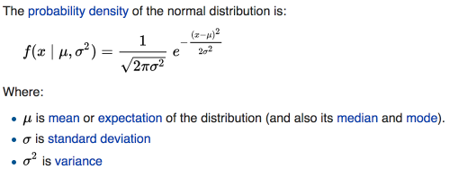

This week I got to have a little fun remembering some High School math, and using one of my favorite libraries: [Highcharts](https://www.highcharts.com/).  Highcharts is a commercial JavaScript data-viz library, and it makes most standard charts and graphs a breeze to implement.  I was using it to plot a normal distribution in order to display a 95% confidence interval.  It's a pretty straightforward problem, but its a nice example of a practical use of Highcharts, and comes with a little stats math that many of us may have learned and forgotten.

### The Problem

The goal was to display a [normal distribution](https://en.wikipedia.org/wiki/Normal_distribution) to represent a 95% confidence interval, given the upper and lower bounds of the confidence interval.  A normal distribution is the classic bell curve, where the area under any section of the graph represents the probability that the true value of the measure being tracked is within that range.  These curves are usually represented something like this:


The x axis of the curve represents the range of values, while the y axis is a function of x that shows the relative probability for different areas.  Data sets that are normally distributed conform to the above bell curve and the [68-95-99.7 rule](https://en.wikipedia.org/wiki/68%E2%80%9395%E2%80%9399.7_rule). There's a 68% chance that the true value is within 1 standard deviation of the middle of the curve (the mean), a 95% chance that the true value is within 2 standard deviations, and a 99.7% chance that the true value is within 3 standard deviations.

### Step 1: Generating a Dataset

Highcharts operates by plotting a set of data points, not by handling equations directly.  So our first step is computing a set of data points to plot.  We can find the equation for calculating a normal distribution's probability density on [Wikipedia](https://en.wikipedia.org/wiki/Normal_distribution).




Yep, we get to play with an equation that has both π and e in it.  I hope this feels sufficiently like a high school math class now.  But we can actually choose to drop the left side of the equation.  It is the [normalization constant](https://en.wikipedia.org/wiki/Normalizing_constant) for the equation: it ensures that the total area under the curve equals 1, but doesn't change the shape of the curve.  Since we're simply displaying the shape of the graph and care primarily about showing the range along the x axis, we can ignore it and instead use this function:

```javascript
const normalY = (x, mean, stdDev) => Math.exp((-0.5) * Math.pow((x - mean) / stdDev, 2));
```

That's a good start, but right now we only have an upper and lower bound value for a 95% confidence interval.  So before we can apply the equation, we need to find a mean, a standard deviation, and a set of x values to run the formula against.  The mean and standard deviation are fairly straightforward, and we can use lodash to generate a set of points.  For the sake of this example, we'll plan on generating 100 points ranging from +/- 5 standard deviations from the mean, which should allow us to see all meaningful parts of the distribution, and still have a bit of padding.  

```javascript
const getMean = (lowerBound, upperBound) => (upperBound + lowerBound) / 2;

// distance between mean and each bound of a 95% confidence interval
// is 2 stdDeviation, so distance between the bounds is 4
const getStdDeviation = (lowerBound, upperBound) => (upperBound - lowerBound) / 4;


const generatePoints = (lowerBound, upperBound) => {
  let stdDev = getStdDeviation(lowerBound, upperBound);
  let min = lowerBound - 2 * stdDev;
  let max = upperBound + 2 * stdDev;
  let unit = max - min / 100;
  return _.range(min, max, unit);
}
```

Now that we have the x axis locations for the points, we can generate a whole data series.  

```javascript
let mean = getMean(lowerBound, upperBound);
let stdDev = getStdDeviation(lowerBound, upperBound);
let points = generatePoints(lowerBound, upperBound);


let seriesData = points.map(x => ({ x, y: normalY(x, mean, stdDev)}));
```


### Step 2: Creating the Chart

Now we have what we need to generate a chart!  Given the data, It's easy to make a simple normal distribution curve with highcharts.  All we need to do is create a `<div id="container">` element and then run this JavaScript:

```javascript
Highcharts.chart('container', {
    chart: {
        type: 'area'
    },
    series: [{
        data: seriesData,
    }],
});
```

Which produces the following graph:


<iframe width="100%" height="400" src="//jsfiddle.net/ben336/8bgm1m18/embedded/result,js/"
allowfullscreen="allowfullscreen" frameborder="0"></iframe>

Thats a good start, but contains a lot of "stuff" that Highcharts provides by default that we don't necessarily want for our normal distribution illustration.  Let's cut the title, legend, y-axis, and tooltips/mouse action.  To do that we need a bit more configuration:

```javascript
Highcharts.chart('container', {
    chart: {
        type: 'area',
        height: 300,
    },
    title: {
        text: ''
    },
    yAxis: {
      labels: {
        enabled: false,   
      },
      gridLineWidth: 0,
      title: ''
    },
    tooltip: {
       enabled: false,
    },
    legend: {
      enabled: false,
    },
    series: [{
        data: seriesData,
    }],
    plotOptions: {
      area: {
        enableMouseTracking: false,
      }
    }
});
```


<iframe width="100%" height="400" src="//jsfiddle.net/ben336/w7165m2u/embedded/result,js/" allowfullscreen="allowfullscreen" frameborder="0"></iframe>

This is pretty great, but we still want to show our confidence interval like the wikipedia image at the top.  Ideally we'd only be filling in the areas within the 95% curve.  Thats pretty easy to do with Highcharts.  We can use *zones*, Highcharts way of applying different styles to different sections of the chart.  We want our zones to apply to the x axis, and we'll define 3 zones: 0 to the lower bound, lower bound to the upper bound, and everything else.  In Highcharts that looks like this:

```javascript
{
  plotOptions: {
    area: {
      zones: [{
        //fillColor gets the inside of the graph, color would change the lines
        fillColor: 'white',
        // everything below this value has this style applied to it
        value: lowerBound,
      },{
        value: upperBound,
      },{
        fillColor: 'white',
      }]
    },
  },
}
```

We also want to show a 95% label on the graph like the image at the start.  There are multiple ways to do that in Highcharts, but for this simple case we'll just abuse the title attribute and move it down into the middle of the chart:

```javascript
{
    title: {
        text: '95%',
        y: 200,
    },
}
```


<iframe width="100%" height="400" src="//jsfiddle.net/ben336/81kb997x/embedded/result,js/" allowfullscreen="allowfullscreen" frameborder="0"></iframe>

And with that we've taken our original inputs and produced a dynamic illustration of a confidence interval that matches the image we started with.  


### More Resources

- Highcharts has great [documentation](http://api.highcharts.com/highcharts/) and you can see more [demos](https://www.highcharts.com/demo) on their site, both for Highcharts and their stock and map chart variants.  Note that Highcharts is not free for commercial use.  I've found that it is well worth the money though for any team that is going to be doing many data visualizations, especially if its using relatively standard forms of data visualizations on variable data.  

- If you need more freeform visualizations, [d3](https://d3js.org/) is a great place to look.  Here's an example of D3 being used to draw a similar chart: http://bl.ocks.org/phil-pedruco/88cb8a51cdce45f13c7e  It's more involved than the Highcharts example, but allows for more flexibility as a result.  And unlike Highcharts, its free to use for anything.  
