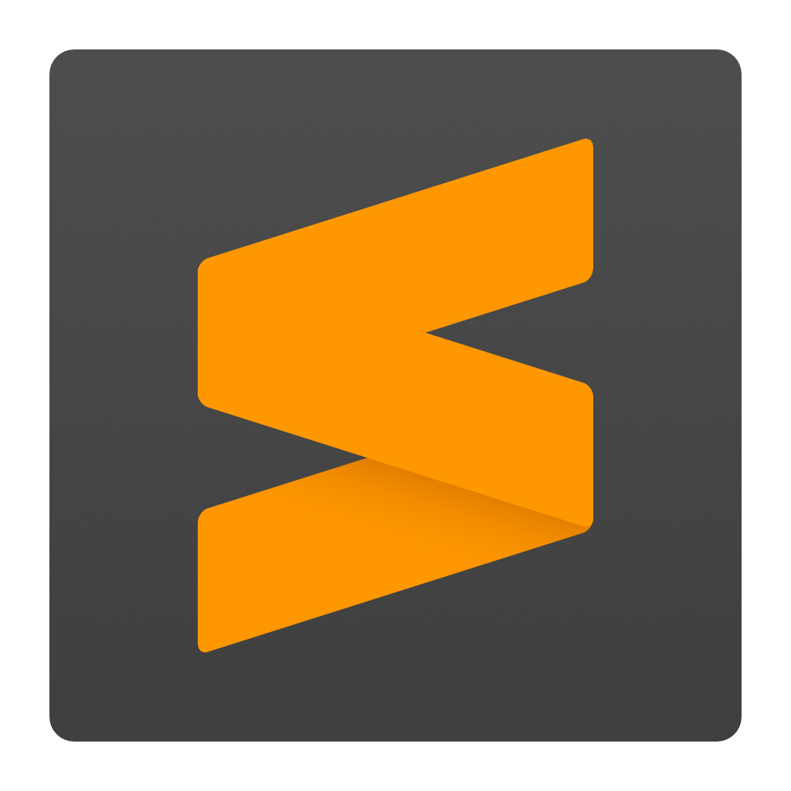
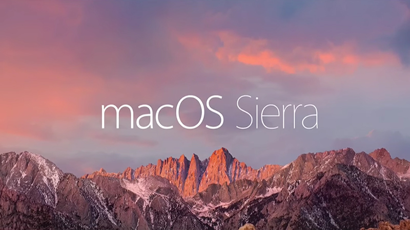

This week I got a new laptop, and for the first time in a while I have separate work and personal computers.  One thing that this has made clear to me is that it is still non-trivial to keep settings and configurations easily up to date between 2 different PCs.

In my experience there are several levels of "portability" for applications, which are easy to think of as letter grades.

#### A - *Seamless*

These applications have built in mechanisms for syncing configs and or data between 2 different environments.  When something is updated on one machine, it is either immediately updated on the other, or easy to pull, without having to remember to update anything or doing any previous setup.

#### B - *Easy*

B grade applications are similar to seamless applications, but may have a few more potholes.  Possibly there is some involved setup required to get syncing working initially, or some small chunks of the application configuration don't sync.

#### C - *Workable*

At this point we've moved out of the range of easy syncing solutions.  Here it may be possible to import and export settings from a file, without any automatic syncing.  Or there may be a straightforward way to automate the setup, but no declarative representation of the config state.

#### D - *Hard*

For some applications there is no clear way to sync or import state, but it is probably still possible through scripting if you're willing to commit to it.

#### F - *Impossible*

Some applications have proprietary settings that can't be exported or scripted. There is no meaningful way to share settings for these programs.

## A mixed bag

Setting up my new laptop this week, I found that the software I use a lot was all over the map on this scale.  Here are the grades:

#### Atom - *B*

[Atom](https://atom.io/) doesn't have native syncing persay (though most configs are in a ~/.atom folder that can possibly be synced with git).  But it has a very nice [sync-settings](https://github.com/atom-community/sync-settings) plugin that uses gists to sync settings across multiple machines.  It loses points due to a little bit of upfront pain (when setting up a new machine you need to either create a new gist or find your old one, and you need to generate github auth keys for each instance), but gains them back with a very nice set of options to selectively restore or choose when to backup, and painless support for all of Atom's 3rd party plugiuns

#### Sublime Text - *B+*

[Sublime Text](https://www.sublimetext.com/3) saves all of its configurations as JSON, so its pretty easy to move them over.  It loses a few points though for making you figure out how to sync them, and a few more points for sticking user configs by default in the `~/Library/Application Support/` directory, where it is a bit more difficult to sync using things like git and dotfiles.  

#### Command Line programs - *A-*

  <image alt="Vim logo" src="vim.png">
  <image alt="fish logo" src="fish.png">

  <image alt="git logo" src="git.png">

Command line programs like Vim, Ack, bash/zsh/fish, and git all nail the idea of declarative configuration files that are stored in a common place.  They fall short of a pure A since they don't provide a sync solution themselves (that would be very non-unixy), but since it is easy to set up [dotfile repos](https://dotfiles.github.io/) to sync and backup these settings, they qualify for a strong A-.

#### iTerm2 - *C*

[iterm2](https://www.iterm2.com/) is probably the most popular terminal replacement on the mac.  It has tons of settings that you normally edit through a GUI menu.  It does allow you to export those settings, and import them on another machine.  So you need to have access to the original file to generate a snapshot at any given time and need a way to transfer the file(s), but otherwise this is still pretty workable.

#### Hyper - *A-*

[Hyper](https://hyper.is/) is a newer [Electron](https://electron.atom.io/)-based terminal application for OSX.  Like Sublime Text, it defaults to offering a GUI interface into text based configuration files.  Unlike Sublime Text, it stores that file and its plugin files in the users home directory where they can easily be included in a dotfile repo.

#### MacOS - *D-*

Unlike most of the applications I run on it, MacOS is extremely unfriendly to syncing configurations.  There are a few settings I want the same on all my laptops.  Touchpad scrolling should be in the "unnatural"[^1] direction, keys should repeat when held, and caps log should be disabled/mapped to control.  There is a set of apps that I would always want to have installed.  There is no declarative way to configure this, or sync it across computers.  Apple's preferred strategy seems to be having folks use time machine backups, which is great for setting up a new computer for the same purpose as an old one when it is being replaced, but unhelpful when 2 laptops are being used by the same person for different purposes.  It is possible to script the setup of a new laptop with scripts like [this one](https://github.com/mathiasbynens/dotfiles/blob/master/.macos) but its very involved and when you update a setting the "normal MacOS way", its not always clear how you would add that setting to a script.  Plus a "from scratch" script won't help keep 2 machines aligned as their configs diverge over time.

#### Cloud Services - *A*

Unsurprisingly, the one class of software that really nails this experience is cloud software.  For services like Dropbox, Bear, Evernote, Slack, email & calendar clients, etc, most if not all settings and data is stored on servers somewhere else, so getting a new machine up to date and staying in sync over time is just a matter of entering a password.  There are reasons to dislike cloud services, but when moving to a new machine, they're a thing of beauty.

## Takeaways

If you are going to be using 2 computers for different purposes as a developer, take the time to setup a good dotfiles repo that contains the configs for the command line programs and editors you use.  These days if you do that, pretty much everything else but the operating system will come right along.

[^1]: Honestly the wording around that feature is pretty insulting.
