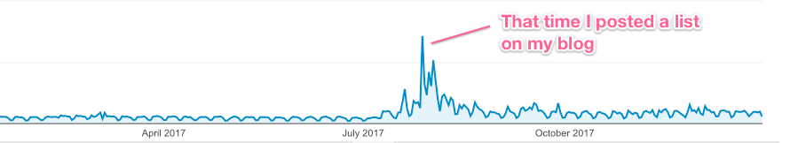

2017 was the 5th full year of this blog, and in many ways it was the most productive.  I wrote one of the most popular things I've written on here, started the weekly links section (on hiatus for New Years, but will return next week), and wrote 21 full articles and 8 weekly links post, the most I've ever posted here in a year.  Here are some of the highlights from my blog and development this year.

### Most Read Posts Published in 2017

1. [Ten Things A Serious JavaScript Developer Should Learn](https://benmccormick.org/2017/07/19/ten-things-javascript/) - It turns out that making lists of things is a good way to get traffic.  I wonder if anybody else on the internet has figured this out?

    

    In all seriousness, I think there's a hunger out there for clearer roadmaps for folks who are early out in their front end development career.  People are telling them to learn all the frameworks, all the tools and all the compile-to-JS languages, and everyone knows they can't learn it all.  So even an imperfect list that can serve as a starting point for figuring that out can get some traction.  This article was my attempt to answer "what should a serious mid-level JavaScript developer have learned and be learning?".  

2. [How To Follow The JavaScript Roadmap](https://benmccormick.org/2017/07/10/how-to-follow-the-javascript-roadmap/) - This post was aimed at a similar audience to the "Serious JavaScript Developer" post, but aimed to help folks who want to follow changes in the JavaScript language keep up with new developments.

3. [Orthogonality and CSS in JS](https://benmccormick.org/2017/01/03/orthogonality-and-css-in-js/) - This article was an examination of the architecture tradeoffs of CSS in JS solutions, and also an examination of how people discuss "separations of concerns" in general.  If you liked this one, keep your eyes open.  I'm planning on writing more architecture level posts in 2018.

### Code I wrote in 2017

Most of the code I wrote this year was again for my work at Windsor Circle.  But I've continued to add new features to this blog, which is based on React and Gatsby, and the source code for that is available [on Github](https://github.com/benmccormick/benmccormickorg).

### Talks I gave in 2017

This was a big speaking year for me.  I gave 3 different talks: [The Vim Survival Guide](https://www.slideshare.net/BenMcCormick/vim-survival-guide-71763917) at Open Source 101, [Intro to Gatsby](https://www.slideshare.net/BenMcCormick/gatsby-intro) at a local meetup group and [Saving Time with Jest](https://www.slideshare.net/BenMcCormick/saving-time-by-testing-with-jest) at All Things Open.  I'd be interested in giving any of those talks again next year, so if you're looking for a speaker, feel free to reach out.

### Languages, Libraries, and Technologies I started using in 2017

- [Mobx](https://mobx.js.org/) is a JavaScript data modeling library that serves as an alternative to Redux or React state for state management.  I wrote about my [first impressions](https://benmccormick.org/2017/01/09/mobx-first-impressions/) at the beginning of the year, but I've continued to use it and love it since then.

- [Yarn](https://yarnpkg.com/en/) was a nice upgrade over npm.  My understanding is that npm has since stepped up and closed the gap here, but I'm continuing to use Yarn for now since it has taken over my projects and muscle memory.

- When I upgraded this blog to Gatsby 1.0, I had the opportunity to learn about [GraphQL](http://graphql.org/).  I've really enjoyed getting to play with it and love the GraphQL community's dedication to providing a great developer experience.

### Languages and Libraries I used (more or less) every day in 2017

JavaScript (ES6), Python, React, PostgreSQL, Backbone (**sigh**), lodash, MobX, Jest

### Languages and Libraries I want to try in 2018

[Victory](https://github.com/FormidableLabs/victory), Rust, and Pandas/other python data analysis libraries [^1]

### Blogs I started following in 2017

[Mark Erikson's Dev blog](http://blog.isquaredsoftware.com/)

### Blogs I read every post from in 2017

[Rands In Repose](http://randsinrepose.com/), [Stratechery](https://stratechery.com/), [Daring Fireball](https://daringfireball.net/), [purposedworking.org](http://purposedworking.org/), [wynnnetherland.com](https://wynnnetherland.com/)

### Podcasts I started listening to in 2017

- [Planet Money](https://www.npr.org/sections/money/) - A long running NPR podcast about money, the economy, and the unexpected ways they affect our everyday lives

- [The Allusionist](https://www.theallusionist.org/) - A great podcast on the crazy history behind different words in the English language.

### Software I started using in 2017

- [Bear](http://www.bear-writer.com/) - I mentioned I was testing this out at the end of last year, but it has become my go-to notes application, and I would recommend it to anyone who wants a stylish notes app in the middle ground between Apple Notes and Evernote (and who uses Apple products).

### Software I used (nearly) every day in 2017

MacOS/iOS, Google Search, Chrome/Safari/Firefox, GMail/MailPlane 3, Twitter/Tweetbot, Feedbin/Reeder, Instapaper, iMessage, Slack, Trello, 1Password, Atom/Vim, iTerm, Fish Shell, Bitbucket, Fantastical, Spotify, Bear, Annotate, Dash

[^1]: Yes this is basically the same list as last year.  ¯\\\_(ツ)\_/¯ I mostly learn tech as I have need for it, and it was a very "nose to the grindstone" year focused on improving existing codebases this year
