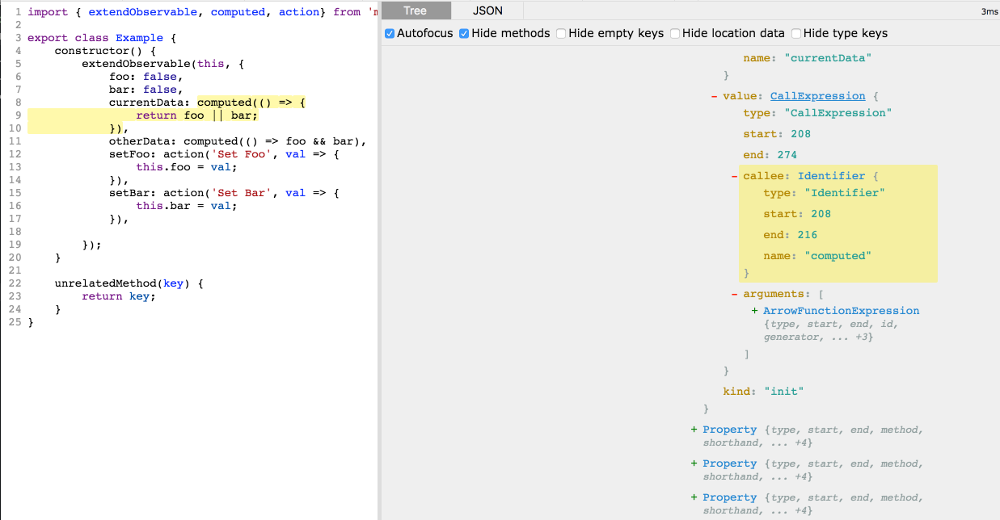

Do you like making repetitive syntax updates across many files?  Enjoy the thrill of painstakingly combing through 1000 line diffs that all look the same to see if you made any typos?  Relish that feeling of doubt in the back of your head as you wonder whether you actually caught all instances of the syntax you needed to update when you switched to the next major version of a library?  If so, you should probably stop reading now, because you won't like codemods at all.  For the rest of us, codemods are a tool for assisting in large refactoring; they save you time and reduce typos.

Codemods originated at Facebook, first with a tool named [codemod](https://github.com/facebook/codemod) that served as a helper for regex or python based refactoring, allowing you to make iterative changes with pretty diffs, then with [jscodeshift](https://github.com/facebook/jscodeshift) a tool for doing more advanced JavaScript refactors that work directly against a data model representation of the code, rather than relying on regex or direct programmatic changes to text.  jscodeshift is extremely powerful, but I found it intimidating to approach.  Once I took the plunge though, it wasn't that hard to start writing codemods.  So here are a few quick tips for anyone else who might be interested.

#### 1. Start with a goal in mind

It's always helpful to dive into a new technology by trying to solve a concrete problem.  That's especially useful for codemods, because the ideas behind them can seem abstract and poorly documented until you begin focusing on a specific issue.  In my case I was originally motivated to look at codemods when updating an application from using MobX version 3 to MobX version 5.  In MobX3, when you write code without using decorators, a typical model class will look something like this:

```javascript
import { extendObservable, computed, action} from 'mobx';

export class Example {
    constructor() {
        extendObservable(this, {
            foo: false,
            bar: false,
            currentData: computed(() => {
                return foo || bar;
            }),
            otherData: computed(() => foo && bar),
            setFoo: action('Set Foo', val => {
                this.foo = val;
            }),
            setBar: action('Set Bar', val => {
                this.bar = val;
            }),

        });
    }

    unrelatedMethod(key) {
        return key;
    }
}
```

I was updating an app with dozens of these model classes.  Unfortunately, in Mobx5, the syntax for these classes has changed, and it now needs to be rewritten like this:

```javascript
import { extendObservable, action} from 'mobx';

export class Example {
    constructor() {
        extendObservable(this, {
            foo: false,
            bar: false,
            get currentData() {
                return foo || bar;
            },
            get otherData() {
                return foo && bar;
            },
            setFoo: val => {
                this.foo = val;
            },
            setBar: val => {
                this.bar = val;
            },

        }, {
            setFoo: action('Set Foo'),
            setBar: action('Set Bar')
        });
    }

    unrelatedMethod(key) {
        return key;
    }
}

```

Computeds must be shifted to gets, action functions have to be pulled out of their wrapper function calls, but the wrapper and action names have to be moved down to a new second object.  This is really finicky to do by hand or with a text editor macro, because it's a lot more complicated than just find and replace.  I'd usually be converting from arrow functions that might or might not have blocks and return statements currently, and I'd have to move the actions down to the new object correctly even though some of the models had 10+ action functions.   Facing several hours worth of finicky manual or script assisted refactoring work was enough to convince me it was time to learn about codemods.


#### 2. Create a small example and learn about its AST

My first productive step towards creating a Mobx3to5 codemod for my codebase was creating the example code above.  I iterated on it a bit as I found new things I cared about; I didn't realize at first that computeds needed to be changed as well as actions, and I eventually realized I needed to handle 2 types of arrow function syntax. But the initial version I wrote got me going.  Having a stripped down example of the code I cared about without the baggage of my real codebase was valuable, and being able to update it to include all the cases I cared about during testing was even better.

Once I created the example, I was able to understand better what I was trying to do by examining its AST.  An AST (Abstract Syntax Tree) is a representation of a JavaScript file's source code as a tree data structure.  For instance here's a portion of the AST for a basic Hello World program:

```json
{
  "type": "Program",
  "sourceType": "module",
  "body": [
    {
      "type": "ExpressionStatement",
      "expression": {
        "type": "CallExpression",
        "callee": {
          "type": "MemberExpression",
          "object": {
            "type": "Identifier",
            "name": "console",
            "_babelType": "Identifier"
          },
          "property": {
            "type": "Identifier",
            "name": "log",
            "_babelType": "Identifier"
          },
          "computed": false,
          "_babelType": "MemberExpression"
        },
        "arguments": [
          {
            "type": "Literal",
            "value": "Hello World",
            "rawValue": "Hello World",
            "raw": "'Hello World'",
            "_babelType": "Literal"
          }
        ],
        "_babelType": "CallExpression"
      },
      "_babelType": "ExpressionStatement"
    }
  ],
}
```

This is a simplified example that looks only at the semantic structure of the syntax.  The full version also contains information about the indenting and exact text of the code, and comes out to about 600 lines when represented as formatted JSON.   All of this from `console.log('Hello World');`.  Fortunately there's a nice tool for exploring ASTs.


[AST Explorer](http://astexplorer.net/) is a site that lets you enter some JavaScript code, and then visualize the AST that represents the code.  When I put my example code above, in, I was able to see that the computed expressions in my original code showed as a `CallExpression` with an `ArrowFunctionExpression` as an argument.



When I put the result code I wanted in, I could see that I would need to switch the property that contained the callexpression to have a type `get` and would need to replace the call expression with a function expression.

#### 3. Start with a small edit

As a starting point, I decided I wanted to write a script that could find MobX classes and just add the second object argument to extendObservable, with a dummy property.  So this:

```javascript
extendObservable(this, {
    foo: false,
    bar: false,
    currentData: computed(() => {
        return foo || bar;
    }),
    otherData: computed(() => foo && bar),
    setFoo: action('Set Foo', val => {
        this.foo = val;
    }),
    setBar: action('Set Bar', val => {
        this.bar = val;
    }),

});
```

would become this:

```javascript
extendObservable(this, {
    foo: false,
    bar: false,
    currentData: computed(() => {
        return foo || bar;
    }),
    otherData: computed(() => foo && bar),
    setFoo: action('Set Foo', val => {
        this.foo = val;
    }),
    setBar: action('Set Bar', val => {
        this.bar = val;
    }),

}, { foo: 'bar'});
```

To do this, I took an existing script that I found in [this repo of small codemod examples](https://github.com/jhgg/js-transforms) and modified it to lookup `extendObservable` calls and add a second argument.  I filtered it to only include calls with 2 arguments, in case I ran the code a second time[^1].


```javascript
module.exports = function (file, api) {
    const j = api.jscodeshift;

    return j(file.source)
        // We're looking for a CallExpression for extend observable
        .find(j.CallExpression, {
            callee: {
                name: 'extendObservable'
            }
        })
        // Verify that it's only using 2 arguments so far, and that the second one is an Object Expression
        .filter(p => p.value.arguments.length == 2 && p.value.arguments[1].type == "ObjectExpression")
        .forEach(p => {
            // Now we want to
            // 1. Add a 3rd argument object
            let args = p.value.arguments;
            args.push(j.objectExpression([j.property('init',j.identifier('foo'), j.literal('bar'))]));
            // TODO: 2. Move action declarations to that argument
            // TODO: 3. Convert action statements to plain functions
            // TODO: 4. Convert computeds to get statements
        })
        .toSource();
};
```

This is a working script to achieve my simple goal.  To break it down:

```javascript
j(file.source).find(j.CallExpression, {
            callee: {
                name: 'extendObservable'
            }
        })
```

jscodeshift provides a jQuery style api for traversing a tree.  Here we're looking for `CallExpression`s that have the name `extendObservable`.  We now have a collection of these expressions, and we can filter it down to only the expressions that have 2 arguments.

```javascript
.filter(p => p.value.arguments.length == 2 && p.value.arguments[1].type == "ObjectExpression")
```

Next we want to go through each callExpression and transform it.  In this case by finding it's arguments list and pushing a new one, using the jsCodeshift API to simply generate the AST objects neededed to represent `{foo: bar}`.

```javascript
.forEach(p => {
            // Now we want to
            // 1. Add a 3rd argument object
            let args = p.value.arguments;
            args.push(j.objectExpression([j.property('init',j.identifier('foo'), j.literal('bar'))]));
            // TODO: 2. Move action declarations to that argument
            // TODO: 3. Convert action statements to plain functions
            // TODO: 4. Convert computeds to get statements
        })
```

Finally, we call `.toSource()` to write the tranformed AST back to the file.

#### 4. Test your edit

Because this type of coding lends itself to experimentation, it's important to develop a good feedback loop while working on your codemod.  If you have a simple example you're off to a good start.  The next step is to find a good way to run your script and see the output.  Simply running your test is a bit frustrating, because jscodeshift is destructive.  It overwrites your file in place, and doesn't save a copy.  You can get around this though by adding `--dry --print` flags to your command line call

`jscodeshift -t my-codemod.js example.js`

will run the transform defined in `my-codemod.js` against `example.js` and modify it in place.

`jscodeshift --dry --print -t my-codemod.js example.js`

will print the transformed file to the console and not update example.js.

For simple codemods and small example files, this is a nice way to iterate quickly.  For more extensive codemods with multiple test cases, I'm excited to try out jscodeshift's Jest support[^2].  It has helper methods for working with transforms, and a workflow of Jest watch checking the output of several inputs against several expected outputs would be lovely.


#### 5. Iterate

After I got that first edit working, it was simply a matter of working through my list.  I needed to remove the experimental `foo:bar` and then

1. Move action declarations to the new argument object
2. Convert action declarations to plain functions in the existing object
3. Convert computeds to get statements

I was able to take those one at a time, and my final script looked something like this:

```javascript
module.exports = function (file, api) {
    const j = api.jscodeshift;

    const buildDecoratorPropertiesFromCurrentObject = currentObj => {

        let decoratorProps = [];
        currentObj.properties.forEach(prop => {
            if (prop.value.type === 'CallExpression' && prop.value.callee.name === 'computed') {
                prop.kind = 'get';
                let fnBody = prop.value.arguments[0];
                if (fnBody.type === 'ArrowFunctionExpression' && fnBody.body.type !== 'BlockStatement') {
                    prop.value = j.functionExpression(null, fnBody.params,
                        j.blockStatement([j.returnStatement(fnBody.body)]),
                        false);
                } else {
                    prop.value = j.functionExpression(null, fnBody.params, fnBody.body, false);
                }
            }
        });
        let dataProps = currentObj.properties.filter(prop => !(prop.value.type === 'CallExpression' && prop.value.callee.name === 'computed'));
        dataProps.forEach(prop => {
            if (prop.value.type === 'CallExpression' && prop.value.callee.name === 'action') {
                // copy action to the decorator area first...
                let args = prop.value.arguments;
                let dupProp = Object.assign({}, prop);
                dupProp.value = Object.assign({}, dupProp.value);
                dupProp.value.arguments = (args.length === 2) ? args.slice(0, 1) : [];
                decoratorProps.push(dupProp);

                // then flatten things out
                prop.value = (args.length === 2) ? args[1] : args[0];
            }
        });
        return [dataProps, decoratorProps];
    }
    return j(file.source)
        // We're looking for a CallExpression for extend observable
        .find(j.CallExpression, {
            callee: {
                name: 'extendObservable'
            }
        })
        // Verify that it's only using 2 arguments so far, and that the second one is an Object Expression
        .filter(p => p.value.arguments.length == 2 && p.value.arguments[1].type == "ObjectExpression")
        .forEach(p => {
            // Now we want to
            // 1. Add a 3rd argument
            // 2. Move action declarations to that argument
            // 3. Convert action statements to plain functions
            // 4. Convert computeds to get statements, or just move them down to the second object?
            let args = p.value.arguments;
            let [dataProps, decoratorProps] = buildDecoratorPropertiesFromCurrentObject(args[1]);
            args[1].properties = dataProps;
            args.push(j.objectExpression(decoratorProps));
        })
        .toSource();
};
```

That looks rather crazy, but the `buildDecoratorPropertiesFromCurrentObject` is mostly straightforward data manipulation, looking for some patterns in the data, and replacing them with a different pattern.  Everything else is just the same base code from our initial example.

#### 6. Use version control and code reviews!

Actually running a finished transform against a codebase is crazy easy.  Just give it a base folder, and `jscodeshift` will run your script against all JavaScript files in the directory.  This is definitely a "With great power comes great responsibility" tool though.  Before running jscodeshift across a large code base, make sure you are using version control and that you've checked in any other changes.  Because the script will update many files at once, you want to be able to isolate the change and review it carefully afterwards, to make sure that you see what is different, and that those changes look right.  In my case, I got to be *done* with my script twice, because the first time I thought it was ready to execute across all of the app files, things still went wrong.  It was easy to fix though, since I was able to just checkout my changes and try again.


### Resources

If you have a change that you want to make to your codebase, but have been holding off because you think it would take forever, I definitely encourage you to check codemods out.  They're not as scary as you think!  Here are some more resources to get started:

- [facebook/jscodeshift](https://github.com/facebook/jscodeshift)
- [AST Explorer](http://astexplorer.net/)
- [Writing Your First codemod with jscodeshift](https://medium.com/@andrew_levine/writing-your-very-first-codemod-with-jscodeshift-7a24c4ede31b)
- [Effective JavaScript Codemods](https://medium.com/@cpojer/effective-javascript-codemods-5a6686bb46fb)

[^1]: This is one of many assumptions I made that won't be true for MobX classes generally.  I was writing a script to convert my app to MobX5 compatible syntax, not write a general case update tool.  In the end there were a few examples that violated my assumptions in the codebase, and I had to update 2 files by hand.
[^2]: jscodeshift was created by Christoph Pojer who is also one of the primary maintainers of Jest.
