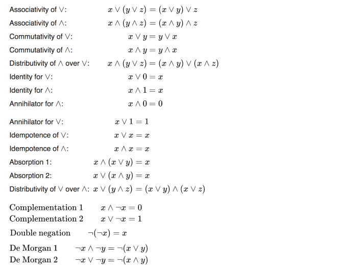
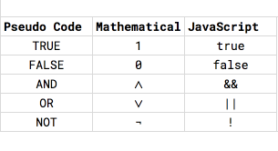

*This is the second post in a series of posts on Computer Science basics for front end developers.  The goal is a practical focus on the practical implications of basic CS theory for JavaScript development.*

Modern programmers owe a lot to the efforts of many head in the sky theoretical mathematicians from the 1800s and early 1900s who were searching for mathematical truths and ended up making discoveries that serve as the basis of many modern computing inventions.  Boolean Algebra is one of a few branches of mathematics that was developed for purely theoretical reasons that has ended up shaping the computer revolution.  It fortunately has the virtue of being a relatively approachable to mathematical newbies.

Boolean algebra is a study of operations on logical values. Or in more understandable language, it is studying the rules of logic when we're limited to dealing with only 2 types of values, true or false.  The basic building blocks of boolean algebra are incredibly simple: in addition to the true and false values, usually encoded as 0 for false and 1 for true, boolean algebra considers 3 basic operations:

- the "AND" operator `∧` - `a∧b` is true if and only if `a` and `b` are both true.
- the "OR" operator `∨` - `a∨b` is true if at least one of `a` or `b` are true and false otherwise.
- the "NOT" operator `¬` - `¬` is a unary operator, it only affects a single value.  `¬a` is true if a is false, and false if a is true.

Of course this is a whole field of mathematics, so the interesting part comes as you start combining these pieces.  Mathematicians have discovered many "laws" that apply to boolean logic.  Some of these will probably look familiar to those of you who took high school algebra.  Here's a sample of the laws from [Wikipedia](https://en.wikipedia.org/wiki/Boolean_algebra).



The last 3 especially are worth remembering.  Taking them out of mathematical notation for a second and using pseudocode instead, the rules are:

- Double Negation: `not not x == x`
- De Morgan 1 `(not x) and (not y) === not (x or y)`
- De Morgan 2 `(not x) or (not y) === not (x and y)`

### Boolean Algebra in JavaScript

For most JavaScript developers, the preceding description of boolean algebra probably seemed suspiciously familiar.  It turns out that JavaScript has all the base units of boolean algebra in its core language.  True and false are represented by the appropriately named boolean primitives `true` and `false`.  AND, OR, and NOT are represented by `&&`, `||` and `!` respectively.



So a JavaScript statement like

```javascript
let x = false;
let y = true
if(x && y) {  // false
  willNeverHappen();
}
```

is equivalent to `x∧y` in boolean algebra notation.  But this being JavaScript, there are some quirks and things to know about.  

First of all it's worth noting that boolean logic in JavaScript is lazy by default.  That means that JavaScript will only evaluate enough of a boolean expression to know what the result will be.  So in an expression like this:

```javascript
let alwaysReturnTrue = () => true;
let alwaysReturnFalse = () => false;
let value = alwaysReturnFalse() && alwaysReturnTrue();
```

the function `alwaysReturnTrue` will never be called.  This will matter when we start talking about real world takeaways.  

The second JavaScript quirk gets its own section.  Because booleans get more complicated when they interact with the rest of the JavaScript world.

### Truthy and Falsy

When JavaScript conditionals like the if statement evaluate an expression, they aren't strictly evaluating to see if something is the boolean values `true` or `false`.   Instead they're looking to see if the expression is *truthy* or *falsy*.  This isn't the kindergarten version of booleans, instead it's JavaScript's way of handling the fact that not all expressions are boolean.  Rather than requiring you to cast your values to boolean or use a statement that produces a boolean, JavaScript instead treats every value as either truthy or falsy.  The rules for this are reasonably consistent and easy to follow once you understand what is happening[^1].  It turns out that most values are truthy, so it is easiest to just learn the falsy values.  In JavaScript the falsy values are:

```javascript
false,
null,
undefined,
0,
NaN,
'', // or ""
document.all // Special case browser hack just for fun
```

If an expression that evaluates to one of these values is read into a boolean context like an if statement or ternary, it will be treated as false.  Any other value will be read as true.

### Implications and Hacks

So far we've gone through some theory, as well as JavaScript's own quirks.  But now let's talk about 3 different implications of this stuff for day to day JavaScript programming.

1. **Shortcuts using the  && and || operators** - It's fairly common, especially in special context like minified code and JSX expressions in React, to run into code that get's clever with the lazy behavior of JavaScript boolean operators.  Specifically the `&&` statement often get's used as an inline if statement like this:

    ```javascript
    let userID = showID && getUserID();
    ```

    which is equivalent to

    ```javascript
    let userID;
    if (showID) {
      userID = getUserID();
    } else {
      userID = showID; //presumably false or null
    }
    ```

    The `||` statement can be used for a similar purpose, usually to provide a fallback value.

    ```javascript
    const = createNewUser(providedRole) {
      let  userRole = providedRole || 'basic-user';
      //...
    }
    ```

    It's important to be careful with this type of use though, because if it would be valid for the user input to be a falsy value like `''`, `null` or `0`, this can introduce subtle bugs.  More on that in a second.

    I wouldn't personally relying too heavily on this technique.  Besides the possibility of subtle bugs, it isn't very approachable for new developers, especially if you try nesting logic this way.  But you should know how it works since you will see it, especially in minified code you may need to debug and JSX.

2. **!! for casting** - Another common idiom to be aware of is the use of double negation to cast values to a boolean.  It is fairly common when you have code that is expecting a boolean and not just a truthy/falsy value to convert the value to a boolean.  One way to do that is using the `Boolean` constructor, like `var bool = Boolean(value)`, but another method is to use double negation.  The first negation evaluates to the boolean that is opposite the truthy/falsy value, and the second one flips it back to the original truthy/falsy state, but as a boolean.

    I personally find this notation to be less confusing than the `&&`/`||` shortcuts, but your mileage may vary.  Either way, it's important to understand its role since it is common to find `!!`s in real world code.

3. **0s and empty strings are dangerous** - For our last quirk, let's imagine a code example function `getCountFromServer`:

    ```javascript
    const getUserCountFromServer = async () => {
        try {
          let response = await fetch('users');
          let users = response.json()
          return users.length;
        } catch (e) {
          // if we can't get the count, return null
          return null;
        }
    }
    ```

    This function makes a request from the server, and then returns the number of users, or `null` if it can't get the value from the server for whatever reason.  Maybe not the best error handling, but certainly something you could see in real world code.  If we want to test to see if this function got data correctly, we have to be careful.  We might want to simplify our testing by taking advantage of `null`'s falsiness like this:

    ```javascript
    let userCount = await getUserCountFromServer();
    if (userCount) {
      // do something with the info
    } else {
      //handle the case where the number failed to load
    }
    ```

    Do you see the bug?  If there are no users, it will be treated the same as if the number had failed to load at all.  This is a pretty common bug in situations where a value might be undefined or null, but could also be a number.  Strings have a similar issue.  It's important to understand that if 0 or empty strings are a valid value for a variable, you can't rely on a general falsiness check to see if the value is defined.  Instead it's better to either define the exact falsy value you expect for "no value" (null in this case) or to check based on type.  For instance in this case, you could rewrite the code to look for a number:

    ```javascript
    let userCount = await getUserCountFromServer();
    if (typeof userCount === 'number') {
      // do something with the info
    } else {
      //handle the case where the number failed to load
    }
    ```

### Feedback Welcome

This is the second post in a new series, and I'd love to hear whether it is helpful for you, and any other topics you'd like to see covered. Feel free to reach out on [Twitter](https://twitter.com/ben336) or [email](mailto:ben@benmccormick.org).  And if you see anything that looks wrong or misleading to you, don't hesitate to [open an issue](https://github.com/benmccormick/benmccormickorg/issues/new) on my blog's github repo.


[^1]: The exception for me are empty arrays.  They get evaluated as truthy in JavaScript and falsy in Python, and I can never remember which is which without testing.
