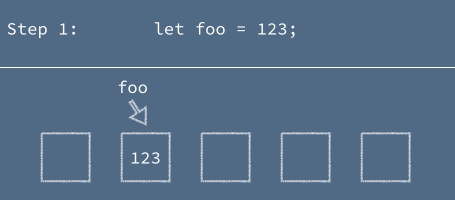
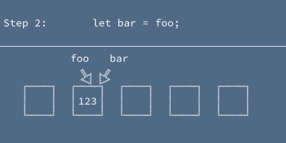
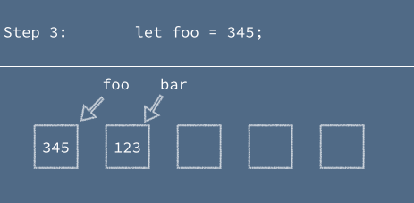

A few weeks ago, I asked for input on the idea of [resources on Computer Science for front end developers](https://benmccormick.org/2018/02/20/cs-for-fe/).  Because there was a decent amount of interest, I'm planning on fleshing out the idea a bit with a small series of posts on CS basics.  These posts will cover some concepts that would usually be covered in an intro level CS course.  If folks find them helpful I may move on to more advanced topics like Data Structures & Algorithms, the software abstractions that modern web development is built on top of, and other math/theory topics.

With these posts I'm not trying to replicate a CS intro course and won't cover everything.  I'm not trying to teach anyone how to program.  Instead I'm covering the ideas and details behind concepts that FE devs may have learned by doing but never been exposed to from an theory point of view.  I am not an academic, so the goal will be to keep a casual tone focused on the practical implications of theory to a Front End developer.  If I'm successful, these posts will give you a better set of mental models when working to understand the code you're reading and writing every day.  That's plenty of throat-clearing, so now I'm going to jump into one of the most fundamental building blocks of any programming language: variables.

### What are Variables? (Not as obvious as it sounds)

Variables in programming languages are symbols that we assign to represent a value.  That seems simple enough, but that sentence is too vague to properly account for the complexity of reality.  When dealing with variables in the real world, it's important to have a good mental model of how they really behave, or you may become confused by how your programs act.  For instance if you believe that variables are always live references to whatever other variable they were assigned to, you may be surprised by the behavior of this snippet:

```javascript
let a = 1;
let b = a;
a = 2;
console.log(b) // prints 1
```

and if you believe that variables always point to a unique value that is created when you assign to them, you might be surprised by this one:

```javascript
let a = [1, 2, 3]
let b = a;
a.push(4)
console.log(b) // prints [1, 2, 3, 4]
```

Knowing generally that a variable points to a value is a great start.  But a proper understanding of the model that a programming language uses for variables can help you avoid subtle bugs.

### How Variables Work

Here's the most important sentence for gaining a proper understanding of how variables work: "A variable points to a location in memory."  Explaining how memory is organized and allocated is outside the scope of this post, but for now it's sufficient to just understand memory as a long list of blocks, each of which has it's own address.  


When a variable is assigned to, it points to the address of whatever value is on the right hand side of the assignment expression (if newly created, the value is assigned an open address in memory first).



If another variable is assigned to the first variable, it too will point to that same address in memory



Finally if we reassign the original variable, it will point to a new location in memory, and the second variable will continue to point to the same location.



Function arguments are based on these same concepts.  When a function is called, the argument variables are assigned to point at the memory address of the value passed into the function.


### Mutable vs Immutable Variables

This memory address stuff can seem pretty abstract, and not very useful, but it's a great gateway to understanding more practical topics.  A while back I wrote a post about [mutable and immutable data](https://benmccormick.org/2016/06/04/what-are-mutable-and-immutable-data-structures-2/).  If you're unfamiliar with the concepts you can read the original article for background.  But basically, JavaScript values are divided into 2 categories: primitives like booleans, strings, and numbers which are immutable, and objects which are mutable.  Immutable primitives can't be changed, when they're operated on they can only be replaced with a new value.  Mutable objects can be changed in place.  That "in place" qualifier can seem a bit hazy without understanding the underlying memory situation, but now we can explain this more clearly: the value for a primitive will never change within a memory location, a variable will instead have to point to a new location in memory.  A mutable variable can be modified without changing it's location in memory.  This is the explanation behind our confusing example from earlier.

```javascript
let a = [1, 2, 3]
let b = a;
a.push(4)
console.log(b) // prints [1, 2, 3, 4]
```

Because `b` points to the same location in memory as `a`, when we mutate `a`, `b` continues to point to the same array as `a` and sees the same changes we performed on `a`.

### Implications and Gotchas

There are a few practical implications of these concepts, and gotchas that folks with the wrong mental model around variables tend to run into.

1. **`===` is based on location in memory for objects** - While it does compare primitive values directly to see if they're the same value, for objects, `===` compares by reference.  So the following code works in a way that people might not expect if they don't understand variables.

```javascript
let a = {x: 2};
let b = a;
let c = {x: 2};
let sameReference = x => x;
let d = sameReference(a)

console.log(a === b) // true
console.log(a === c) // false
console.log(a === d) // true
```

2. **Modifying objects in functions modifies them outside of the function scope** - This is a pretty common gotcha for folks who don't understand variables and memory.  When they have a bad mental model of function arguments, you get code like the following made up example.

```javascript
// function to create a contact that is ready to send
let formatContactForSend = contact => {
  contact.fullName = contact.firstName + contact.lastName;
  delete contact.id;
  return contact;
}
// get a contact from somewhere
let newContact = {
  id: 1,
  firstName: 'Ben',
  lastName: 'McCormick'
};
// send along the formatted version of the contact
send(formatContactForSend(newContact));

//oops
console.log(newContact); /* {
  firstName: "Ben",
  lastName: "McCormick",
  fullName: "Ben McCormick"
}
*/
```
3. **`const` isn't really a constant** - [ES6](https://benmccormick.org/2015/09/14/es5-es6-es2016-es-next-whats-going-on-with-javascript-versioning/) introduced the new keywords for declaring variables `let` and `const`.  Both help with issues around variable scoping[^1], but the difference between the two can seem rather confusing.  It seems like `const` might indicate a constant value that can't be changed.  But mutable values declared with const can in fact change:

```javascript
const arr = [1, 2, 3];
arr.push(4);
console.log(arr) // [1, 2, 3, 4]
```

Instead `const` is once again about memory and reference assignment.  A variable that is assigned through const can't be reassigned to a new location in memory.  So if it is pointed to a primitive like `123` or `true`, it truly is a constant, because the value can't change. But when it's pointed to a mutable value, it's reference won't change, and it will always `===` any variables that have been assigned to it, but the actual contents of that memory can change.


### Feedback is lovely

This is a new series, and I'd love to hear whether it is helpful for you, and any other topics you'd like to see covered. Feel free to reach out on [Twitter](https://twitter.com/ben336) or [email](mailto:ben@benmccormick.org)[^2].  


[^1]: A topic for a different post
[^2]: My carrier pidgeons have all fled their coop. I do promise that if you send me smoke signals I will sit back and ponder their meaning. Right after calling the fire department.
