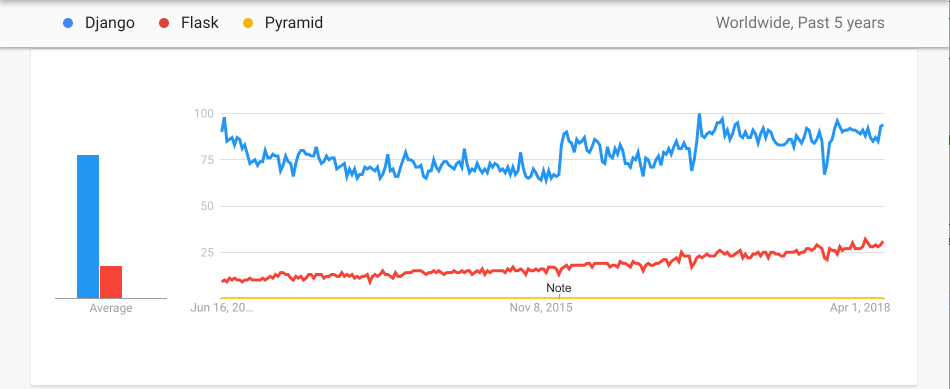
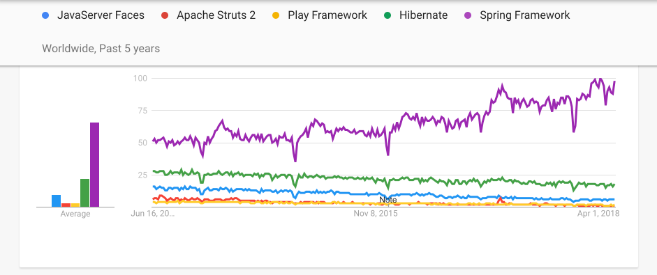
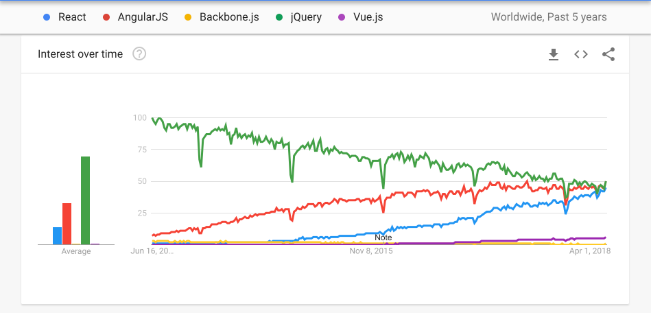
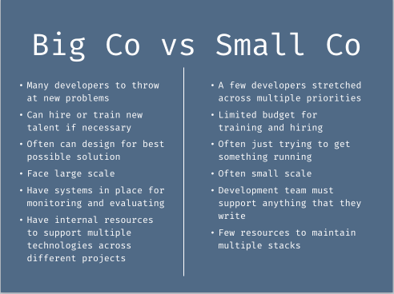

I've seen a lot of complaints about JavaScript lately.  Most fall into a few buckets:

#### The "There's so much to learn" critique

> "Why are there so many libraries and concepts that I have to know in JavaScript development?  I shouldn't have to know Webpack, Babel, React, Redux, React-Redux, ESLint, Jest, React-Router, Lodash and Glamorous just to build a simple hello world app.  And then I talked to my friend who uses Angular and she was using a completely different set of libraries!  How does anybody learn any of this stuff?"

#### The "JavaScript Churn" critique

> "Why does everything change so fast in JavaScript?  Just 4 years ago, I learned to build an app using Backbone & Marionette for code, RequireJS, JSHint and Grunt as build tools, and Jasmine for testing. I even learned to manage my dependencies with Bower. You're telling me that nobody uses any of those tools anymore?  I've been writing Django apps on the backend for a decade and they've never changed this much!"

#### The "Good Old Days" critique

> "JavaScript used to be so much simpler.  You could just add your scripts and use *View Source* to see exactly what was going on.  I could build a whole website without ever needing a build step.  Why has JavaScript become so complicated?"

#### The "Where to Begin" critique

> "I'm trying to learn JavaScript and I don't even know where to start.  Should I learn React? Ember? Angular? jQuery? Or build something without a framework?. I have no idea where to start!"

Basically JavaScript development encompasses an incredibly broad set of concepts and libraries, those libraries change often, they've become much more complicated over the past decade, and there isn't a clear starting point for folks who want to get started.  These are all fair points!

JavaScript has more popular user-land libraries than any other language.  At the time of writing this post 20 of the top 25 frameworks and libraries on GitHub were JavaScript or CSS projects[^1].  Many of those projects are competing implementations that you wouldn't use together in the same project.  It's now extremely uncommon for production JavaScript apps to go without a build step, even in development mode, and even beginner tutorials often assume that you'll have one. And because of the wealth of options, those tutorials rarely start and end in the same plae as one another.  Finally the churn is real.  Here's a look at Google trend charts for the most popular web frameworks in a few different languages over the past 5 years:

#### Python

If you had chosen a Python web framework in 2013, you would have been picking between a dominant Django, a clear 2nd option in Flask, and a "barely worth mentioning as 3rd place" Pyramid.  If you're choosing a Python web framework today... well nothing has really changed.

#### Java

Java looks about the same as Python.  There are more options, but the popularity pecking order hasn't meaningfully changed in 5 years.

#### JavaScript

JavaScript looks nothing like the other 2.  5 years ago things looked similar-ish to Python: jQuery was dominant, Angular was a clear 2nd option, and Backbone was a distant 3rd[^2].  Since then, React has emerged, Angular has continued to grow, and jQuery has started to lose mindshare.  Meanwhile Backbone has died off and Vue has shown up, though only as a blip on the radar for now.  This chart doesn't even capture the fact that Angular searches here actually encompass 2 minimally compatible libraries that share a name, or the additional libraries like Aurelia, Ember, Knockout, Marionette, and Preact that I might have included if Google trends didn't limit me to 5 searches.

If you bet on a Python framework 5 years ago, you've likely gotten roughly what you had a right to expect in terms of community support and resources. If you bet on a JavaScript framework 5 years ago, you essentially bought a lottery ticket.

So the problems people are facing are real.  I don't know how to solve them, but I do have some ideas why they exist.  Here's a quick list of contributing factors.

### Many tribes under one tent

There are many different *tribes* in server-side web development.  Some folks prefer static typing, other's like dynamic types.  Some like Object oriented programming, others are all about functional programming.  Devs have preferences around TDD, pair programming, explicit vs magic code, performance, language usability, documentation and more.  On the server side, these preferences result in tribes, but those tribes have a tendency to define themselves along **programming language** lines. Functional programmers write Clojure or Haskell, developers who like TDD or pair programming may be attracted to the Ruby community, and developers who don't care about any of the noise and just want to get paid to use what they learned in college write Java.

Client side code is different though.  If you want to write client side code, JavaScript has been the only game in town for the last 25 years.  As a result, all of those tribes write JavaScript.  You get the functional people, the object oriented crowd, the folks who care deeply about language details, and the ones who just want to make their program work.  As a result, on the client side, tribe boundaries tend to coalesce around framework boundaries rather than language boundaries.  That's why there are so many competing JavaScript frameworks relative to other languages, because the React and Ember communities for example are more comparable to language communities on the server side than framework communities.  This creates a stable equilibrium of multiple competing communities within the JavaScript tent.

Because they share a common language and are built for a common specific purpose, it is much easier and more sensible for JavaScript framework communities to steal ideas from each other, and for supporting libraries to work with multiple competing frameworks.  As a result, developers move between tribes meaning there's an incredibly large set of libraries that any one developer may end up working with over time.  The cross-pollination of ideas and competition between many similar frameworks also lead to a landscape that changes more rapidly than the more insular server-side language communities.

### Shifting Environments

The vast majority of JavaScript code runs in an environment that the developer doesn't control: a user's browser.  Browser's are complicated, and while they've become much more uniform in different years, they're still not completely cross-compatible, especially for developers who must still support Internet Explorer versions from 2013, 2012 or even 2011[^3].  That leaves developers with 2 choices:

1. Keeping a dizzying array of browser implementation details in their heads at all times, and always coding to an amorphous "universal standard" that isn't written down anywhere and can change over time.
2. Introducing tooling to smooth over the differences, and accepting the complexity and abstractions that come with it.

From the 90s to around 2008, the JavaScript community mostly embraced the first approach.  Over the last decade there has been a near universal shift towards the second approach.  This has plenty of benefits, but it does lead to the loss of simplicity described above. But compatibility hasn't been the only driver of an increase in tooling...

### Communities are driven by their largest stakeholders

The explosion of JavaScript tooling wasn't simply a result of a sudden spontaneous hobbyist interest in JavaScript.  Many of the largest software companies in the world have invested heavily in moving JavaScript forward.  React is a Facebook project, Angular is a Google project.  Ember is community driven, but LinkedIn has invested heavily in it and now employs several core members.  Meanwhile community-driven projects like Backbone and jQuery have diminished.  This has mostly been a boon for JavaScript developers, as our tools have gotten much better over the last decade.  But it does mean that these projects are incentivized to optimize for their largest stakeholders first.

Large companies with deep rosters of software developers view the tradeoffs of churning technology for iterative performance and capability benefits much differently than small businesses with 1-5 front end developers.

Large companies[^4] can absorb the churn of new technology, because they have resources to hire and train new developers, and can actually use these new technologies as a hiring edge by offering prospective hires the opportunity to work on the latest and greatest.

Small companies and individual devs on the other hand are often overwhelmed by the pace of change, and often weren't feeling the pain points that the changes were meant to overcome in the first place.  But these developers are usually stretched too thin to meaningfully contribute back to open source, and therefore don't drive the direction of the projects

### Nature of UI development/Culture

Finally it's worth noting that UI development is just different than server-side development.  Display requirements tend to change more than business rules.  There's a larger amount of subjective/aesthetic requirements and fewer hard answers about whether something is "working as intended".  So there may well be cultural reasons why folks who are attracted to new ideas and constant change get pulled into the front end world.

[^1]: I excluded repos that were just documentation, runtimes, or programming languages.  You can see the list [here](https://gist.github.com/benmccormick/a1f297a64936a868cd63ccb59e297329) and I originally pulled the results from the Github search page [here](https://github.com/search?p=1&q=stars%3A%3E1&s=stars&type=Repositories).
[^2]: Google trends limited me to 5 libraries, but Ember would have been hanging around Backbone if it had been included too, with a better finish that's still below Vue now.
[^3]: Fortunately IE 6-8 appear to be well and truly dead at last, at least in terms of most mainstream web support.
[^4]: Large vs small is obviously oversimplifying here. There are a small minority of large companies that really fit what I'm describing as "large" here, and some of them are actually just well-funded startups that aren't actually that large in terms of employee count.  Everyone else is somewhere on a spectrum where they will fit more or less of what I'm labeling "small", even though they may actually be rather large and successful.  There's also a whole third category of consultants who contribute to frameworks and then make money off of teaching others, who have their own incentives for churn here.
