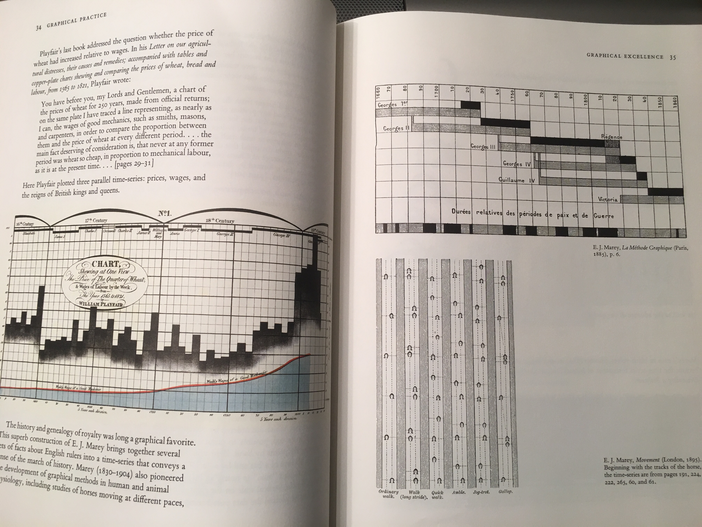

If you have any interest at all in data visualization, you can't get very far learning about it without hearing the name Edward Tufte.  His four books on the subjects have had a huge influence on the industry over the last 35 years, a time where data visualization has blossomed as it has moved from a tedious hand drawn task to a computer assisted activity that even middle schoolers can attempt with the software available on most laptops.

Tufte's first book, [The Visual Display of Quantitative Information](http://amzn.to/2H6EB2f) is also his most well known and acclaimed book[^1].  It lays out many of the principles that he would go to expand on elsewhere:

- Focus on the data
- "Graphical excellence is that which gives to the viewer the greatest number of ideas in the shortest time with the least ink in the smallest space"
- Graphics should have *integrity*.  They shouldn't mislead the reader.
- Remove unecessary clutter
- *and more*

The book is also beautiful.  Tufte chose to self-publish it so that he could control the exact layout and typography.  He also mixes in many old hand drawn visualizations to mix with a fewer new computer assisted graphics.  The result is stunning, and makes for a very enjoyable read throughout, as there is always something interesting to look at.  

Test

[^1]: Amazon named it one of the 100 Best Non-Fiction books of the 20th century
