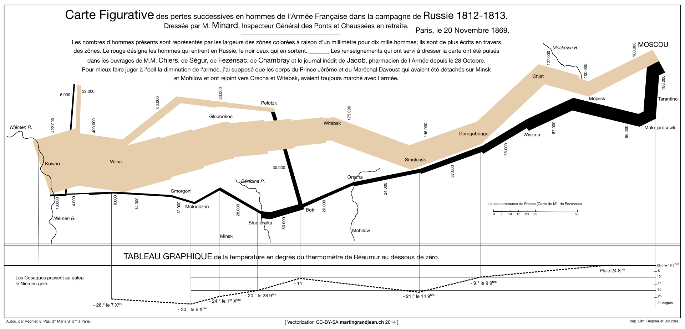

If you have any interest at all in data visualization, you can't get very far learning about it without hearing the name Edward Tufte.  His four books on the subjects have had a huge influence on the industry over the last 35 years, a time where data visualization has blossomed as it has moved from a tedious hand drawn task to a computer assisted activity that even middle schoolers can attempt with the software available on most laptops.

Tufte's first book, [The Visual Display of Quantitative Information](http://amzn.to/2H6EB2f) is also his most well known and acclaimed book[^1].  It lays out many of the principles that he would go to expand on elsewhere:

- Focus on the data
- "Graphical excellence is that which gives to the viewer the greatest number of ideas in the shortest time with the least ink in the smallest space"
- Graphics should have *integrity*.  They shouldn't mislead the reader.
- Remove unecessary clutter
- *and more*

The book is also beautiful.  Tufte chose to self-publish it so that he could control the exact layout and typography.  He also mixes in many old hand drawn visualizations to mix with a fewer new computer assisted graphics.  The result is stunning, and makes for a very enjoyable read throughout, as there is always something interesting to look at.  

I was pleased to find that the book didn't back up some of my own pre-conceived notions about Tufte and his work.  When I've seen him referenced in the past, it has been almost solely in terms of minimalism.  He was an expert witness for fewer colors, fewer lines, less ink.  But his takes here are more nuanced.  He definitely tends towards minimalism, and argues for reducing graphs to their bare minimum ink amount over conforming to familiar forms[^2].  But his go to example of great data display throughout the book is hardly minimalist.  Minard's map of Napoleon invading Russia is a complex visualization that tracks the size of an army, time, location and temperature, all in a single image.

Instead Tufte is really arguing for data efficiency.  Simple things should be displayed simply.  If you have a single number, don't dress it up in a fancy graph.  Just show the number.  If you have a series of numbers, a table or simple scatter will work fine, no need for a fancy piece of chart "art".  But when you have truly complex data, a complex visualization can make it accessible in ways that a large page of words and numbers never could on its own.

I found [The Visual Display of Quantitative Information](http://amzn.to/2H6EB2f) fun, informative and inspirational.  If you work with data and have never read it, I'd definitely recommend checking it out.

[^1]: Amazon named it one of the 100 Best Non-Fiction books of the 20th century
[^2]: Some of that may be a relic of this book being originally written in the 80s before computers, his own work and the work of other similar thinkers greatly increased public awareness of data visualization standards like line and bar charts.
