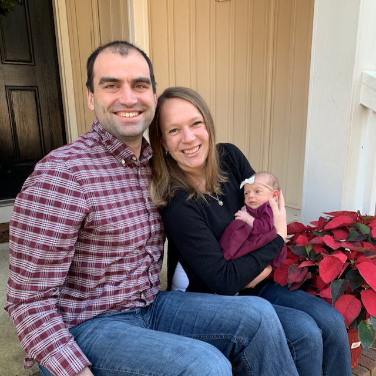

2018 was the 5th full year of this blog, and I chose to experiment a bit.  For the first 9 months of the year, I posted a Weekly Links post every week, and also published 24 normal articles, before taking a break the last 3 months to deal with some changes in work and home life.  My employer went through an acquisition this year and I started working with a new team. Then Claire and I welcomed our first daughter, Elena, to the world earlier this month.  It's been a busy but rewarding year.

I'm excited to get back to the blog in 2019, and take what I've learned the last few years and make some improvements I've been considering for a while.  The biggest one is shifting to a newsletter format for initially publishing my posts.

## Newsletter

Over the last year, email newsletters have become my favorite ways to stay up to date in my professional world.  High quality newsletters from people like [Kent](https://buttondown.email/kentcdodds), [Lara](https://larahogan.me/sign-up/), and [Ponyfoo](https://ponyfoo.com/weekly) are some of the best ways to both keep up with what's going on tech and trends, but also learn new ideas in a blog post, way.  It's a better forum for thoughtful content than social media, allows for communication between the writer and their audience.

I've always allowed people to subscribe to this blog through email, but to be honest, the experience has been kind of crappy.  I've meant to improve my email template forever, and articles sometimes got jumbled into a single email.  Going forward, they're going to be a first class citizen, and the best way to follow the blog.  I'll publish articles there first, and include extra "weekly link" like content in the emails only.  I'm switching emails over to [Buttondown](https://buttondown.email/) and they should be much cleaner and content focused going forward.  If you follow this blog through email, you're probably reading this post in that format now.  If not, please go ahead and [subscribe](https://benmccormick.org/subscribe/).  I'll be starting the year with a series of posts about front end architecture.

## 2018 Roundup

### Most Read Posts Published in 2018

####  [React Architecture Confessions](https://benmccormick.org/2018/02/07/react-confessions/)

React unquestioningly has a learning curve.  I decided to talk through the various mistakes I'd made as I learned React on the fly while building a large web application.

#### [Evil JavaScript](https://benmccormick.org/2018/07/04/evil-javascript/)

This was something different for me, a tongue-in-cheek look at the ways you can use and abuse some of JavaScript's more powerful features

#### [ES6: The Bad Parts](https://benmccormick.org/2018/06/05/es6-the-bad-parts/)
My take on which parts of ES6 should be avoided after 3 years of use.

### Languages, Libraries, and Technologies I started using in 2018

With all the changes, it hasn't been a big year for experimentation, but Immer is fantastic.

- [Immer](https://github.com/mweststrate/immer) This probably deserves a full post at some point, but I've been experimenting with using only Immer and React's built in state features for state management on a new project, and it's been fairly nice so far.  It's a lovely little library that makes working with immutable data pleasant.

- [Storybook](https://storybook.js.org/) My other big experiment on the new project has been using Storybook as a collaboration tool for our UI components.  It's still early days, but I'm liking it.

### Languages and Libraries I used (more or less) every day in 2018

JavaScript (ES6), Python, React, PostgreSQL, lodash, MobX, Jest, Immer, CSS Modules

### Languages and Libraries I want to try in 2019

GoLang or Rust, IoT hacking and Pandas/other python data analysis libraries

### Blogs I started following in 2018

[Lara Hogan's Engineering Leadership blog and newsletter](https://larahogan.me/)
[Overreacted by Dan Abramov](https://overreacted.io/)

### Blogs I read every post from in 2018

[Overreacted by Dan Abramov](https://overreacted.io/), [Lara Hogan's Engineering Leadership blog and newsletter](https://larahogan.me/), [Rands In Repose](http://randsinrepose.com/), [Stratechery](https://stratechery.com/), [Daring Fireball](https://daringfireball.net/), , [wynnnetherland.com](https://wynnnetherland.com/)

### Software I used (nearly) every day in 2018

MacOS/iOS, Google Search, Chrome/Safari/Firefox, GMail/MailPlane 3, Twitter/Tweetbot, Feedbin/Reeder, iMessage, Slack, Jira, 1Password, VS Code/Vim, iTerm, Fish Shell, Bitbucket, Fantastical, Spotify, Bear, Annotate, Dash

### Best Technical Books I read in 2018

[Clean Architecture](https://amzn.to/2LsAJMk), [Atomic Design](http://atomicdesign.bradfrost.com/), [A Philosophy Of Software Design](https://amzn.to/2EFXcVI)

### Best Non-Technical Books I read in 2018

[Radical Candor](https://amzn.to/2SfcnYP), [The Tech-Wise Family](https://amzn.to/2Lscqy0), [Between The World And Me](https://amzn.to/2GHNX90), [Vision](https://amzn.to/2V7vDJU), [The Innovators](https://amzn.to/2Bts7QM)
