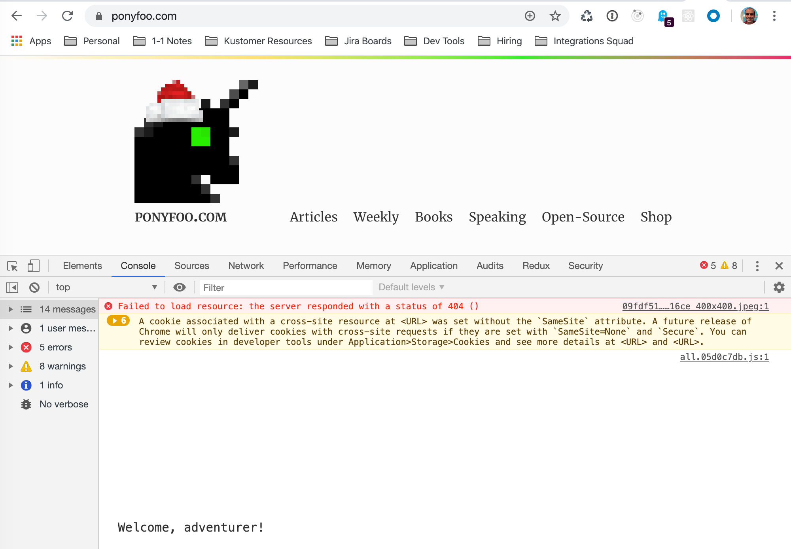
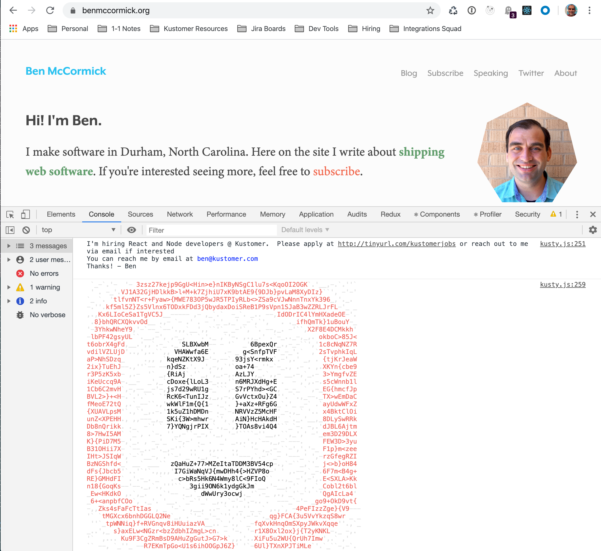

I've always enjoyed sites that had easter eggs in their consoles, whether they're simple and whimsical like Ponyfoo.com



or practical like Facebook's 


I'm also part of a [fast growing company](https://www.kustomer.com/) and we're always hiring, so I thought I'd see if I could leave a fun message in the console, and play around with ASCII art while I was at it.  

Kustomer's logo is *Kusty*; a smily speech bubble with apostrophes for eyes:


So how did I get Kusty showing up in the console on this site?  I started with a bit of a cheat: I asciified the logo using [asciify.me/](https://www.asciify.me/).  That got me a nice starting place, I had an Ascii version of Kusty to work with:

```
 ' ``.'` . -_+")cTtfyyyszztszszszztzfztfsfzsfzsstttyt17vr>, .   ` '-`- `
  ..`.'`.~)71tyyzzfzfzsyststztyftsytsystyztzzyzsyyytyfsytf1l?!  -.` `'`.
-.- - `+}Tzztsfyffztzzyyztsffyytfyyzztyfzyfzyfystzftszfytfysyt{+--'.- `.
 `--.>Lyffttyztsfyztyt11fYtyyzYTz1yT1yfzfTt1TsYfftsttzzysffssyyt7+  ''`-
 -`!iysttfstffzTi?"+,,!~^~!^__~!_:,:^^^,!~_~~:_,,!:^+/i1zyytfyztzzi~''-.
. !}tsftzffyTv+~..  -`-.' '. .`-   .'.-- ` ` . -'- .-..~+v1fsfttszf}< . 
 ,xftyyysszv, -. ```' '. .-.``'.-   ''.'--'- '  ` ...''  .!vytyzsstsx^- 
'/zsstzzzf*` `` '  ` `- '`- ` `.`  -.-   - `.'-- -` - '` '``=1szfyzssi' 
+Yzftsztf? `  `-` ` -- ` "vje4J>' ...` `  '~iteau(.'` `-- ``'/tzszszfY+'
isttsstzl:     `.-  .`'[qQQRgQBt  - `-.' rkDQWRQg6  -''- `   ^]ffyzstyi'
xyfssytyv''- .''-   .:#QBW&j}v+'  '`. `'s@gR@$Lv"-``   - - .'`?ystysztL`
xtyytzsyv .`-.'-  `' JRgBV:...``.' -.  [HWHd+  .'-- `-     '' /ysyzftsl'
cyyfysfyi  '-`'``' -`NBWW^'    .'`` - '2gBQ{`    .-`-'. . `-'.(zsyyzzzL_ 
{ytyztfti    '-`'..''DBRWSS%9wk"-  .-  nWWHOwE%%5x    `' -  `'|ftzttytx- 
{ttszfysi.`-' `.'' -.DWHgggBRgH2-`.''  2BWHgWRHgB&' .`. '  . '/sfztfsyc` 
7zzsfsyzi - '`  '' ` &BHgQWRgBHj-'- ' 'JQWHBBHHHQ@   ` .-```- /ttfttyy7' 
lsfsttfti-'.`  -` -'`DBHgHHRWRHu.. `'`.nWHRgRRBgg&.`'` '`   '-?fsysfss7.
xstfsytti `- `.'''`.'pBBRQQRBgBn. '' ' CQBWBQBBBQO--'`   - -- )sstfzyz] 
}fzztyfsv.  ' -   '..+[yfsfyzyv!-    ` !ittfftztc+' '  '  -. ')zzzzstsL`
7ttszfssi'- '-  '`  -``-- - -`` -.-.-`` `` '..- . .''- .  '.- /sfyyftsL`
{fsyysyzv-' ' .-  '`  '    - - -  ```-...' .' -  - .-'`-.'-  `/fstyzszl'
7{yzzyttfi '- '.'.' ' ' . - - . -'  -'-- ''`  .  -'   `'- .  '`(ffstfss}`
{ztfzttsi -   -' ..'` ``'`.--  .  -. '. .'''   '  -' -''.-. ' )zssfyzs]-
{tzszzzyi'.'-`.--  ' `"&QQQHQWWgHWWgBQWWBggBgWW&/ `` '.' '`- -/zfszzzs}-
xyffzzzsi -.`-`'''- ' ']MHgHRHHgRQHBBWQWHHgBQQO1-`.`'.--. ''` |zzztfysl' 
ittsfsttc^`   -  .'   '`~zMHHQWgBQRQgHQWggHQMt:'' '`- .'   `-,{fttttzzi`
+Yzftsstt|'. .  ' .   .  .-vJONHHBWQggBB&MFi. ` ' -.  `.'--  \yyzszyf1>`
 /tfyyyzyf"  - `.`'..``  -`- -+\c1f2yTc/<. '``.-`.`'-.'`-'` rfztyssfsi'' 
 :Ltzzytsstv,- ` '.`'  '` ' ```- '`    .`.- `'. . - ` ``--,itftfsfyt{,'`  
--^LtfsfsftsYi+:'`-. `  .  .-` - `.--''`` -   `. ``'`  ~>iTztyyyfzs[< `.
.. ^iftstzzfsssYv)r,^__!_^!!~'.-'. ..- -'' `,_:_~_~:>)i1zsfzsstfzfi!. `-
.`  .>]ytfyyzsyszftsz1TYY1Y11v>-     -.'-'. {TYTTYstzttfzsfftsstl<'   '`
-.-.-. >lfsszzsyytszysyzzzzysfy1?< '       `7zzffsyystzsttztzfx>` ' - .'
`.' `''`.^(c1zfttfztfyssyyffttzyyf}r~.- '''-7tfyzszzztysfy1L(!-.-`-.`.-`
-'    `' -. !+"([TyyzyzzsztststfsszyYi*_` -`{zyzfzfffT[v">!'`..`-` .`.-` 
```

At this point I could have tossed that into a console.log and called it a day, but I wanted to take this to the next level.  And that means color!

This isn't something you run into every day while writing for the web, but it turns out that you can apply css to text in the console using a `%c` macro.  The format goes like this:

```js
console.log('%cbold text %cred text', 'font-weight:bold', 'color: red')
```

That code outputs <span style="font-weight: bold">bold text</span> <span style="color:red">red text</span>.

Of course its a pain to split that giant Kusty ascii block into multiple console logs with different colors.  So I minimized the pain and wrote a script that would let me take a set of ranges and render characters in one of 3 colors, and using either solid characters `A-Za-z1-9+{}<>;` or space characters <code> `.,_-'</code>. I did eat the cost of writing out the map characters manually based on the generated ascii.  If I was going to do this again, I'd probably write out a script to generate the map from the original ascii image, and just fill in the color mappings manually. 

```js
//we use these characters for the solid lines
const solidChars =
  'abcdefghijklmnopqrstuvwxyzABCDEFGHIJKLMNOPQRSTUVWXYZ123456789+{}<>;';
// and these ones for empty space
const spaceChars = " `.,_-'";

// these maps chars and colors 
const chars = [spaceChars, solidChars];
const colors = ['#E0E0E0', '#ED6159', 'black'];

// this is the mapping to generate kusty
const map = [ [13, 0, 0], [45, 1, 1], [13, 0, 0], null, [9, 0, 0], [53, 1, 1] /* etc */ ]

// generate the ascii string from the map
const ascii = map.reduce((agg, val) => {
  // nulls mean spaces
  if (val === null) return agg + '\n';
  agg = agg += '%c';
  let characters = chars[val[1]].split('');
  const randChar = () =>
    characters[Math.floor(Math.random() * characters.length)];
  for (let i = 0; i < val[0]; i++) {
    agg += randChar();
  }
  return agg;
}, '');

const colorStrings = map
  .filter(x => x !== null)
  .map(
    val => `color:${colors[val[2]]}; font-family: monospace, font-weight: bold`
  );

console.log(ascii, ...colorStrings);
```

The code is fairly straightforward, going through each segment and generating a string of random characters based on the map.  The interesting parts are probably:

- We use `null` to denote new lines.  Could have been anything, but null is pretty obvious when you write out the mapping markup.  
- I usually use lodash for this, but I wrote some custom code to pull a random item from an array:
    `const randChar = () => characters[Math.floor(Math.random() * characters.length)];`
- I added a rare for loop in JavaScript code: even though map/filter/forEach etc work better for most things, a for loop is still the best way to do things when you're given a number of times you want something to occur.

It works pretty well!



### Next Steps 

Now that I've done this it would be pretty easy to reuse this code to create a terminal Kusty with [chalk](https://github.com/chalk/chalk#readme). Maybe next New Years.

For everyone else, if this seemed fun to you, you might be interested in the [job openings at Kustomer](https://boards.greenhouse.io/kustomer).  Feel free to apply or reach out to me directly if you're interested in working with us.  