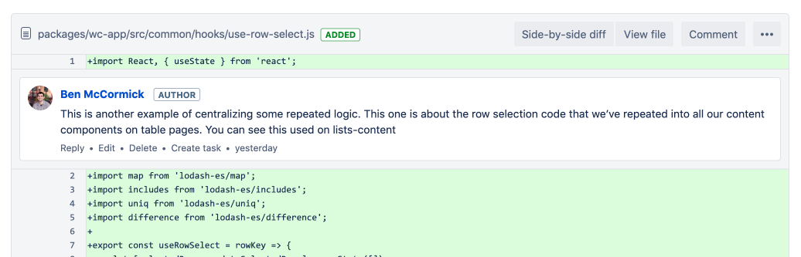

> Deliberate practice [is when] (1) your attention is focused tightly on a specific skill you're trying to improve [...] (2) **you receive feedback so you can correct your approach to keep your attention exactly where it is most productive.**
>
> *- Cal Newport, Deep Work*

In [Deep Work](https://amzn.to/2TqwDeR), Cal Newport explains that research has shown the primary difference between experts and amateurs in a typical field is not innate talent; instead it is the amount of time they've spent in *Deliberate Practice* within their field of study that sets them apart.  Deliberate practice is not merely time spent working on the craft, but includes a [feedback loop](https://benmccormick.org/2018/08/02/feedback-loops/) aspect. To get better at something, we need to receive meaningful feedback on whether what we're doing is working.

When working with a team, one of the best ways to get this type of feedback is [quality code reviews](https://benmccormick.org/2019/01/14/value-from-code-reviews).  When you're reviewing, you get to see other developers approaches to code, and when you've written code, you hopefully get high quality feedback from a different point of view.

In reality, code reviews don't always provide the value they could.  Many developers don't give much feedback at all on code reviews, give unhelpful aesthetic feedback, or may even use it abusively to try to show off their "superiority". I can't solve all of those problems, but here are a few tips I've found that help me get better feedback when my code is being reviewed.

#### 1. Annotate Pull Requests

Most people assume that the inline commenting features in Github and Bitbucket code reviews are for use by the people reviewing the code.  But I've found that it can be helpful to preemptively add comments to my PRs to give reviewers context.
This is especially useful for information that may be relevant during a code review but isn't long term relevant, like the original reason for extracting some reusable code and where it came from.  Below is an example of a comment I left demoing how React hooks could be used to pull out shared logic in my work project.

These types of comments are also good ways to point a reviewer to the important parts of a review. This matters for reviews where there are many small changes across a large number of files, with a few high impact changes.  It's always better to make atomic changes (see [more here](https://benmccormick.org/2019/01/14/value-from-code-reviews)), but when you must make a large change, this technique can help a lot.  I have received noticeably better feedback on my large pull requests since I began annotating

#### 2. Encourage Questions

If you're receiving feedback from more junior members of a team, they may not always be comfortable giving direct feedback on code.  One way to get better feedback in those situations is to encourage them to ask questions about things they don't understand.  This gives them opportunities to learn, but also let's you see which parts of your code are unintuitive or unfamiliar to the rest of the team.  In some cases the questions will expose bugs that a more confident reviewer may have pointed out straight out, and that experience can help grow a reviewers confidence and lead to even better feedback next time.

Of course asking questions rather than assuming understanding can be a good tactic when giving feedback in general, and is worth considering when doing your own reviews regardless of whether a reviewer has encouraged it.

#### 3. Find More Than One Reviewer

This applies to more than just code, but if you're not getting the feedback you need right now, ask somebody else.  In a work setting, this might be finding different team members to review your code.  If that isn't possible at work, finding other ways to write code and get feedback on it can make a big difference in your career.  Not everyone has time or capacity for this, but contributing to open source, project nights at local meetups and hackathons can all be great ways to learn and get feedback from others.  If you can find a mentor to talk through code challenges with, that can be beneficial even if they aren't on your team and going through your code line by line.

