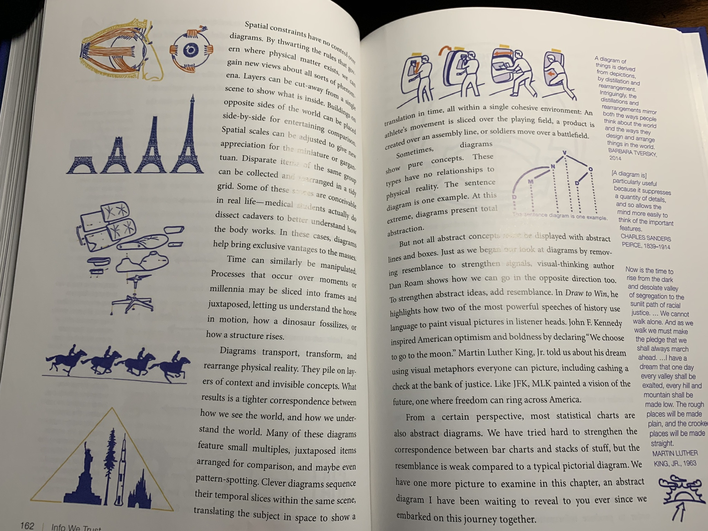
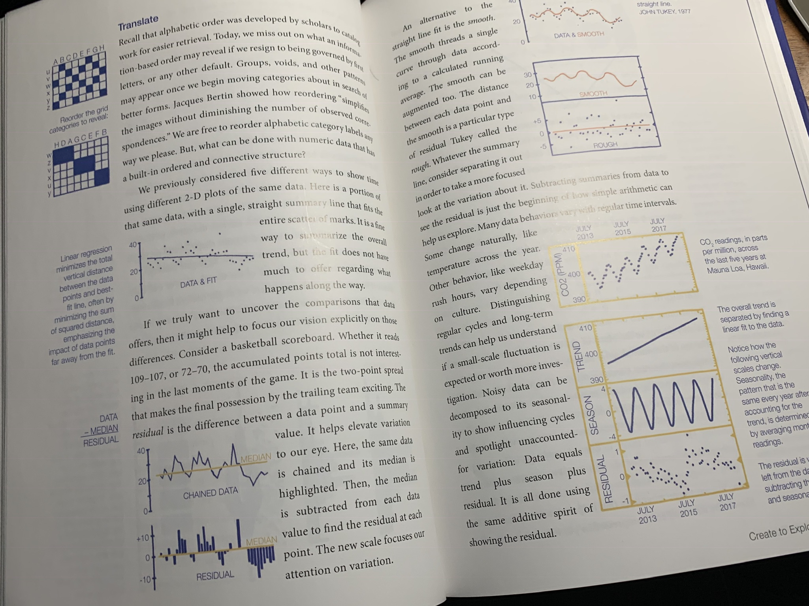
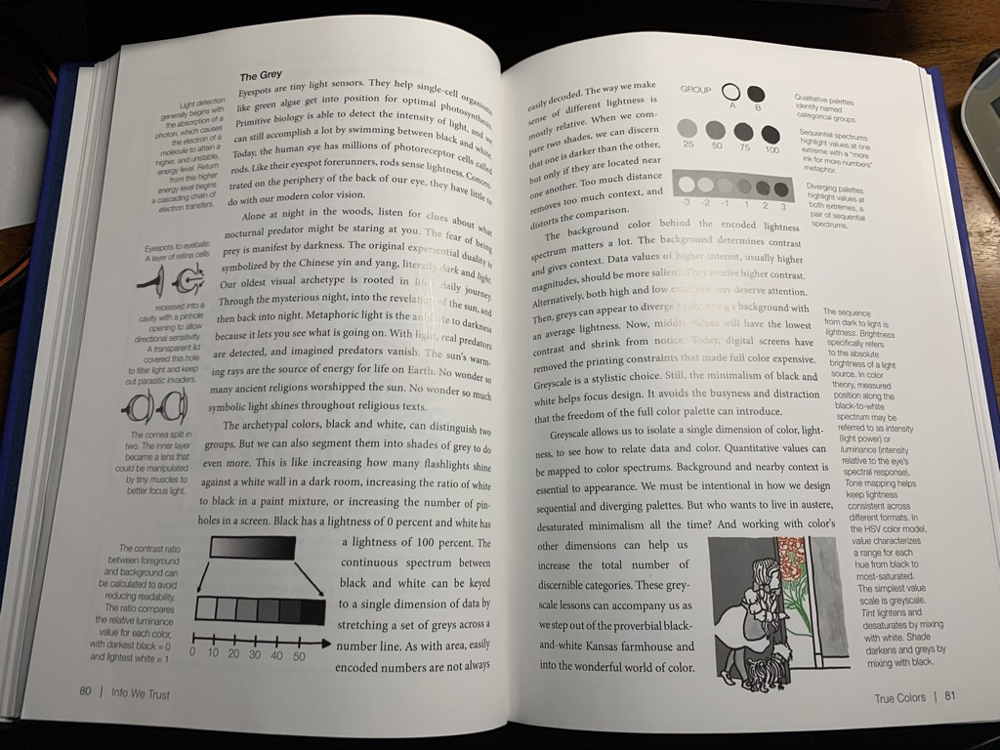
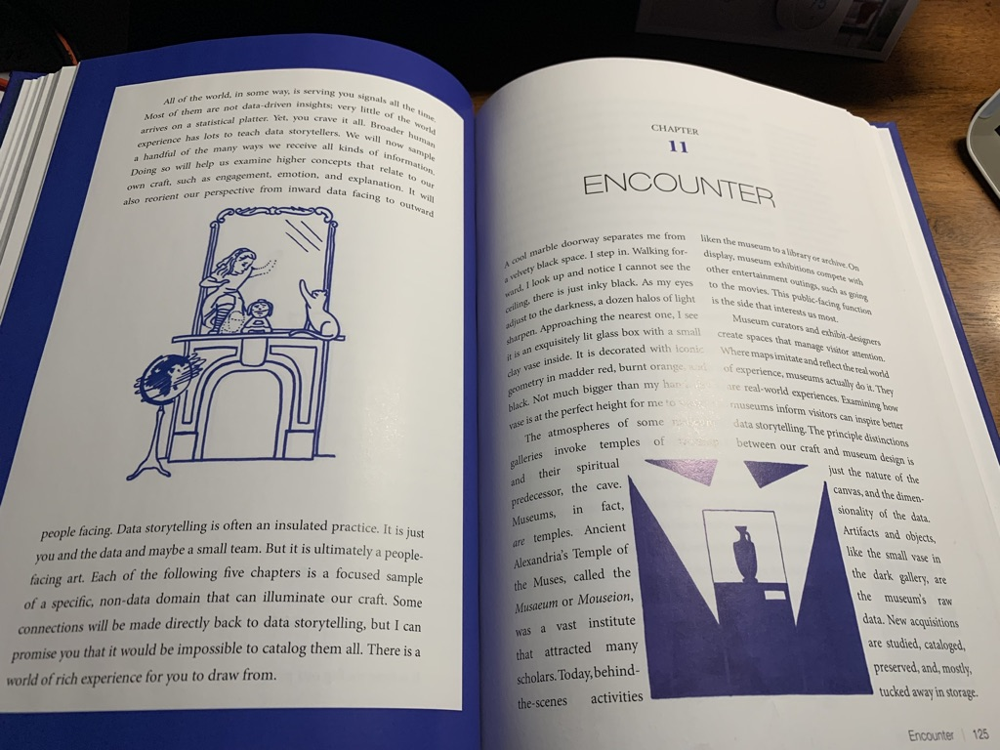

Sometimes surprises are good.  I bought RJ Andrews new book [Info We Trust](https://amzn.to/2Ww9BBl) expecting to get some practical tips on how to create better data visualizations.  But frankly there's very little in the way of "how to" in this book.  Instead I was treated to a deeply engaging book that's part history of data visualization, part exploration of human psychology, and 100% a love letter to "data storytelling", with brief detours into linguistics, museum curation sentence diagramming and propaganda posters. If you're looking to know when to use a bar chart vs a pie chart in your powerpoint slides, this book will be a disappointment.  But if you want to learn how to think deeply about telling stories with data, or just enjoy seeing somebody who loves their topic nerd out about it for 200 pages in a beautiful formatted book, this may be for you.

Let's start with that beautiful book.  This is not a read that you want to pick up on Kindle.  The book is littered with fascinating illustrations, all [hand drawn by the author (!!!)](https://infowetrust.com/illustrations/), and almost every page has interesting quotes, examples and tangents in the marginalia.  Here are a few random pages that I snapped with my phone while writing this:  every single page is this beautiful.

In addition to the eye candy, Andrews mostly avoids giving readers rules, but instead dives deep into the whys of data storytelling.  Things I was left thinking about:

1. The way I think about bars vs columns differently based on my different assumptions about distance vs stacks of items
2. How the plethora of data available in the world today has a cost: our attention.  That has left me thinking both about designing interfaces that manage attention, but also how to reclaim my own distracted attention.
3. The difference between data and information, and how each can be useful.  How in the product I work on we can help users get access to enough raw data to explore on their own, but also give them meaningful "information" derived from that data.
4. I was motivated to get better at drawing, and explaining things with images in my day to day work.  I don't do this enough.

If all of that sounds too high level and impractical for you, this is probably not the book for you.  But anyone who is already a data viz geek will find something to love, and as somebody who is tangential to the field it certainly expanded my mind and gave me a lot to think about.  All in all, this one is easy to recommend. [Check it out!](https://amzn.to/2Ww9BBl)
