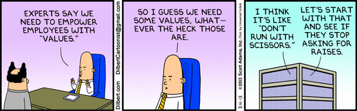
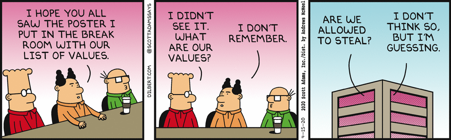

*This article was first published in my newsletter, [Herding Lions](https://herdinglions.benmccormick.org/)*

I recently had the pleasure of working with a team to help define [Kustomer’s engineering values](https://medium.com/kustomerengineering/kustomers-engineering-values-80d06dae4306?utm_campaign=Herding%20Lions&utm_medium=email&utm_source=Revue%20newsletter). We went through a brainstorming process, got feedback from the team and ended up with a set of values that we believe reflect the best of our culture and how we work. These days this is the type of work that often feels most impactful to me; we’re investing in culture. But earlier in my career I probably would have been deeply suspicious of it. Aren’t values just babble-speak that managers use to justify their existence? Have I become what I once hated?

What I’ve learned through seeing this modeled in healthy organizations (both before and after shifting to management) is that values are how you scale culture as a company grows and evolves. Good values help employees make hard choices, help new employees know how to be productive in an organization, and allow hiring for culture fit in a way that doesn’t just translate to “this person looks like me”.

This of course doesn’t happen in every (most?) organizations that define a set of values. For values to be useful you need meaningful values that are regularly used well. Otherwise they’re just an easy to make fun of list of words.

Meaningful values are opinionated tradeoffs and applicable to day to day decisions. Opinionated means that you’re making a choice – values are a decision to prioritize one good over another good, not just to reject something obviously bad. The [agile manifesto](https://agilemanifesto.org/?utm_campaign=Herding%20Lions&utm_medium=email&utm_source=Revue%20newsletter) is a good example of this: instead of saying “Quality is good” (duh!) they say prefer working software over comprehensive documentation – a guiding preference that some devs may not embrace and can practically be used to guide decisions. From Kustomer’s values, we choose to “Optimize For Impact”, which means we may move off of something before getting to perfect, and may explicitly ignore some issues if they won’t move the needle. We value “Do What You Say” because we’re targeting a culture of accountability and trust over one that is simply “nice”. These values directly guide how I as a manager might choose to give feedback in a situation, and how an engineer thinks about calculating scope and an estimated due date for a project.
Meaningful values are also specific to their context. Instead of writing our own values, Kustomer could have just taken [Google’s values](https://about.google/philosophy/?utm_campaign=Herding%20Lions&utm_medium=email&utm_source=Revue%20newsletter). And we certainly did look at other companies for inspiration. But ultimately values are useful for defining the culture of a company and the behaviors that are successful there, and that will not be the same between 2 companies. If you ask your employees to start behaving like Google employees that will likely lead to some interesting results, but your context isn’t Google’s and ultimately you’ll likely find that what works for a huge multi-national tech giant may not make sense for you. And realistically the values and behaviors that benefited Google as they were a small growing startup may not be the right ones for them today – [they’ve even famously shaded away from “Don’t be evil”](https://gizmodo.com/google-removes-nearly-all-mentions-of-dont-be-evil-from-1826153393?utm_campaign=Herding%20Lions&utm_medium=email&utm_source=Revue%20newsletter). Instead, understand what behaviors and priorities are useful and valued in your current context (some level of aspirational values are appropriate but mostly this should be descriptive of what is effective in your context today), and find ways to communicate those clearly and crisply, preferably using language that you already hear in your company today. It doesn’t mean that you can’t share values with another place or even use a term that is somewhat generic – it just has to have a clear meaning in your culture. Kustomer’s value of “Trust” is somewhat generic as a buzzword, but in practice its a term that has been important throughout our history and internally provides a clear set of priorities – work that threatens our customers’ trust always comes first, and we should always be proactive rather than reactive about quality issues. We also value going fast, but quality comes ahead of velocity. Every new engineer goes through a training where we unpack these concepts, so the value was simply naming something that already existed for us.

Once you’ve established a set of meaningful values, you still need to regularly put them to use in order to see value. That means referencing them when you make decisions (“We shouldn’t work on this because we need to **optimize for impact**” or “We can’t ship this without a monitoring strategy – we need to keep our customer’s **trust**, and we can’t do that if we don’t know when things break”). It also means rewarding behaviors that align with our values. At the company level, Kustomer monthly recognizes an employee who embodies our “Don’t just talk about it, be about it” value with a DJTAIBAI award. I’ve seen other companies experiment with “micro-awards” where employees have a budget for sending other employees rewards that get tied to their values. This also can work into your normal processes of evaluation and recognition by emphasizing behavior that aligns or deviates from values in performance reviews and 1-1 coaching. The more the values get talked about and rewarded as expected behavior, the more they have the power to scale culture.

Values are a tool for naming the culture you want to have and starting to iterate to it. They don’t guarantee that you’ll get there, and if the values you list aren’t already a meaningful reality for at least part of your company, they’re probably not going to transform your team. But they can help you scale what you have as you grow, and they can help set a bar that will open the path to the difficult conversations needed when things need to change.
