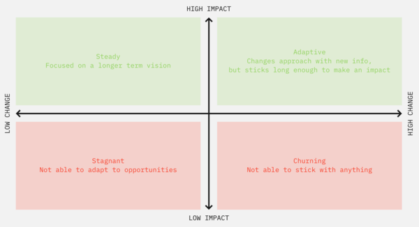

*This article was first published in my newsletter, [Herding Lions](https://herdinglions.benmccormick.org/)*

At this point I’ve spent the large majority of my career working in startups at different stages. While life can look very different in a 15 person early stage startup and a 300 employee growth stage startup, one thing that is constant across every startup I’ve encountered is a rapid pace of change and a relatively short time horizon for planning. Plans aren’t made for too long in advance, and yet often still manage to change significantly before reaching the original goal. Even in more stable environments, the reality is every software project is a unique undertaking to bring something new into the world. That brings an unavoidable level of unpredictability, meaning that everyone working in software must accept dealing with changing plans and priorities.

Some common questions predictably come with this state of affairs. How much change is too much? For a specific change, why are we doing this instead of sticking to our original plan? As engineering leaders we need to be able to both make choices about what changes to advocate for and push back on, and also learn how to explain those choices to our teams and other folks we work with.

I’ve found 2 different models helpful for thinking about changes in plans.

### Understanding the level of the change

Changes in roadmap can come in at a few different levels. Understanding the level can help you understand how to think about it, and how to talk to your team about it.

1. **A consequence of existing ambiguity**
This occurs when a team didn’t have clear committed plans previously or didn’t communicate them clearly elsewhere. This is less of a change and more a symptom of ongoing chaos. If a situation like this persists, it is the Engineering Manager’s problem to fix. 

2. **A higher level need**
A team is sometimes asked to do something that doesn’t directly tie into its mission, but is important for the broader company. Examples include helping another team with their project, or working on a revenue driving sales ask that wasn’t part of the original product roadmap.

Higher level requests are important to take seriously and often are the right thing to do. But if they become a regular pattern it can be a sign that your team doesn’t have the right mission, or you’re getting sucked into thinking too short term. 

3. **A tactical change**
When working on a project a team often learns about new and better ways to achieve their goals. A different approach to code, a new feature that moves the same goal, or putting different people with a new perspective on a problem are all new pieces of.information that serve as opportunities to make a better plan.

Tactical changes are normal and a sign that you’re paying attention to what you learn as you go. However, If you’re making these type of changes repeatedly, they’re not tied to a clear lesson from the work you’re doing, or you’re making similar tweaks on every project (looks like we need to add unexpected time for more testing again) it might be a sign that you didn’t properly plan or the team isn’t aligned on a goal. 

4. **A strategic change**
Sometimes teams change plans because their overall approach to achieving their goals has changed. Maybe they’ve decided to focus on a specific segment of their customer base or realized they need to focus on building up our quality before releasing new features. 

The most important thing with strategic changes is clear communication – do your team and the stakeholders around your team understand not just what new work you’re doing, but also the strategic change behind it? If not, that misalignment can quickly move a project into muddy waters.

5. **A change in mission**
Sometimes a team’s whole purpose can change. This often corresponds with a reorg or a higher level strategic change in the company. These changes should be rare, but are a good opportunity for a team to increase its impact. 

After a change in mission expect to spend a lot of time learning, helping teammates work through the change, and handling a period of other change requests – because by default you’ve found your way back to ambiguity and it is your job to work your way out of that.

### Track Your Stability Over Time

Beyond examining individual changes it can be helpful to keep track of how often you’re changing your plans over time. Some teams are naturally more stable, while others change plans more often. These aren’t necessarily descriptions of virtue – a team that never changes its plan can end up being slow to respond to environment changes and continue for months on low impact work, but a team that is constantly changing plans may never hold a direction long enough to make a dent in any problem. It’s best to consider this along 2 axes, level of change and level of impact.

Teams that are stagnant may need to consider more aggressively seeking feedback on their approach from users and consider making changes, or finding a higher value mission that is unlocking more impact over time.

Teams that are churning on the other hand might need to commit to finishing more, even if that means being a bit less responsive to new requests or opportunities. A discipline of making and then completing small time bound goals can be helpful here.

Of course there’s a fine line between stagnant and steady, churning and adaptive. An approach that was working before might go stale, and a team that appears stagnant may be in the early stages of unlocking a big iterative return. So this model should be used carefully, but it is helpful to have an opinion on where your team stands today as you consider new requests to change your plans.