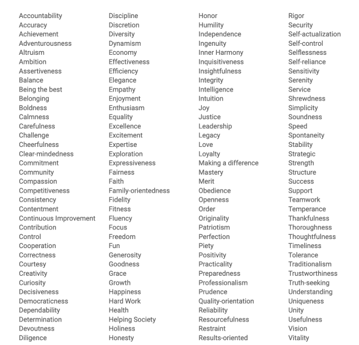

As a way to help myself grow in my first year as a manager, I've been working through [Google's New Manager Training](https://rework.withgoogle.com/guides/managers-develop-and-support-managers/steps/review-googles-new-manager-training/) which they have generously published online.  One exercise that stood out to me was a "values selection" process, where they encourage managers to select a ranked list of 5-10 words from a list of ~400 that resonate to them as values.

Choosing values is an odd process, because you're choosing between "goods".  When I first went through this sheet, I circled over 40 words as values that "resonated" with me.  They're things that I value and strive for, or wish that I was more like.  You're not deciding between adventurousness and cowardice, instead you're trying to decide whether  adventurousness, belonging, or clear-mindedness are more important to you.

The usefulness here is that management often forces you to choose between goods (ship quicker? higher quality? How does that impact work/life balance for your team?). The results of these decisions routinely lack clarity, with plenty of lagging indicators and crossed signals.  Values can be guideposts through ambiguity.  I've seen the value of this at a company level in my current gig, where having a set of values that are repeated often allow us to weaponize them as decision making tools [^1].

Going through the list, I eventually cut things down to 20, 12, 10 and then 8.  That feels like a lot to me, but for each of the 8 I can easily cite work situations I've faced in the past month where my response came directly out that value.  In the end I ended up with *Integrity*, *Thankfulness*, *Community*, *Prudence* (in the [classical sense](https://en.wikipedia.org/wiki/Prudence)), *Generosity*, *Continual Improvement*, *Accountability*, *Justice*.  I find that these are easy to connect to my everyday work when I write them out as more detailed sentences though.

1. Act with *integrity*.
2. Live with *thankfulness* for what I’ve been blessed with.
3. I want to work and live life in *community*.
4. Make decisions based on a rational analysis of reality, not feelings and first impressions (*Prudence*).
5. Don’t save it all for myself. Leave margin and be *generous*.
6. *Continual Improvement* + Goodism are a powerful combo[^2].
7. Be *accountable* for my responsibilities and hold others to the same.
8. Actively work for *justice*

Those are "guideposts" that I can easily quote to myself or post up somewhere, but still have enough substance to say something meaningful when I'm considering how to handle a low performing team, organizational changes, or personal career decisions. I've already seen them bring a clarity to my thinking about tough things in a short period of time.  If you're interested, I highly recommend checking out [Google's training](https://rework.withgoogle.com/guides/managers-develop-and-support-managers/steps/review-googles-new-manager-training/)

[^1]: I've also seen how quickly this becomes useless when those values are not universally embraced or enforced.
[^2]: Probably a separate post, but *goodism* has always been my response when asked if I'm a perfectionist: "I'm a goodist.  I care about doing work that is good and meets the needed standards, but tend to move to the next challenge when I pass that bar and hit diminishing returns".
